# Installation

<a id="pip-install"></a>
## Via pip 

### Pre-requisite

`synphage` relies on one non-python dependency, [Blast+](https://ftp.ncbi.nlm.nih.gov/blast/executables/blast+/) >= 2.12.0, that need to be manually installed when synphage is installed with `pip`.

### Install `synphage`

`synphage`is available as a [Python package](https://pypi.org/project/synphage/) and can be install with the Python package manager `pip` in an opened terminal window.

=== "Linux/MacOS"
    ```bash
    # Latest
    pip install synphage
    ```

=== "Windows"
    ```bash
    # Latest
    python -m pip install synphage
    ```

This will automatically install compatible versions of all Python dependencies.

<a id="run-synphage-pip"></a>
### Run `synphage`

1. Environment variables

    1. `synphage` uses the environment variable `INPUT_DIR` to allow the user to specify a data directory.

        ```bash
        export INPUT_DIR=/path_to_data
        ```

        ???+ info
            - If no data directory is set, the data folder will be the temporary folder by default.
            The current data directory can be checked in the [config panel](#dir-config)<a id="dir-config"></a> of the jobs.  
            - This directory contains all the data generated during the run as well as the genbank files and sequences.csv file added by the user.  

    2. Set `EMAIL` and `API_KEY` environment variables (optional). These variables are only required if you want to use the `NCBI_download` job.
   
        ```bash
        export EMAIL=john.doe@domain.com
        export API_KEY=gdzjdfzkhlh6832HBkh
        ```

    3. Optional. Set the environment variable DAGSTER_HOME to keep track of the previous run and generated assets.
   
        ```bash
        export DAGSTER_HOME=/dagster
        ```

        ???+ info
            This directory contains the information linked to the run of the pipeline. In order to keep the information about previous runs when working in the same project, it is advice to connect a volume to it otherwise information will be wiped out when the container is removed.


2. Copy genbank files in the `/genbank/` directory of you `INPUT_DIR`
    ```bash
    cp path_to_my_gb_files/*.gb /<path_to_data>/genbank/
    ```

    ???+ warning
        The use of spaces and special characters in file names, might cause error downstream.

    ???+ note
        `.gb`and `.gbk` are both valid extension for genbank files

3. For ploting add a sequences.csv file in the /data directory. Format your file according to the example below:
    ```txt
    168_SPbeta.gb,0
    Phi3T.gb,1
    ```
    ```bash
    # Create file
    touch sequences.csv
    # Edit file
    vim sequences.csv
    # Copy file to the /data directory
    docker cp path_to_file/sequences.csv /data/
    ```

    ???+ warning
        Please here use **only** `.gb` as file extension.

    ???+ info
        The integer after the comma represents the orientation of the sequence in the synteny diagram.
        0 : sequence
        1 : reverse

4. Start dagster and synphage
    ```bash
    dagster dev -h 0.0.0.0 -p 3000 -m synphage
    ```


<a id="docker-install"></a>
## Via docker 

### Pre-requisite : docker

In order to use `synphage` Docker Image, you first need to have docker installed.

=== "Linux"
    - Install [docker desktop](https://www.docker.com/products/docker-desktop/) from the executable.  
    - Check the full documentation for [docker Linux](https://docs.docker.com/desktop/install/linux-install/).  
  
=== "MacOS"
    - Install [docker desktop](https://www.docker.com/products/docker-desktop/) from the executable.  
    - Check the full documentation for [docker Mac](https://docs.docker.com/desktop/install/mac-install/).  

=== "Windows"
    - Install [docker desktop](https://www.docker.com/products/docker-desktop/) from the executable.  
    - Check the full documentation for [docker Windows](https://docs.docker.com/desktop/install/windows-install/).

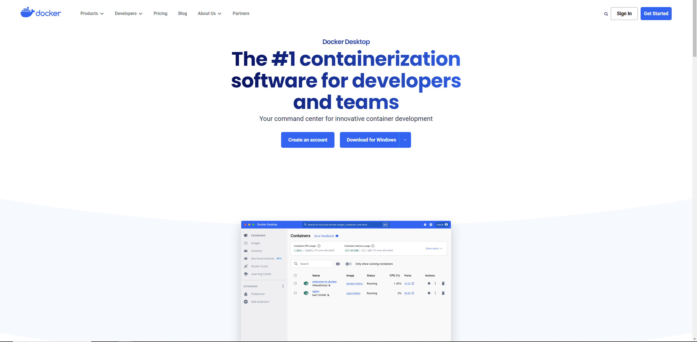{ align=right }

???+ info
    When installing docker from the website, the right version should automatically be selected for your computer.


### Pull synphage image

=== "Docker Desktop"
    1. Open the docker desktop app and go to `Images`.  
    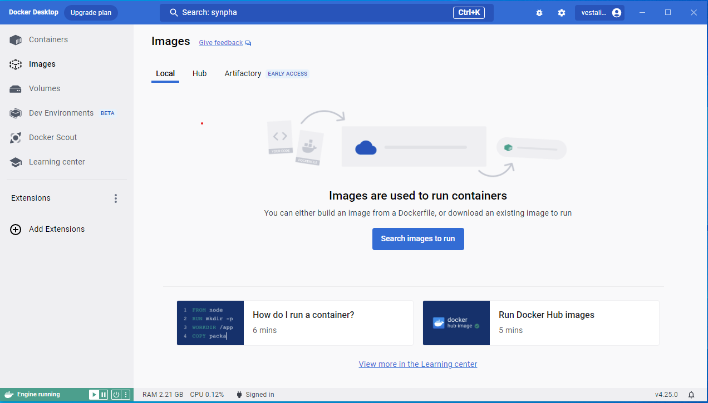{align=right}  

    2. Go to the search bar and search for `synphage`.  
    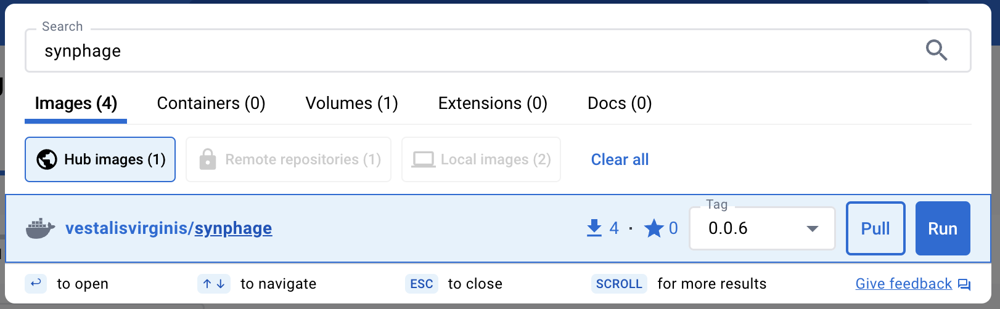{align=right}  

    3. Pull the image (it will automatically select for the latest image (advised)).   

    4. The synphage image is installed
    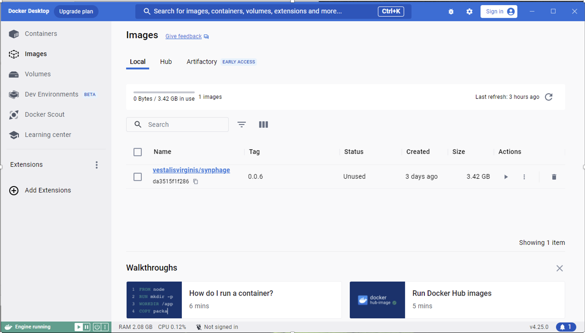{align=right} 

    ???+ note
        Your Dashboard might look a bit different depending on the Docker Desktop version and your OS.
 
=== "Bash"
    ```bash
    # Pull the image from docker hub
    docker pull vestalisvirginis/synphage:latest

    # List installed Docker Images
    docker image ls
    ```
    It will download the latest image. If a former version is desired, reeplace latest by version tag (e.g. `0.0.6`).

<a id="run-synphage-container"></a>
### Run `synphage` container 

=== "Docker Desktop"
    1. Start the container
    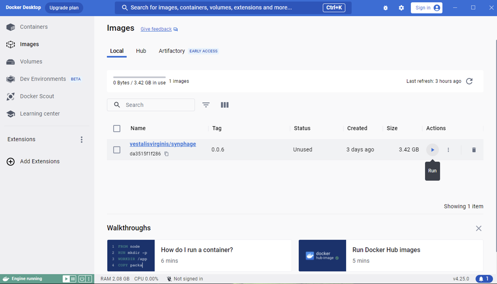{align=right}  

    2. Open the drop-down menu `Optional settings`:  
    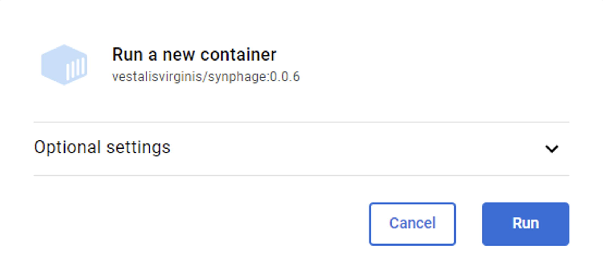{align=right}  

    3. Set the `port` to 3000 (or any other port still available on your computer).  
    Port is the only setting required for running the program, as it uses a web-interface.   
    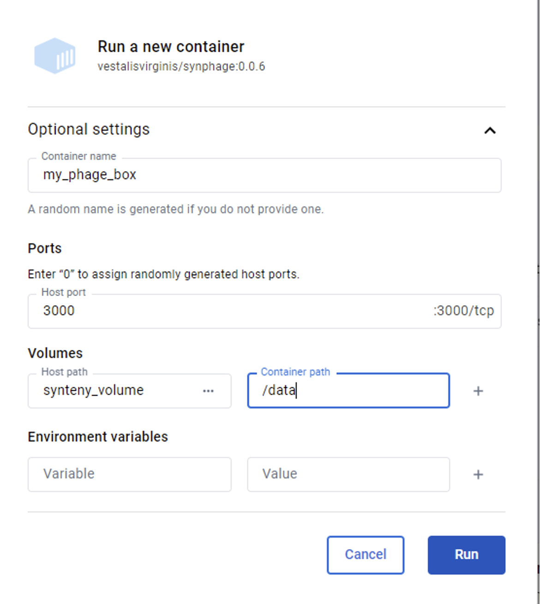{align=right}  

    4. Set `EMAIL` and `API_KEY` environment variables (optional). These variables are only required if you want to use the `NCBI_download` job.
    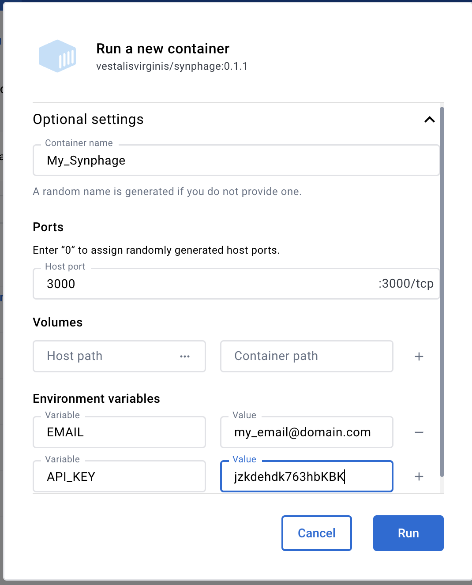{align=right} 

    5. Press the `Run` botton.

    6. In `Containers -> Files` : Drag and drop your genbank files in the `/data/genbank` directory of your running container
    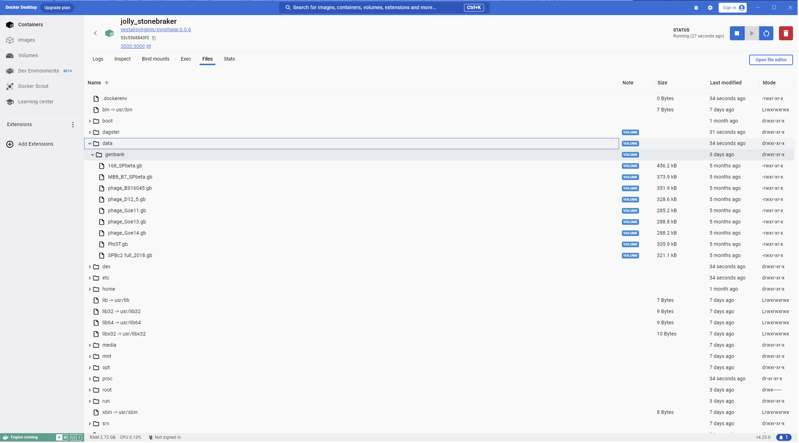{align=right}

        ???+ warning
            The use of spaces and special characters in file names, might cause error downstream.

        ???+ note
            `.gb`and `.gbk` are both valid extension for genbank files

    7. For ploting add a `sequences.csv` file in the /data directory. Please use the file editor of the docker to check that the format of your file is according to the example below:
    ```txt
    168_SPbeta.gb,0
    Phi3T.gb,1
    ```
    Example of incorrectly formatted csv file (can happen when saved from excel):
    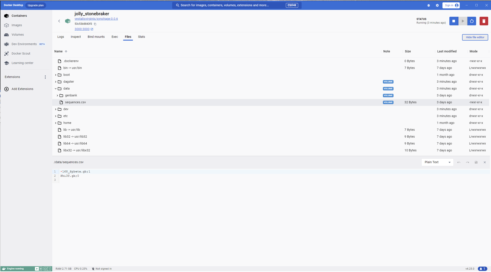{align=right}
    Example of correctly formatted csv file:  
    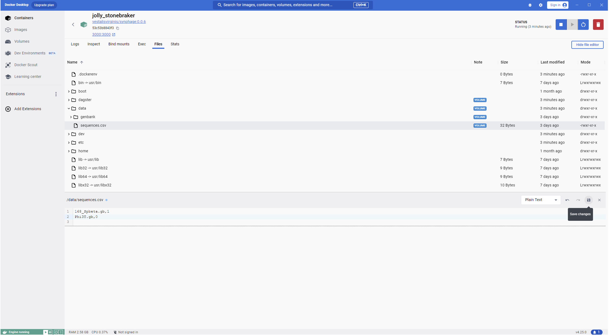{align=right}

        ???+ warning
            Please here use **only** `.gb` as file extension.

        ???+ info
            The integer after the comma represents the orientation of the sequence in the synteny diagram.
            0 : sequence
            1 : reverse

    8. Connect to the web interface
    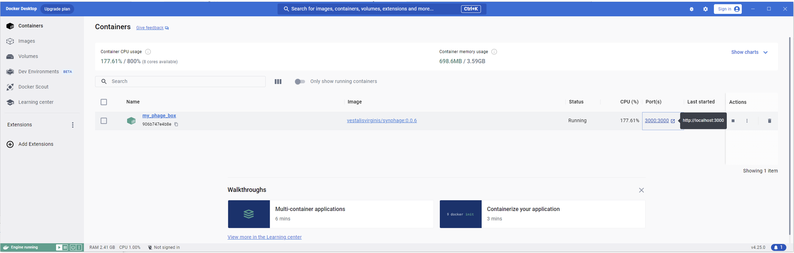 
 
=== "Bash"

    1. Environnment variable 
    Only required if you want to use the `NCBI_download` job.
    The variables can be exported before starting the container or a .env file can be copied into the working directory.

        === "export"
            ```bash
            export EMAIL=john.doe@domain.com
            export API_KEY=gdzjdfzkhlh6832HBkh
            ```

        === ".env file"
            ```text
            EMAIL=john.doe@domain.com
            API_KEY=gdzjdfzkhlh6832HBkh
            ```

        ???+ note
            Dagster will recognise and import environment variable from the .env file automatically.

    
    2. Start the container
    ```bash
    docker run -d --rm --name my_phage_box -p 3000:3000 vestalisvirginis/synphage:latest
    ```

    3. Copy genbank files in the `/data/genbank/` directory of the container
    ```bash
    docker cp path_to_my_gb_files/*.gb container_id:/data/genbank/
    ```

        ???+ warning
            The use of spaces and special characters in file names, might cause error downstream.

        ???+ note
            `.gb`and `.gbk` are both valid extension for genbank files

    4. For ploting add a sequences.csv file in the /data directory. Format your file according to the example below:
    ```txt
    168_SPbeta.gb,0
    Phi3T.gb,1
    ```
    ```bash
    # Create file
    touch sequences.csv
    # Edit file
    vim sequences.csv
    # Copy file to the /data directory
    docker cp path_to_file/sequences.csv /data/
    ```

        ???+ warning
            Please here use **only** `.gb` as file extension.

        ???+ info
            The integer after the comma represents the orientation of the sequence in the synteny diagram.
            0 : sequence
            1 : reverse

    5. Open localhost:3000 in your web-browser.


### Save your data

???+ warning
    Before stopping the container, don't forget to save your data. You can easily download the folder containing the tables and the graph onto your computer.

=== "Docker Desktop"

    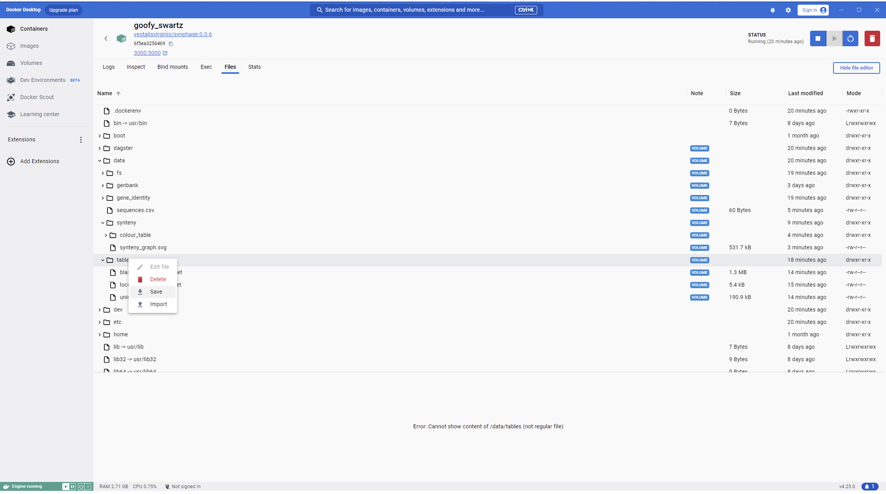{align=right}

=== "Bash"

    ```bash
    docker cp container-id/data/* your_directory/
    ```

### Stop and remove your container:

At the end of your work you can stop and remove your container:

=== "Docker Desktop"
    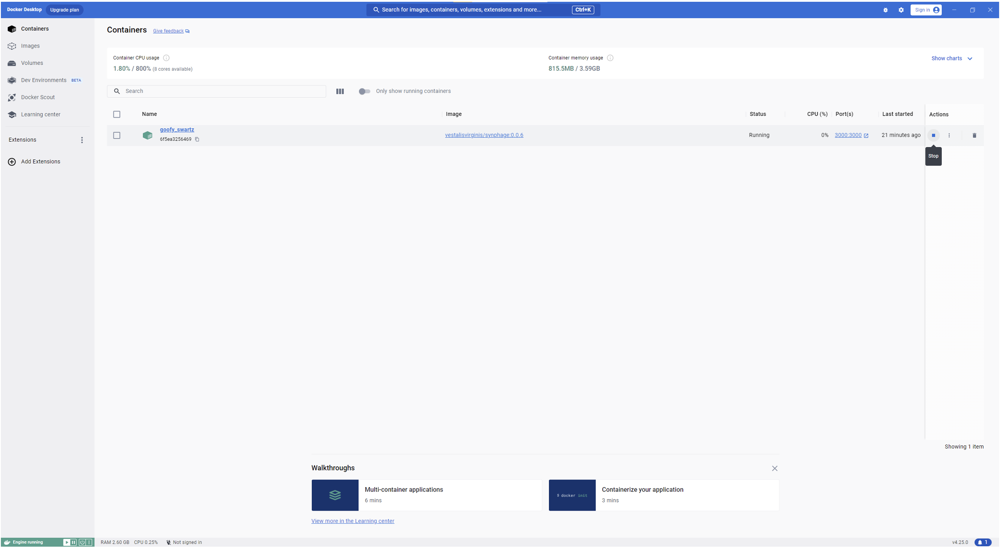 

    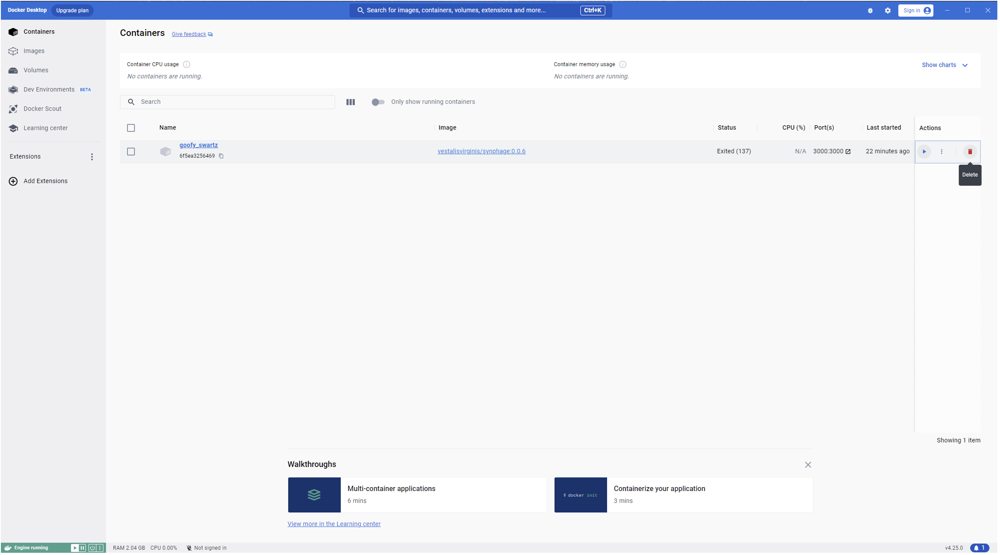 

=== "Bash"

    ```bash
    docker stop <container-id>
    docker rm <container-id>
    ```

### Keep your data

???+ info

    The container has two volumes. 

    `/dagster` : which contain the information linked to the run of the pipeline. In order to keep the information about previous runs when working in the same project, it is advice to connect a volume to it otherwise information will be wiped out when the container is removed.

    `/data` : which contains all the data generated during the run as well as the genbank files and sequences.csv file added by the user.


In order to keep your data and be able to re-use them, for example re-used previously computed sequences and create new plots, you can create `Volumes` to attached to the container.  

=== "Docker Desktop"
    1. Create volume  
        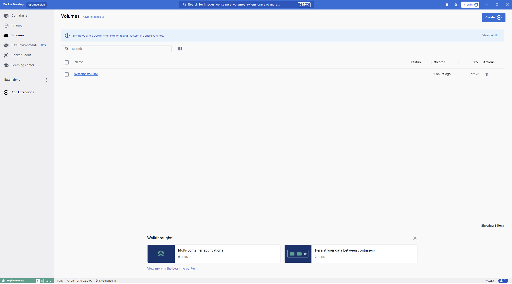 

    2. Connect your volume to the docker volume when starting your container.
     

=== "Bash"

    1. Create volume  
    ``` bash
    docker volume create synphage_volume
    ```
    2. Connect your volume to the docker volume when starting your container.
    ```bash
    docker run -d --rm --name my_phage_box -v synphage_volume:/data -p 3000:3000 vestalisvirginis/synphage:latest
    ```

???+ info

    A volume can also be created for dagster in order to keep a trace of your previous run. In this case the corresponding volume in the container is `/dagster`.