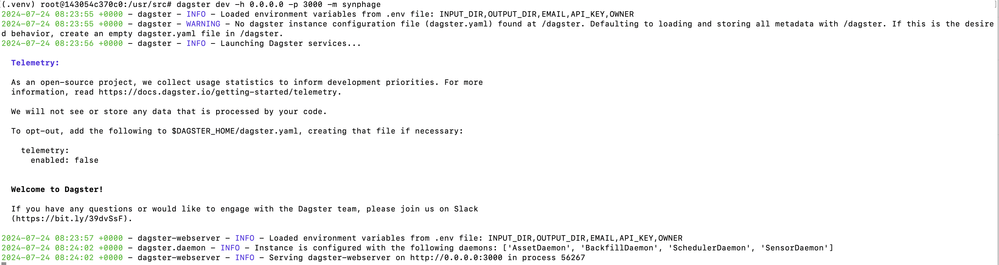

# Installation


## Via pip  <a id="pip-install"></a>

### Requirements
The following dependencies need to be installed in order to run synphage on your system.
 
- `Python 3.11`
- A Python package manager such as `Pip` or `uv`

- [Blast+](https://ftp.ncbi.nlm.nih.gov/blast/executables/blast+/) >= 2.12.0

Install [Python](https://www.python.org/) and [Blast+](https://ftp.ncbi.nlm.nih.gov/blast/executables/blast+/) using your package manager of choice, or by downloading an installer appropriate for your system from [python.org](https://www.python.org/downloads/) and from the [NCBI](https://ftp.ncbi.nlm.nih.gov/blast/executables/blast+/) respectively.  
The Python package manager `pip` is installed by default with Python, however you may need to upgrade pip to the latest version:
``` bash
pip install --upgrade pip
```


### Install `synphage`

`synphage`is available as a [Python package](https://pypi.org/project/synphage/) and can be install with the Python package manager `pip` in an opened terminal window.

=== "Linux/MacOS"
    ``` bash
    # Latest
    pip install synphage
    ```

=== "Windows"
    ``` bash
    # Latest
    python -m pip install synphage
    ```

=== "WSL"
    ``` bash
    # Add example for WSL + video
    ```

This will automatically install compatible versions of all Python dependencies.


### Run `synphage`  <a id="run-synphage-pip"></a>

1. Environment variables

    `synphage` uses the following environment variables:  
        - `INPUT_DIR` : for specifying the path to the folder containing the user's `GenBank files`. If not set, this path will be defaulted to the temp folder. This path can also be modified at run time.  
        - `OUTPUT_DIR`: for specifying the path to the folder where the data generated during the run will be stored. If not set, this path will be defaulted to the temp folder.  
        - `EMAIL` (optional): for connecting to the NCBI database.  
        - `API_KEY` (optional): for connecting to the NCBI database and download files.  
        - `DAGSTER_HOME` (optional): for storing metadata generated during former run of the pipeline

    ???+ info
        - `EMAIL` and `API_KEY` are only required for connecting to the NCBI database and downloading GenBank files. If the user only works with local data, these two variables can be ignored.
        - `DAGSTER_HOME` is only necessary to keep track of the previous run and generated metadata. Does not impair data storage if not set.

    ???+ tip
        These variables can be set with a `.env` file located in your working directory (Dagster will automatically load them from the .env file when initialising the pipeline) or can be passed in the terminal before starting to run synphage: 
        === ":material-file-document-outline: .env"
            ``` .env
            INPUT_DIR=path/to/my/data/
            OUTPUT_DIR=path/to/synphage/data
            EMAIL=user.email@email.com
            API_KEY=UserApiKey
            ```
        === ":octicons-terminal-16: bash"
            ``` bash
            export INPUT_DIR=<path_to_data_folder>
            export OUTPUT_DIR=<path_to_synphage_folder>
            export EMAIL=user.email@email.com
            export API_KEY=UserApiKey
            ```


2. Data Input and Output

    1. Data Input

        The input data are the GenBank files located in the `INPUT_DIR`. However paths to other data location can be passed at run time for loading data from another directory.

        ???+ warning
            - Only a single path can be configured per loading job run.
            - The use of special characters in file names, might causes errors downstream.

        ???+ note
            `.gb`and `.gbk` are both valid extension for genbank files


    2. Data Output

        All output data are located in the `OUTPUT_DIR` set by the user.  
        This directory can be reused in future runs if the user needs to process additional sequences or simply generate additional synteny diagrams. 
        

        ???+ warning
            - If no output directory is set, the data folder will be the temporary folder by default.
            Be aware that the naming convention for the temporary folder (temp/, tmp/, ...) depends on your system.


        ???+ tip
            The current data directory can be checked in the [config panel](jobs.md#dir-config) of the jobs.  


3. Start synphage via dagster web-based interface

    To start synphage run the following command:
    ``` bash
    dagster dev -h 0.0.0.0 -p 3000 -m synphage
    ```

    ???+ tip
        As synphage uses dagster-webserver, -h and -p flags are required to visualise the pipeline in your browser:  
        -h : Host to use for the Dagster webserver  
        -p : Port to use for the Dagster webserver

    To access the webserver, follow the link displayed in your browser or copy/paste it in your web-browser. In this example:
    ``` bash
    http://0.0.0.0:3000
    ```

    <figure markdown="span">
    
    <figcaption>Dagster running form the terminal and link to the webserver</figcaption>
    </figure>


1. Stop synphage

    After completing your work, you can close the web-browser and stop the process running in the terminal with ++ctrl+c++ .


## Via synphage docker image  <a id="docker-install"></a>

### Requirements
The following dependency needs to be installed in order to run synphage Docker Image on your system.

- `Docker` or `Docker Desktop`


=== "Linux"
    - Install [docker desktop](https://www.docker.com/products/docker-desktop/) from the executable.  
    - Check the full documentation for [docker Linux](https://docs.docker.com/desktop/install/linux-install/).  
  
=== "MacOS"
    - Install [docker desktop](https://www.docker.com/products/docker-desktop/) from the executable.  
    - Check the full documentation for [docker Mac](https://docs.docker.com/desktop/install/mac-install/).  

=== "Windows"
    - Install [docker desktop](https://www.docker.com/products/docker-desktop/) from the executable.  
    - Check the full documentation for [docker Windows](https://docs.docker.com/desktop/install/windows-install/).


???+ info
    When installing docker from the website, the right version should automatically be selected for your computer.
    { align=right }


### Pull synphage image

=== ":simple-docker: Docker Desktop"
    1. Open the docker desktop app and go to `Images`.  
        {align=right}  

    2. Go to the search bar and search for `synphage`.  
        {align=right}
        
        ???+ note
            The latest image will automatically be selected - advised

    3. Pull the image.  
        Select `Pull` and wait for the download to complete.

    4. synphage docker image is installed
        {align=right} 

    ???+ note
        Your Dashboard might look a bit different depending on the Docker Desktop version and your OS.
 
=== ":octicons-terminal-16: Bash"
    ```bash
    # Pull the image from docker hub
    docker pull vestalisvirginis/synphage:<tag>

    # Check the list of installed Docker Images
    docker image ls
    ```
    Replace `<tag>` with the [latest image tag](https://hub.docker.com/r/vestalisvirginis/synphage/tags).


### Run `synphage` container  <a id="run-synphage-container"></a>

#### Start the container  

=== ":simple-docker: Docker Desktop"
    1. Start the container
        {align=right}  

    2. Open the drop-down menu `Optional settings`:  
        {width=500}  

    3. Set the `host port` to 3000  
   
        ???+ tip  
            Setting the port is required to run synphage as it uses a web-interface.  
            3000 is given as example, any other `available` port can be used.
  

          {width=500}

        ???+ warning
            Make sure that the port is available and not already in use (by another running container for example).

    4. Set the `Volumes`

        1. Data Output  
            All output data are located in the `/data` directory of the container.  
            The output data can be copied after the run from the /data folder or they can be stored in a `Docker Volume` that can be mounted to a new Docker Container and reused in subsequent run if the user needs to process additional sequences or simply generate additional synteny diagrams.

            {width=500}

        2. Dagster home  
            Metadata generated during the successive runs of the pipeline are stored in `/dagster_home` directory.  
            Setting a `DAGSTER_HOME` Volume is only necessary to keep track of the previous run and generated metadata. It does not impair data storage if not set.  

        ???+ danger
            All the data will be deleted when the container will be removed.
            If no Volume is mounted to the /data directory and the user do not save the data, data will be lost.


    5. Set the environment variables (optional)  
        `synphage` uses the following environment variables:  
        - `EMAIL` (optional): for connecting to the NCBI database.  
        - `API_KEY` (optional): for connecting to the NCBI database and download files.  
        - `DAGSTER_HOME` (optional): for storing metadata generated during former run of the pipeline
         
        {width=500}

        ???+ info
            - `EMAIL` and `API_KEY` are only required for connecting to the NCBI database and downloading GenBank files. If the user only works with local data, these two variables can be ignored.


    6. Press the `Run` botton  
        Your container is now running.


    7. In `Containers -> Files` : Drag and drop your genbank files in the `/data/genbank` directory of your running container
    {align=right}

        ???+ warning
            The use of spaces and special characters in file names, might cause error downstream.

        ???+ note
            `.gb`and `.gbk` are both valid extension for genbank files

    8. For ploting add a `sequences.csv` file in the /data directory. Please use the file editor of the docker to check that the format of your file is according to the example below:
    ```txt
    168_SPbeta.gb,0
    Phi3T.gb,1
    ```
    Example of incorrectly formatted csv file (can happen when saved from excel):
    {align=right}
    Example of correctly formatted csv file:  
    {align=right}

        ???+ warning
            Please here use **only** `.gb` as file extension.

        ???+ info
            The integer after the comma represents the orientation of the sequence in the synteny diagram.
            0 : sequence
            1 : reverse

    9.  Connect to the web interface
     
 
=== ":octicons-terminal-16:  Bash"

    1. Environnment variable 
    Only required if you want to use the `NCBI_download` job.
    The variables can be exported before starting the container or a .env file can be copied into the working directory.

        === "export"
            ```bash
            export EMAIL=john.doe@domain.com
            export API_KEY=gdzjdfzkhlh6832HBkh
            ```

        === ".env file"
            ```text
            EMAIL=john.doe@domain.com
            API_KEY=gdzjdfzkhlh6832HBkh
            ```

        ???+ note
            Dagster will recognise and import environment variable from the .env file automatically.

    
    2. Start the container
    ```bash
    docker run -d --rm --name my_phage_box -p 3000:3000 vestalisvirginis/synphage:latest
    ```

    3. Copy genbank files in the `/data/genbank/` directory of the container
    ```bash
    docker cp path_to_my_gb_files/*.gb container_id:/data/genbank/
    ```

        ???+ warning
            The use of spaces and special characters in file names, might cause error downstream.

        ???+ note
            `.gb`and `.gbk` are both valid extension for genbank files

    4. For ploting add a sequences.csv file in the /data directory. Format your file according to the example below:
    ```txt
    168_SPbeta.gb,0
    Phi3T.gb,1
    ```
    ```bash
    # Create file
    touch sequences.csv
    # Edit file
    vim sequences.csv
    # Copy file to the /data directory
    docker cp path_to_file/sequences.csv /data/
    ```

        ???+ warning
            Please here use **only** `.gb` as file extension.

        ???+ info
            The integer after the comma represents the orientation of the sequence in the synteny diagram.
            0 : sequence
            1 : reverse

    5. Open localhost:3000 in your web-browser.


### Save your data

???+ warning
    Before stopping the container, don't forget to save your data. You can easily download the folder containing the tables and the graph onto your computer.

=== "Docker Desktop"

    {align=right}

=== "Bash"

    ```bash
    docker cp container-id/data/* your_directory/
    ```

### Stop and remove your container:

At the end of your work you can stop and remove your container:

=== "Docker Desktop"
     

     

=== "Bash"

    ```bash
    docker stop <container-id>
    docker rm <container-id>
    ```

### Keep your data

???+ info

    The container has two volumes. 

    `/dagster` : which contain the information linked to the run of the pipeline. In order to keep the information about previous runs when working in the same project, it is advice to connect a volume to it otherwise information will be wiped out when the container is removed.

    `/data` : which contains all the data generated during the run as well as the genbank files and sequences.csv file added by the user.


In order to keep your data and be able to re-use them, for example re-used previously computed sequences and create new plots, you can create `Volumes` to attached to the container.  

=== "Docker Desktop"
    1. Create volume  
         

    2. Connect your volume to the docker volume when starting your container.
     

=== "Bash"

    1. Create volume  
    ``` bash
    docker volume create synphage_volume
    ```
    2. Connect your volume to the docker volume when starting your container.
    ```bash
    docker run -d --rm --name my_phage_box -v synphage_volume:/data -p 3000:3000 vestalisvirginis/synphage:latest
    ```

???+ info

    A volume can also be created for dagster in order to keep a trace of your previous run. In this case the corresponding volume in the container is `/dagster`.