# Navigating `synphage` pipeline

## Pre-requisite  

In order to use the software, the user needs to provide:
- `genbank files` of the genomes to analyse (.gb or .gbk)
- a csv file called `sequences.csv` containing the name and orientation of the sequence to plot (only necessary for the plotting job)

For more information, refer to section: ['Run `synphage`'](installation.md#run-synphage-pip) when using python environment or [`Run `synphage` in container](installation.md#run-synphage-container) when using a docker container.


## Data architecture

The folders and files are organised as follow inside the `data directory`:

```bash
.
├── download/
├── genbank/
├── sequences.csv
├── gene_identity/
│   ├── fasta/
│   ├── blastn_database/
│   └── blastn/
└── tables/ 
│   ├── blastn_summary/
│   ├── locus_and_gene/
│   └── uniqueness/
└── syntenys/ 
│   ├── colour_table/
│   └── synteny_graph.svg
└── fs/ 
```  

## Software structure

### Jobs

The current software is structured in four different jobs.  
 - `blasting_job` : create the blastn of each sequences against each sequences (results -> gene_identity folder)  
 - `transform` : create three tables from the blastn results and genbank files (results -> tables)  
 - `synteny_job` : create the synteny graph (results -> synteny)  
 - `ncbi_download_job` : download genomes to be analysed from the NCBI database (same combinaison of keywords can be used as in the ncbi website)  

???+ note
    Different synteny plots can be generated from the same set of genomes. In this case the two first jobs only need to be run once and the third job (`synteny_job`) can be triggered separately for each graphs.


### Output data

#### Tables 

The tables generated by the software are saved as parquet files. Those files can easily be read with a software such as Tad (https://duckdb.org/docs/archive/0.5.1/guides/data_viewers/tad).


#### Synteny plot  

The synteny plot is generated as `.svg` file and `.png` file, and contains the sequences indicated in the sequences .csv file. The genes are colour-coded according to their abundance (percentage) among the plotted sequences. The cross-links between each consecutive sequence indicates the percentage or similarities between those two sequences.
The `.svg` can be open with a software such as Inkscape (https://inkscape.org) and be further annotated if needed.  


##### Plotting config options  

Field Name | Description | Default Value
 ------- | ----------- | ----
`title` | Generated plot file title | synteny_plot
`colours` | Gene identity colour bar | ["#fde725", "#90d743", "#35b779", "#21918c", "#31688e", "#443983", "#440154"] 
`gradient` | Nucleotide identity colour bar | #B22222
`graph_shape` | Linear or circular representation | linear
`graph_pagesize` | Output document format | A4
`graph_fragments` | Number of fragments | 1
`graph_start` | Sequence start | 1
`graph_end` | Sequence end | length of the longest genome  


#### Genbank file download

The `ncbi_download_job` allow to download sequences of interest into the genbank folder to be subsequently processed by the software. 

##### Requirement  

Connection to the NCBI databases requires user's `email` and `api_key`.
```bash
export EMAIL=user.email@email.com
export API_KEY=UserApiKey
```  

##### Query config options  

Field Name | Description | Default Value
 ------- | ----------- | ----
`search_key` | Keyword(s) for NCBI query | Myoalterovirus
`database` | Database identifier | nuccore  


## How to run the software

After starting starting the container, open the dagster web-interface (https://dagster.io) into the web-browser.

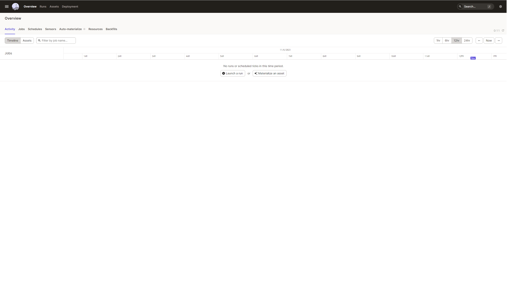 

In order to run the different jobs, hit the `Job` tab. The three job constituing the pipeline will be displayed.

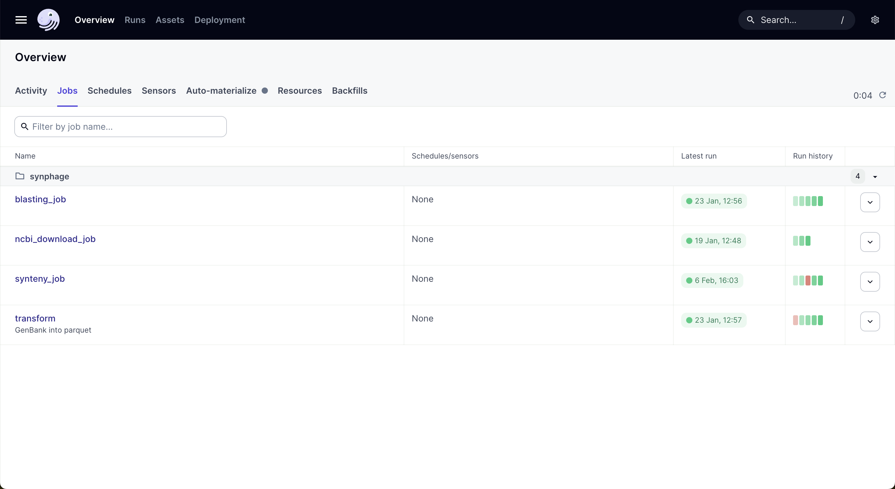 


### Job 1 : blasting job

The first step of the pipeline is to run blastn between each genomes using the blast+ tool from the ncbi (https://doi.org/10.1186/1471-2105-10-421). This job require that sequences have been added to the genbank folder. In order to run the job, hit the rigth up corner botton labelled `Materialize all` .

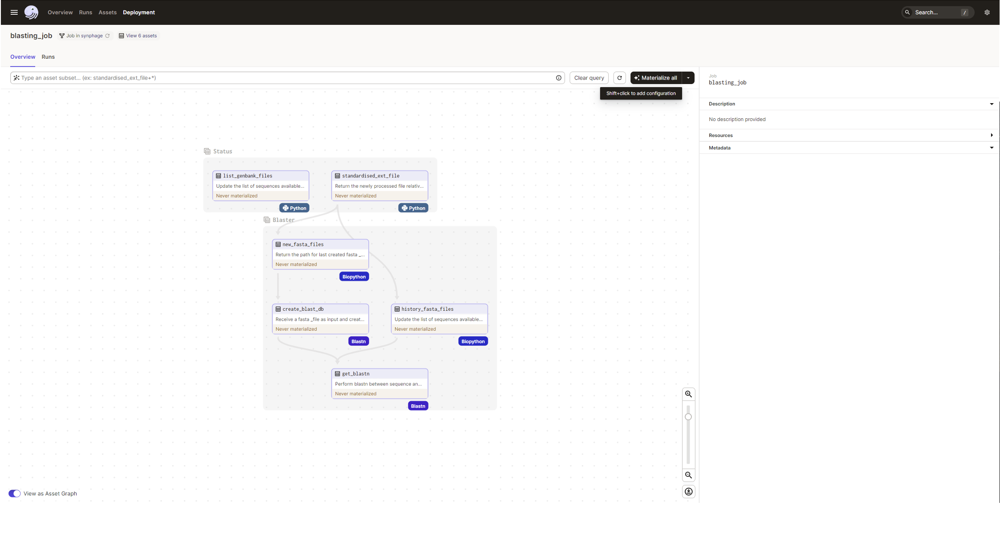 

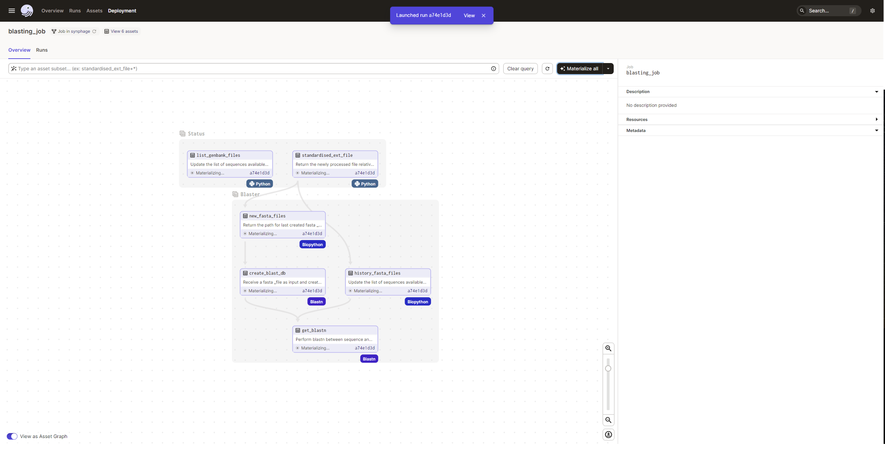 

Once an element is indicated as materialized, metadata related to the job will be available in the rigth panel. See example below, showing the list of the sequence that have been processed. 

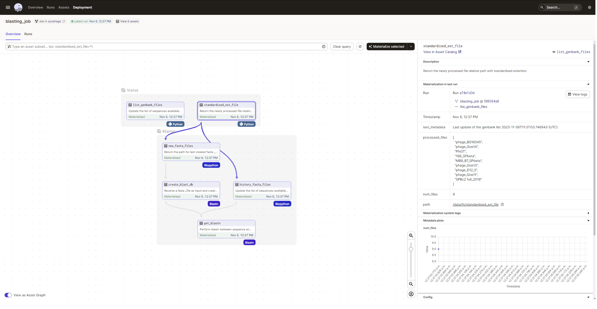 

Once all the assets are materialized, new sequences can be added to the folder and be processed the same way.

### Job 2 : transform job

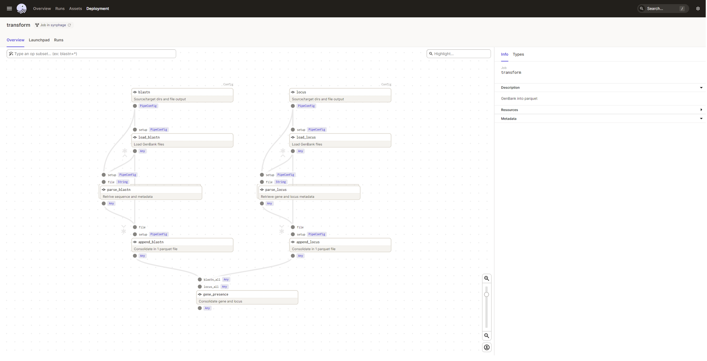 

In order to run the second job, genbank files needs to be present in the genbank folder and the first job needs to have been materialized.  
To run run the job, hit the Launchpad tab and and then the rigth down-corner botton `Launch run`.

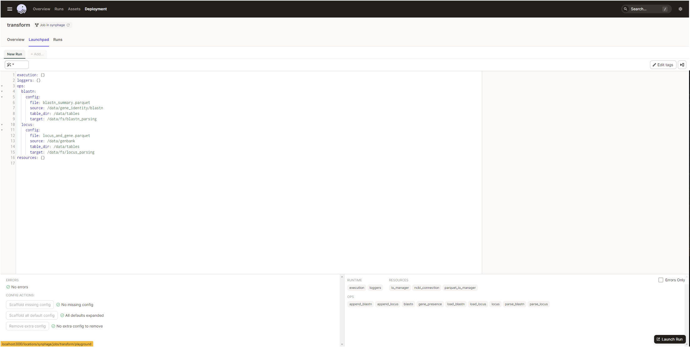 

As previously you can follow the progression of the job.

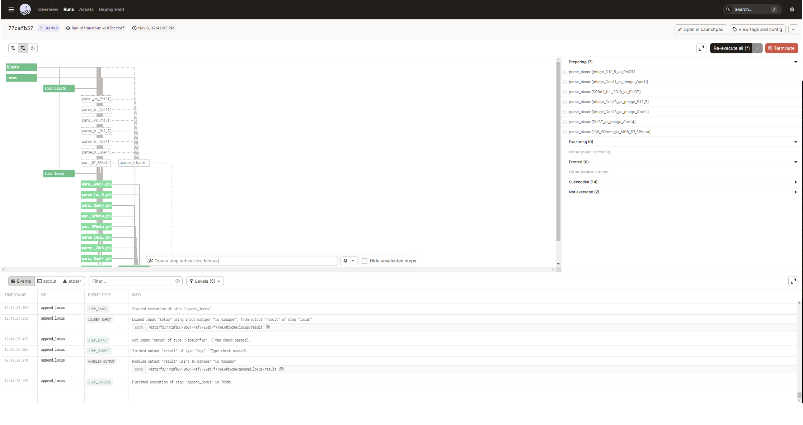 

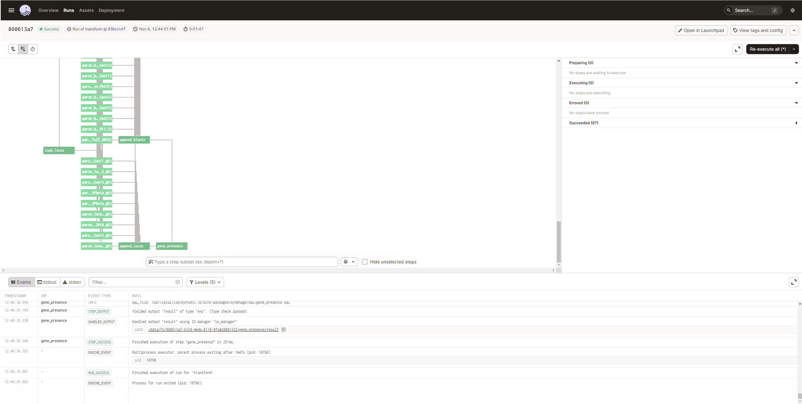 

Job 2 needs to be re-run after Job 1 in order to integrate the new data to the table.


### Job 3 : synteny job

This job requires the genbank files to be available in the genbank folder, that job 1 and 2 have been run on the sequence of interest and that a sequences.csv is present in the /data folder.

As for the first job, this job is triggered by hiting the `Materialize all` botton.

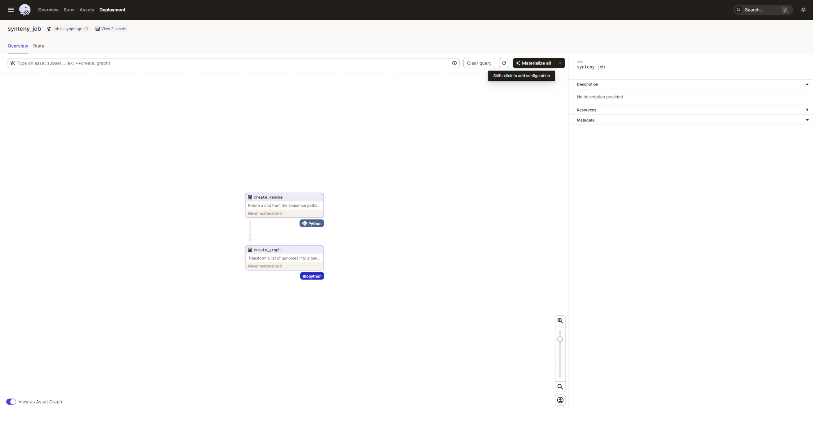 

In the same way as previously, you can follow the progression of the job.

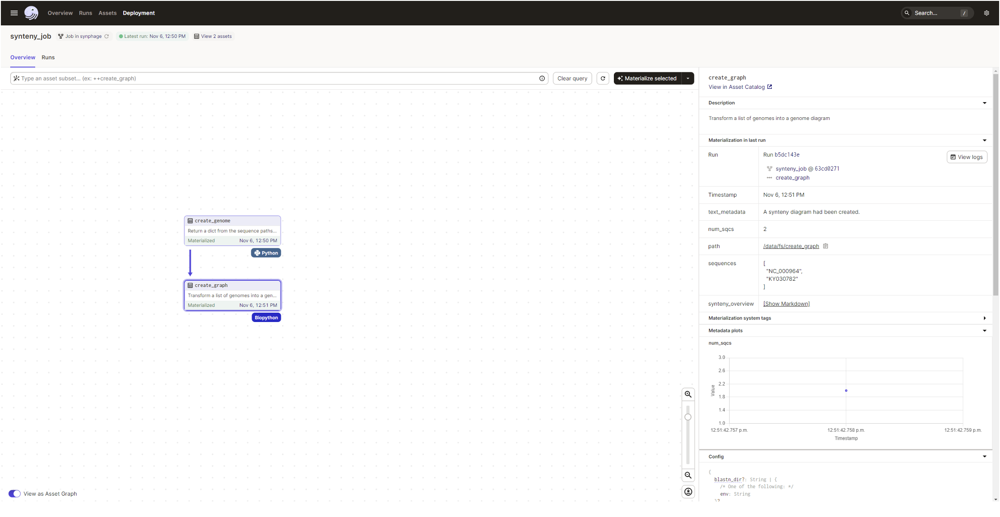 

Metadata for each assets are also available in the rigth panel for each asset. 

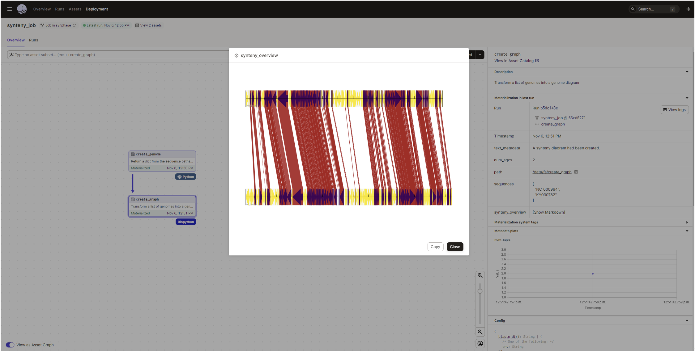 

The `sequences.csv` file can be amended and the job can be run again (2 more sequences were added for the plot):

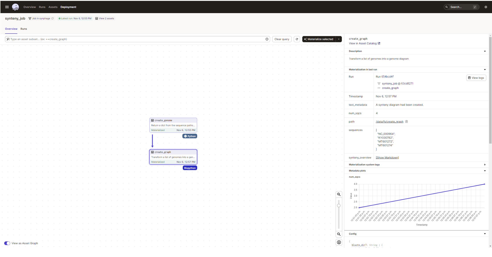 

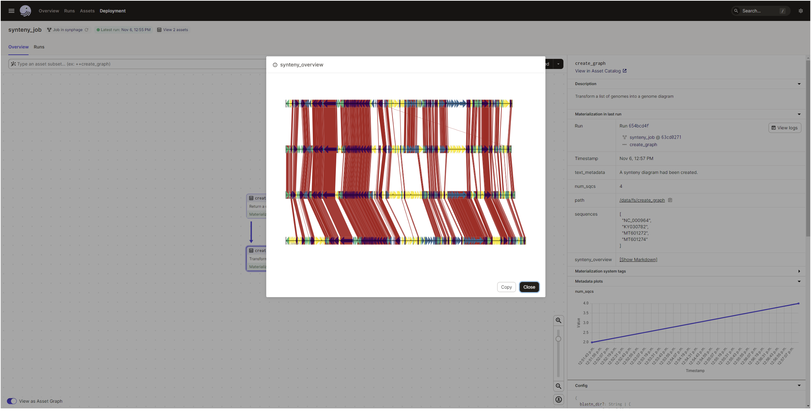 

In order to change the configurations for the graphic, click the arrow on the right side of the `materialise all` botton to access the drop-down menu and select `Open launchpad`.

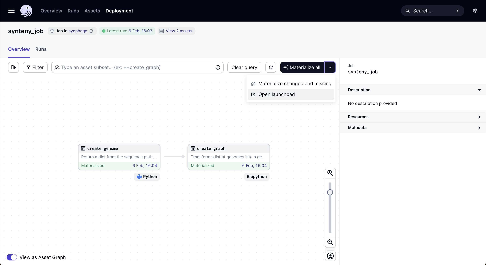 

In the launchpad it is possible to replace any config values by your own configuration. For example, the value for the gradient can be changed from '#B22222' (red brick colour) to '#c0c0c0' (silver grey colour). The list of config options is defined in the 'Synteny plot --> List of config options' sections.

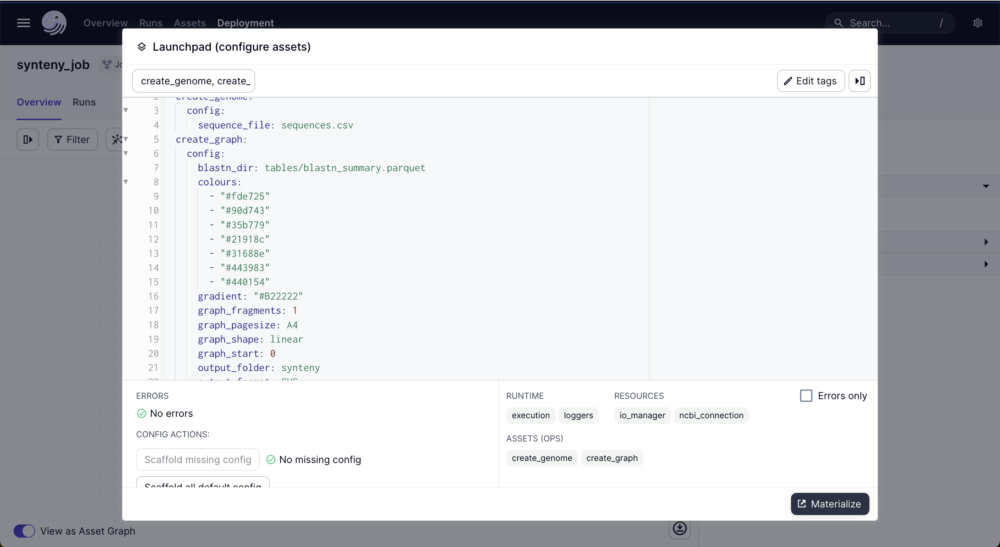 


### Job 4 : NCBI download job  

This job requires to have the `EMAIL` and `API_KEY` environnmental variable set in order to access the NCBI database.  

In order to set your keywords for the NCBI database query, click the arrow on the right side of the `materialise all` botton to access the drop-down menu and select `Open launchpad`.  

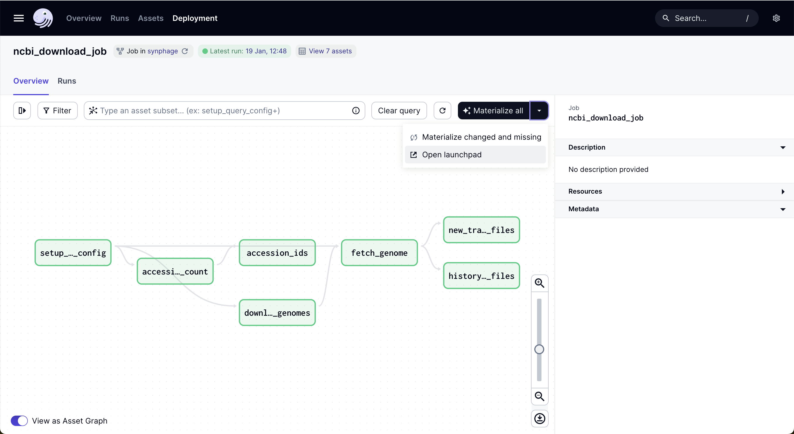  
  
You can then set the `search_key` with your own keywords. Example: "Paenibacillus larvae"[Organism] AND complete genome[Title]  

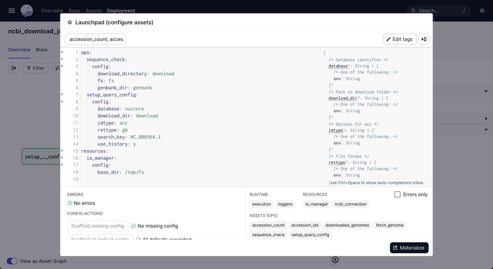  

### Metadata and results of each run

Dagster wil keep track of the job that have been run and of he outcome.

The informations can be found in the `Assets` panel.

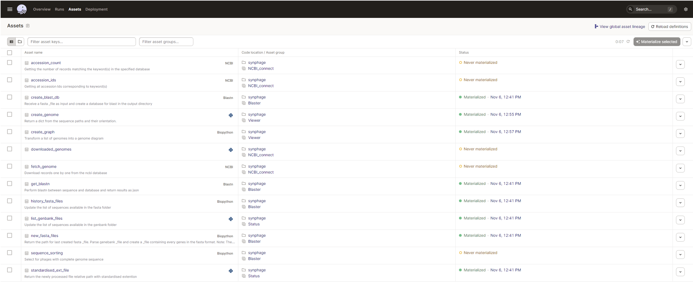 

For each asset, you can review the metadata generated during the run as for the below example regarding the creation of the synteny plot.

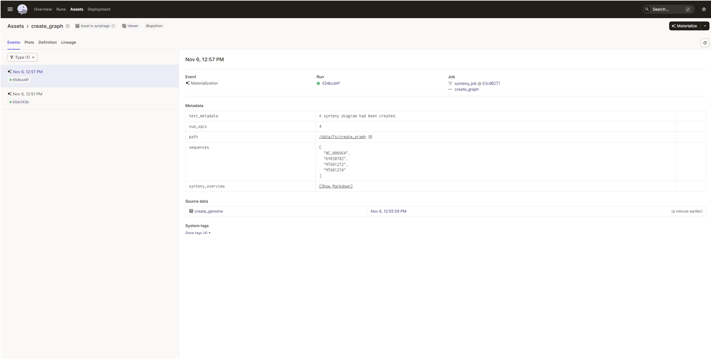  