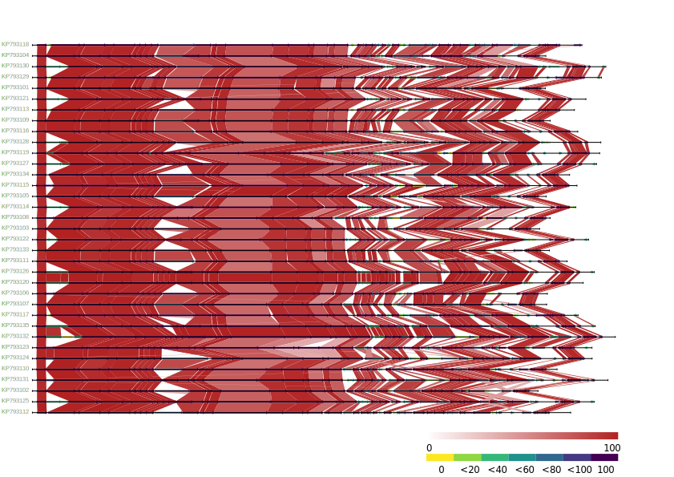

# Synphage output data

All the data generated during synphage runs are stored in the data directory. (see Data Output setup for [pip](installation.md#data_output_pip), [docker desktop](installation.md#data_output_dd) or [docker](installation.md#data_output_docker) users)  

synphage's output consists of four to six main parquet files (depending if blastn and blastp were both executed) and the synteny graphic. However all the data generated by the synphage pipeline are made available in your data directory.


## synphage data architecture  <a id="data_architecture"></a>

The folders and files are organised as follow inside the `data directory`:  

```
.
├── <path_to_synphage_folder>/
│   ├── download/
│   ├── fs/
│   ├── genbank/
│   ├── gene_identity/
│   │   ├── fasta_n/
│   │   ├── blastn_database/
│   │   └── blastn/
│   ├── protein_identity/
│   │   ├── fasta_p/
│   │   ├── blastp_database/
│   │   └── blastp/
│   ├── tables/
│   │   ├── genbank_db.parquet
│   │   ├── processed_genbank_df.parquet
│   │   ├── blastn_summary.parquet
│   │   ├── blastp_summary.parquet
│   │   ├── gene_uniqueness.parquet
│   │   └── protein_uniqueness.parquet
│   ├── sequences.csv
│   └── synteny/
│      ├── colour_table.parquet
│      ├── synteny_graph.png
│      └── synteny_graph.svg
└── ...
```


## Main files  

The most relevant files to the users are located in the `./table` and `./synteny` directory.


### Tables

The `tables` folder contains the four to six main parquet files generated by the pipeline.  
1. `genbank_db.parquet` : original data parsed from the GenBank files.   
2. `processed_genbank_df.parquet` : data processed during the validation step. It contains two additional columns:  
   - `gb_type` : specifying what type of data is used as unique identifier of the coding elements  
   - `key`: unique identifier based on the columns: `filename`, `id` and `locus_tag`  
3. `blastn_summary.parquet` : data parsed from the `blastn` output json files. It contains the collection of the best match for each sequence against each genomes. The percentage of identity between two sequences are then used for calculating the plot cross-links between the sequences.  
4. `blastp_summary.parquet` : data parsed from the `blastp` output json files. It contains the collection of the best match for each sequence against each genomes. The percentage of identity between two sequences are then used for calculating the plot cross-links between the sequences.  
5. `gene_uniqueness.parquet` : combines both `processed_genbank_df.parquet` and `blastn_summary.parquet` in a single parquet file, allowing the user to quickly know how many matches their sequence(s) of interest has/have retrieved. These data are then used to compute the colour code used for the synteny plot. The result of the computation is recorded in the `colour_table.parquet`. This file is over-written between each `plot` run.  
6. `protein_uniqueness.parquet` : combines both `processed_genbank_df.parquet` and `blastp_summary.parquet` in a single parquet file, allowing the user to quickly know how many matches their sequence(s) of interest has/have retrieved. These data are then used to compute the colour code used for the synteny plot. The result of the computation is recorded in the `colour_table.parquet`. This file is over-written between each `plot` run.  


???+ tip "How to read parquet files"
    `parquet` files can be read and manipulated with any DataFrame API of choice, such as [Pandas](https://pandas.pydata.org/), [Apache Spark](https://spark.apache.org/docs/latest/api/python/index.html), [Polars](https://docs.pola.rs/api/python/stable/reference/index.html), [DuckDB](https://duckdb.org/) but also in a non-programmatic manner using softwares such as [Tad](https://www.tadviewer.com/).  


### Synteny

The `synteny` folder contains one parquet file and to graphical outputs.  
1. `colour_table.parquet`: results of the colour-code computation used for the plot. This table is computed for each plot as it is based on the sequences used for plotting the graph.   
2. `synteny_graph`:  is generated as `.svg file` and `.png file`, and contains the sequences indicated in the `sequences.csv` file. The genes are colour-coded according to their abundance (percentage) among the plotted sequences. The cross-links between each consecutive sequence indicates the percentage of similarities between those two sequences.


???+ example "Synteny diagram"
    === "blastn data"
        
    === "blastp data"
        