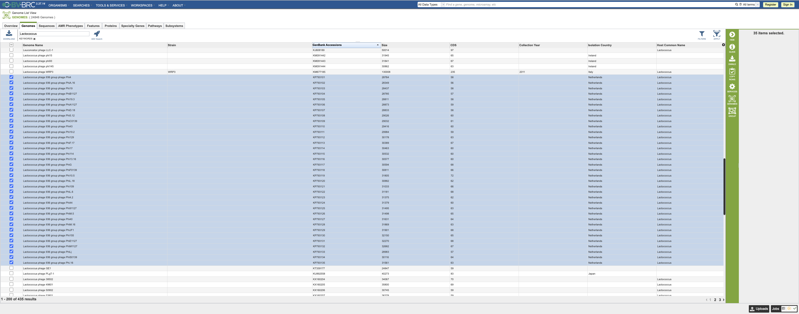
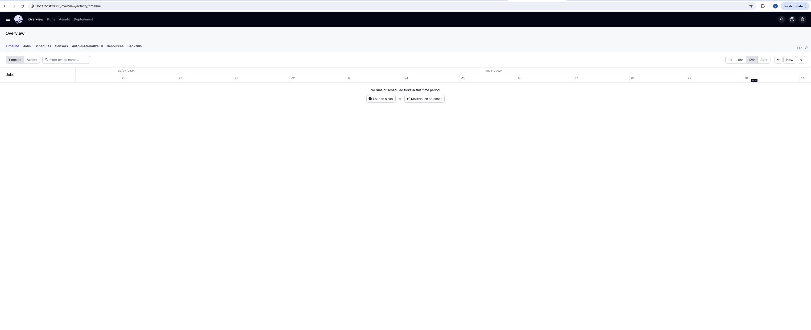

# Synteny diagram of bacteriophage genomes with 'synphage'

For this step-by-step example, a group of closely related Lactococcus phages has been selected based on name from [Bacterial and Viral Bioinformatics Resource Center (BV-BRC)](https://www.bv-brc.org/view/GenomeList/?eq(genome_name,phage)#view_tab=genomes&filter=keyword(Lactococcus)).  

<figure markdown="span">
    
    <figcaption>Selected *Lactococcus* phages for this example</figcaption>
</figure>  

Lactococcus phage genomes can be mosaic and are relevant for the diary industry.  

## Running 'synphage' pipeline  

To get familiar with `synphage` capabilities, you can reproduce the step-by-step example describe below. To get started, go to [step 1](#step1-phage-example).  

*Prerequisite:* you need to have `synphage` installed in a python environment or in a docker container (see [Installation](installation.md#pip-install)) and running. Open the Dagster UI in your browser to get started.
<figure markdown="span">
    
    <figcaption>Dagster UI - landing page</figcaption>
</figure>

### Step 1: Download the data of interest 

Go to Dagster_home -> Jobs -> download.  
<figure markdown="span">
    
    <figcaption>Dagster UI - landing page</figcaption>
</figure>

This job needs to requir e configuration  
To access the configuration window, open the dropdown menu (white arrow on the right of the black box located on the up right corner, labelled Materialize all) and select `Open launchpad`.  
Enter the keywords (Accession names for the genomes previously selected.) to query the NCBI database:  

=== "search_key"
KP793101[Accession] OR KP793102[Accession] OR KP793103[Accession] OR KP793105[Accession] OR KP793104[Accession] OR KP793107[Accession] OR KP793106[Accession] OR KP793108[Accession] OR KP793109[Accession] OR KP793112[Accession] OR KP793114[Accession] OR KP793113[Accession] OR KP793110[Accession] OR KP793115[Accession] OR KP793117[Accession] OR KP793118[Accession] OR KP793122[Accession] OR KP793116[Accession] OR KP793120[Accession] OR KP793121[Accession] OR KP793123[Accession] OR KP793126[Accession] OR KP793127[Accession] OR KP793125[Accession] OR KP793124[Accession] OR KP793128[Accession] OR KP793130[Accession] OR KP793129[Accession] OR KP793132[Accession] OR KP793131[Accession] OR KP793133[Accession] OR KP793135[Accession] OR KP793134[Accession] OR KP793111[Accession] OR KP793119[Accession]

Select `Materialize`, in the right bottom corner.  

(# ref job assets after materialisation)

(# ref metadata example of fetch genome --> number of files and file names)  

### Step 2: Run data quality checks on the dataset

(For more detailed information on this step, check the doc(link to doc))  

Go to Dagster_home -> Jobs -> make_validations.  
(# ref job assets before materialization)
This job runs validation on each of the files that have been downloaded.  

Select `Materialize all` (black box located on the up right corner).  

The first asset shows the results for the checks, for example, for sequence (XXX) --> describes the checks.  
(# ref checks on the asset , + check details)
 
The second asset apply some logic according to the check results to know what features the consider for downstream processing of the data. For example, sequence XXX will be processed as YYY.  
(# ref metadata assets)

The third asset write the transform dataset.  

### Step 3: Run the blast

For this example, blastn was run on the dataset.  

Go to Dagster_home -> Jobs -> make_blastn  
(# ref asset before materialisation)

Select `Materialize all` (black box located on the up right corner).  
(# ref asset after materialisation)

=== "create_fasta_n"
    --8<-- "fasta example.md:name"

=== "create_blast_n_db"
--8<-- "fasta example.md:name"

=== "get_blastn"
--8<-- "json output example.md:name"
=== "transform_blastn"
--8<-- "df example.md:name"

The generated `gene_uniqueness.parquet` file is used to generate the downstream graphic.  
This file can be read and manipulated with any DataFrame API the user choose, such as Pandas (ref), Apache Spark (ref), Polars (ref), DuckDB (ref) but also in a non-programmatic manner using softwares such as Tad (ref).  

### Step 4: Generate the plot

Go to Dagster_home -> Jobs -> make_plot
(# ref asset before materialisation)

This job require some configuration:   
To access the configuration window, open the dropdown menu (white arrow on the right of the black box located on the up right corner, labelled Materialize all) and select `Open launchpad`.  
Change title and blastn   

Select the 'Materialize' botton.   
(# ref asset after materialisation)

Show output graph.  

## Analyse the data

Examples of two queries in the data tables as in the paper figure
- unique genes
- conserved genes with protein_id....

Conclusion

