# Synteny diagram of bacteriophage genomes with 'synphage'

For this step-by-step example, a group of closely related *Lactococcus* 936-type phages has been selected based on name from [Bacterial and Viral Bioinformatics Resource Center (BV-BRC)](https://www.bv-brc.org/view/GenomeList/?eq(genome_name,phage)#view_tab=genomes&filter=keyword(Lactococcus)).  

<figure markdown="span">
    
    <figcaption>Selected *Lactococcus* phages for this example</figcaption>
</figure>  

*Lactococcus* 936-type phages are especially relevant for the [diary industry](https://doi.org/10.1038/srep21345). Genomes of this phage species are known for its mosaic architecture i.e., they carry genes or segments from distinct evolutionary origins, likely acquired by recombination. In this example, unique and conserved genes and proteins will be highlighted within this phage group, based on analysis of 35 genomes.  


## Running 'synphage' pipeline  

To get familiar with `synphage` capabilities, you can reproduce the step-by-step example described below. To get started, go to [step 1](#step1-phage-example).  

???+ success "*Prerequisite:*"
    You need to have `synphage` installed in a python environment or in a docker container or to have pulled synphage docker image. Start synphage and open the Dagster UI in your browser to get started.  
    === "venv"
        ``` bash
        pip install synphage
        dagster dev -h 0.0.0.0 -p 3000 -m synphage
        ```
        For more details, see [installation instruction](https://vestalisvirginis.github.io/synphage/installation/#via-pip) or [how to run the software](https://vestalisvirginis.github.io/synphage/installation/#pull-synphage-image).
    === "docker"
        ``` bash
        docker pull vestalisvirginis/synphage:<tag>
        docker run --rm --name my-synphage-container -p 3000 vestalisvirginis/synphage:<tag>
        ```
        For more details, see [installation instruction](https://vestalisvirginis.github.io/synphage/installation/#via-docker) or [how to run the software](https://vestalisvirginis.github.io/synphage/installation/#pull-synphage-image).
    === "Docker Desktop"
        <iframe width="560" height="315"
        src="http://0.0.0.0:8000/synphage/images/phages/docker_desktop_movie.mp4" 
        frameborder="0" 
        allow="accelerometer; autoplay; encrypted-media; gyroscope; picture-in-picture" 
        allowfullscreen></iframe>  
        For more details, see [installation instruction](https://vestalisvirginis.github.io/synphage/installation/#via-docker) or [how to run the software](https://vestalisvirginis.github.io/synphage/installation/#pull-synphage-image).


<figure markdown="span">
    
    <figcaption>Dagster UI - landing page</figcaption>
</figure>


### Step 1: Download the data of interest <a id="step1-phage-example"></a>

Go to 
{ width="50"}
{ width="50"} Dagster_home -> Jobs -> download.  

<iframe width="560" height="315"
src="http://0.0.0.0:8000/synphage/images/phages/job_1.webm" 
frameborder="0" 
allow="accelerometer; autoplay; encrypted-media; gyroscope; picture-in-picture" 
allowfullscreen></iframe>

<figure markdown="span">
    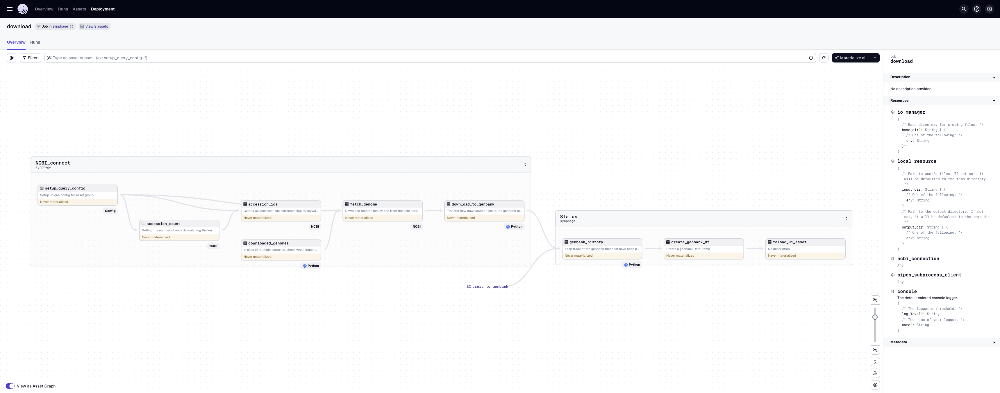
    <figcaption>Overview of the download job</figcaption>
</figure>


???+ info
    A warning message will pop-up. Select `Confirm`. This will not impact the smooth run of the download job.
    <figure markdown="span">
        { width="200"}
        <figcaption>Warning message - Download job</figcaption>
    </figure> 

In order to query our genomes of interest, we need to pass a query to the `search-key` in the configuration panel.  
To access the configuration window, open the dropdown menu (white arrow on the right of the black box located on the up right corner, labelled `Materialize all`) and select `Open launchpad`.  
<figure markdown="span">
    { width="200"}
    <figcaption>Access the lauchpad to the job configuration</figcaption>
</figure>

Configure the `search_key` parameter, changing the default value with the following keywords (Accession names for the genomes previously selected in this case) to query the NCBI database:  

=== "search_key"
    ``` bash
    KP793101[Accession] OR KP793102[Accession] OR KP793103[Accession] OR KP793105[Accession] OR KP793104[Accession] OR KP793107[Accession] OR KP793106[Accession] OR KP793108[Accession] OR KP793109[Accession] OR KP793112[Accession] OR KP793114[Accession] OR KP793113[Accession] OR KP793110[Accession] OR KP793115[Accession] OR KP793117[Accession] OR KP793118[Accession] OR KP793122[Accession] OR KP793116[Accession] OR KP793120[Accession] OR KP793121[Accession] OR KP793123[Accession] OR KP793126[Accession] OR KP793127[Accession] OR KP793125[Accession] OR KP793124[Accession] OR KP793128[Accession] OR KP793130[Accession] OR KP793129[Accession] OR KP793132[Accession] OR KP793131[Accession] OR KP793133[Accession] OR KP793135[Accession] OR KP793134[Accession] OR KP793111[Accession] OR KP793119[Accession]
    ```

<figure markdown="span">
    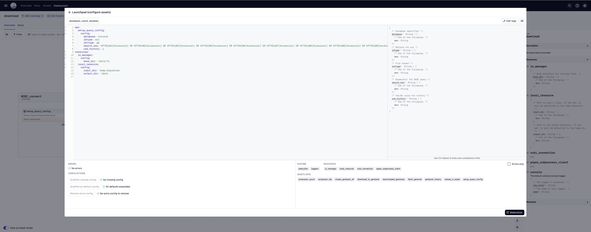
    <figcaption>Configuration panel - Download job</figcaption>
</figure>

Select `Materialize`, in the right bottom corner.  

Most of the assets provides metadata after successful complition of the run. These metadata allow the user to easily follow the smooth execution of the job.
<figure markdown="span">
    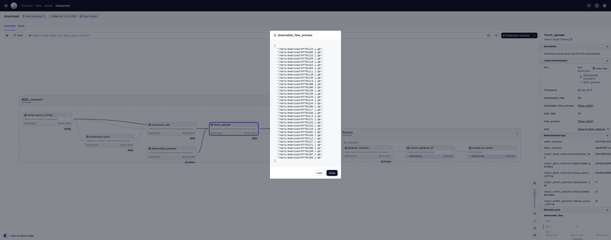
    <figcaption>Example of metadata provided for the `fetch_genome` asset. After complition the user can see the number and the name of GenBank files that have been downloaded.</figcaption>
</figure>

When the job finishes its execution, we can move to `step 2` to run the validation on the data.
<figure markdown="span">
    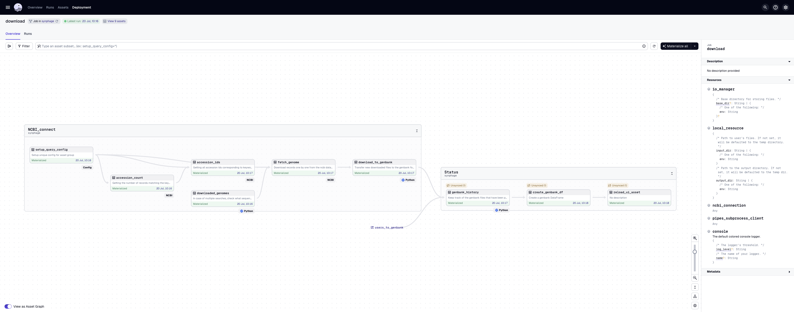
    <figcaption>Job is terminated</figcaption>
</figure>


### Step 2: Run data quality checks on the dataset

???+ note
    For more detailed information on this step, check the [Validation](jobs.md#step2-validation-job).  

Go to Dagster_home -> Jobs -> make_validations.  
<figure markdown="span">
    
    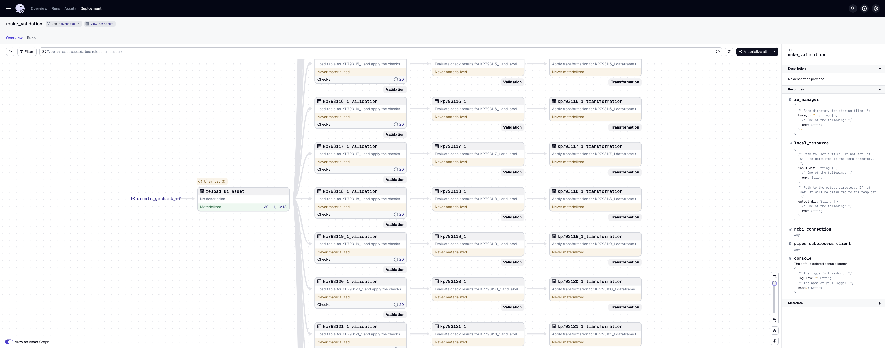
    <figcaption>Zoom In </figcaption>
    <figcaption>Overview of the validation job</figcaption>
</figure>

Select `Materialize all` (black box located on the up right corner).

This job runs checks on each of the files that have been downloaded. The number of checks that pass or fail is directly visible on the assets and reflects how complete each dataset is.
The result table for the checks is available in the metadata panel and the detailed results for the checks can be accessed either from the right panel under `Checks -> View all check details` or by selecting the asset and then the `Checks` tab.  

<figure markdown="span">
    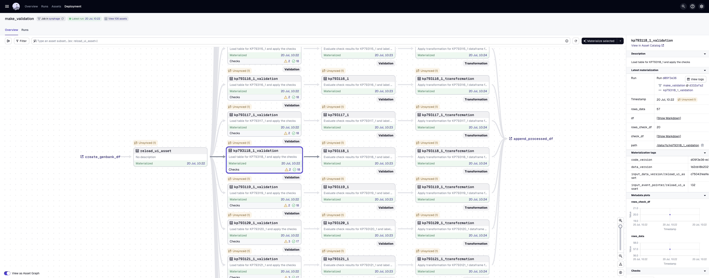
    <figcaption>The assets display the number of failed and passed checks.</figcaption>
    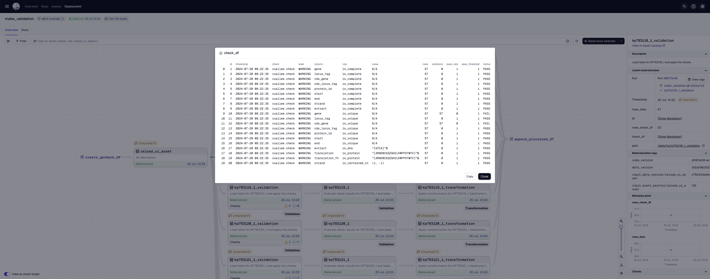
    <figcaption>Result table for the check, accessible from the metadata panel.</figcaption>
    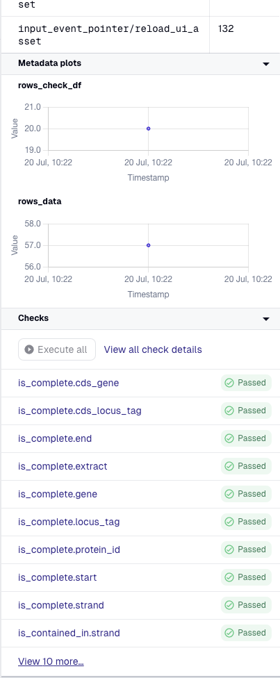
    <figcaption>Check results are accessible via the right panel.</figcaption>
    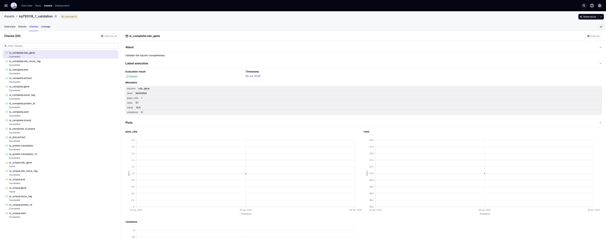
    <figcaption>Full asset check results.</figcaption>
</figure>

The metadata attached to the second step of the validation inform the user about the logic applied to file processing in later steps, more precisely what feature type the software will be using for downstream processing and what attribute will be used as unique identifier for the coding genes.
<figure markdown="span">
    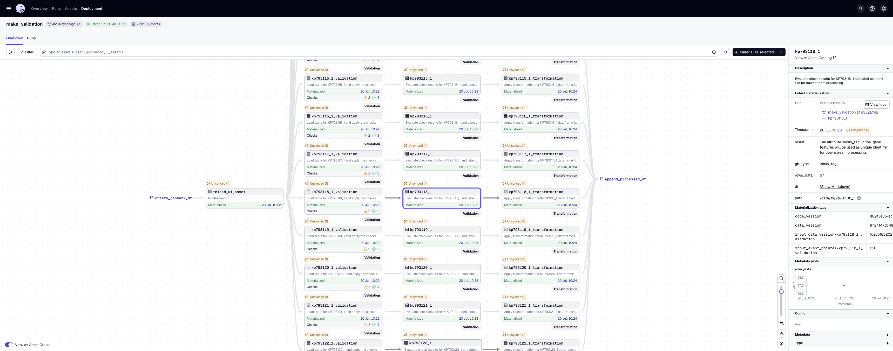
    <figcaption>Step 2 of the validation with metadata.</figcaption>
</figure>

The metadata attached to the last step of the validation, render an overview of the transformed data.
<figure markdown="span">
    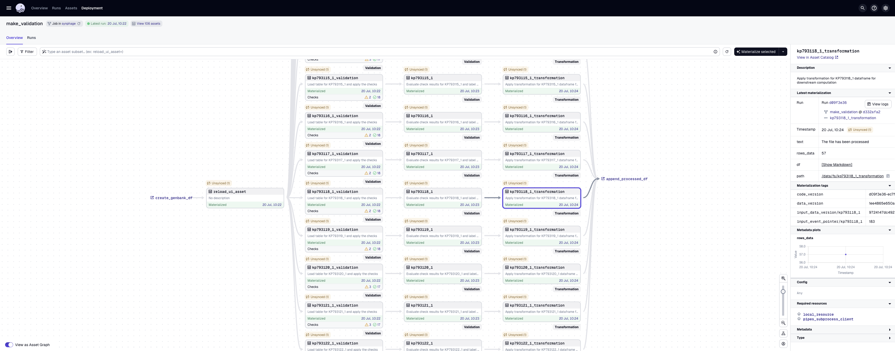
    <figcaption>Step 3 of the validation with metadata.</figcaption>
</figure>  


### Step 3: Run the blast

For this example, blastn was run on the dataset.  

Go to Dagster_home -> Jobs -> make_blastn  
<figure markdown="span">
    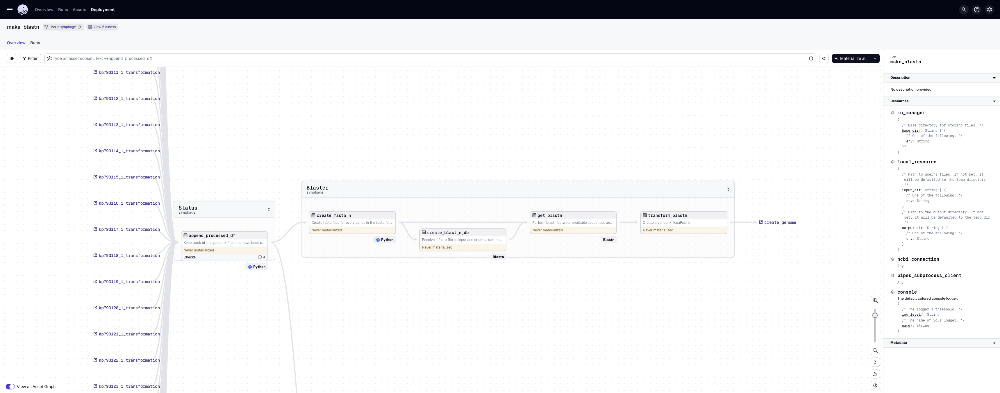
    <figcaption>Overview of the blastn job</figcaption>
</figure>  

Select `Materialize all` (black box located on the up right corner). 

<figure markdown="span">
    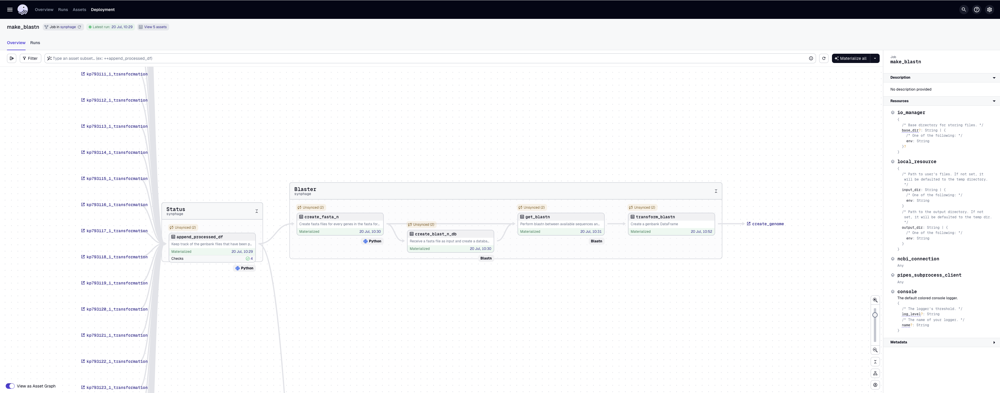
    <figcaption>Completed job</figcaption>
</figure> 

Checks are run at the beginning of the job to verify that the keys and identifiers used for each of the coding element are unique over all the sequences.
<figure markdown="span">
    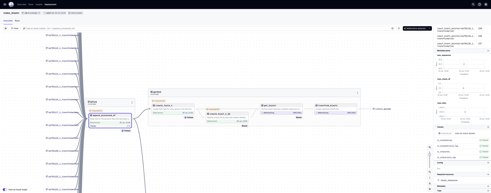
    <figcaption>The checks confirm the uniqueness of the chosen identifier for each of the coding elements.</figcaption>
</figure> 

Several file types are generated during this step. An sample is presented below.

=== "create_fasta_n"
    ``` title="KP793103_1.fna"
    --8<-- "KP793103_1.fna::7"
    ```

=== "create_blast_n_db"
    ``` title="KP793103_1"
    KP793103_1.ndb
    KP793103_1.nhr
    KP793103_1.nim
    KP793103_1.not
    KP793103_1.nsq
    KP793103_1.ntf
    KP793103_1.nto
    ```

=== "get_blastn"
    ``` title="KP793103_1_vs_KP793107_1"
    --8<-- "KP793103_1_vs_KP793107_1:19:51"
    ```

=== "transform_blastn"
    **``` KP793103_1_vs_KP793107_1.parquet ```**  
              
    | search_target                                           | query_id   |            query_key |   query_len |   number_of_hits |            source_key |   num |   bit_score |   score |       evalue |   identity |   query_from |   query_to | query_strand   |   hit_from |   hit_to | hit_strand   |   align_len |   gaps |   percentage_of_identity |
    |:--------------------------------------------------------|:-----------|---------------------:|------------:|-----------------:|----------------------:|------:|------------:|--------:|-------------:|-----------:|-------------:|-----------:|:---------------|-----------:|---------:|:-------------|------------:|-------:|-------------------------:|
    | {"db":"/data/gene_identity/blastn_database/KP793107_1"} | Query_1    |  9338265281086248732 |         525 |                1 |  7763576513298070802  |     1 |     821.033 |     444 | 0            |        498 |            1 |        525 | Plus           |          1 |      525 | Plus         |         525 |      0 |                   94.857 |
    | {"db":"/data/gene_identity/blastn_database/KP793107_1"} | Query_2    | 16784793607745071823 |        1623 |                1 |  5312076624733181123  |     1 |    2366.68  |    1281 | 0            |       1509 |            1 |       1623 | Plus           |          1 |     1623 | Plus         |        1623 |      0 |                   92.976 |
    | {"db":"/data/gene_identity/blastn_database/KP793107_1"} | Query_3    | 10311725312318426547 |         285 |                1 | 17285202555729306767  |     1 |     433.236 |     234 | 2.63096e-124 |        268 |            1 |        285 | Plus           |          1 |      285 | Plus         |         285 |      0 |                   94.035 |
    | {"db":"/data/gene_identity/blastn_database/KP793107_1"} | Query_4    | 16833909307678177342 |        1137 |                1 | 12431818248849801861  |     1 |    1945.64  |    1053 | 0            |       1109 |            1 |       1137 | Plus           |          1 |     1137 | Plus         |        1137 |      0 |                   97.537 |
    | {"db":"/data/gene_identity/blastn_database/KP793107_1"} | Query_5    |  7716253111867132591 |         537 |                1 |  6258967671276254993  |     1 |     931.832 |     504 | 0            |        526 |            1 |        537 | Plus           |          1 |      537 | Plus         |         537 |      0 |                   97.952 |

=== "unified_dataframe"
    **```gene_uniqueness.parquet```** 

    |    | query_cds_gene   | query_cds_locus_tag   | query_protein_id   | query_function   | query_product                | query_translation                                                                                                                                                                                                                                                                                                                                                                                                                                                                                                                                                                                                                                                                                                                                                                                                                                                                                                                                    |   query_transl_table |   query_codon_start |   query_start_sequence |   query_end_sequence |   query_strand | query_cds_extract                                                                                                                                                                                                                                                                                                                                                                                                                                                                                                                                                                                                                                                                                                                                                                                                                                                                                                                                                                                                                                                                                                                                                                                                                                                                                                                                                                                                                                                                                                                                                                                                                                                                                                                                                                                                                                                                                                                                                                                                                                                                                                                                                                                                                                                                                                                                                                                                                                                                                                                                                                                                                                                                                                                                                                                                                                               | query_gene   | query_locus_tag   | query_extract                                                                                                                                                                                                                                                                                                                                                                                                                                                                                                                                                                                                                                                                                                                                                                                                                                                                                                                                                                                                                                                                                                                                                                                                                                                                                                                                                                                                                                                                                                                                                                                                                                                                                                                                                                                                                                                                                                                                                                                                                                                                                                                                                                                                                                                                                                                                                                                                                                                                                                                                                                                                                                                                                                                                                                                                                                                   | query_translation_fn                                                                                                                                                                                                                                                                                                                                                                                                                                                                                                                                                                                                                                                                                                                                                                                                                                                                                                                                 | query_id   | query_name   | query_description                                       | query_topology   | query_organism                         | query_taxonomy                                                             | query_filename              | query_gb_type   |            query_key |   query_len |            source_key |   query_from |   query_to |   percentage_of_identity | source_cds_gene   | source_cds_locus_tag   | source_protein_id   | source_function   | source_product           | source_translation                                                                                                                                                                                                                                                                                                                                                                                                                                                                                                                                                                                                                                                                                                                                                                                                                                                                                                                                   |   source_transl_table |   source_codon_start |   source_start_sequence |   source_end_sequence |   source_strand | source_cds_extract                                                                                                                                                                                                                                                                                                                                                                                                                                                                                                                                                                                                                                                                                                                                                                                                                                                                                                                                                                                                                                                                                                                                                                                                                                                                                                                                                                                                                                                                                                                                                                                                                                                                                                                                                                                                                                                                                                                                                                                                                                                                                                                                                                                                                                                                                                                                                                                                                                                                                                                                                                                                                                                                                                                                                                                                                                              | source_gene   | source_locus_tag   | source_extract                                                                                                                                                                                                                                                                                                                                                                                                                                                                                                                                                                                                                                                                                                                                                                                                                                                                                                                                                                                                                                                                                                                                                                                                                                                                                                                                                                                                                                                                                                                                                                                                                                                                                                                                                                                                                                                                                                                                                                                                                                                                                                                                                                                                                                                                                                                                                                                                                                                                                                                                                                                                                                                                                                                                                                                                                                                  | source_translation_fn                                                                                                                                                                                                                                                                                                                                                                                                                                                                                                                                                                                                                                                                                                                                                                                                                                                                                                                                | source_id   | source_name   | source_description                                         | source_topology   | source_organism                           | source_taxonomy                                                            | source_filename             | source_gb_type   |
    |---:|:-----------------|:----------------------|:-------------------|:-----------------|:-----------------------------|:-----------------------------------------------------------------------------------------------------------------------------------------------------------------------------------------------------------------------------------------------------------------------------------------------------------------------------------------------------------------------------------------------------------------------------------------------------------------------------------------------------------------------------------------------------------------------------------------------------------------------------------------------------------------------------------------------------------------------------------------------------------------------------------------------------------------------------------------------------------------------------------------------------------------------------------------------------|---------------------:|--------------------:|-----------------------:|---------------------:|---------------:|:----------------------------------------------------------------------------------------------------------------------------------------------------------------------------------------------------------------------------------------------------------------------------------------------------------------------------------------------------------------------------------------------------------------------------------------------------------------------------------------------------------------------------------------------------------------------------------------------------------------------------------------------------------------------------------------------------------------------------------------------------------------------------------------------------------------------------------------------------------------------------------------------------------------------------------------------------------------------------------------------------------------------------------------------------------------------------------------------------------------------------------------------------------------------------------------------------------------------------------------------------------------------------------------------------------------------------------------------------------------------------------------------------------------------------------------------------------------------------------------------------------------------------------------------------------------------------------------------------------------------------------------------------------------------------------------------------------------------------------------------------------------------------------------------------------------------------------------------------------------------------------------------------------------------------------------------------------------------------------------------------------------------------------------------------------------------------------------------------------------------------------------------------------------------------------------------------------------------------------------------------------------------------------------------------------------------------------------------------------------------------------------------------------------------------------------------------------------------------------------------------------------------------------------------------------------------------------------------------------------------------------------------------------------------------------------------------------------------------------------------------------------------------------------------------------------------------------------------------------------|:-------------|:------------------|:----------------------------------------------------------------------------------------------------------------------------------------------------------------------------------------------------------------------------------------------------------------------------------------------------------------------------------------------------------------------------------------------------------------------------------------------------------------------------------------------------------------------------------------------------------------------------------------------------------------------------------------------------------------------------------------------------------------------------------------------------------------------------------------------------------------------------------------------------------------------------------------------------------------------------------------------------------------------------------------------------------------------------------------------------------------------------------------------------------------------------------------------------------------------------------------------------------------------------------------------------------------------------------------------------------------------------------------------------------------------------------------------------------------------------------------------------------------------------------------------------------------------------------------------------------------------------------------------------------------------------------------------------------------------------------------------------------------------------------------------------------------------------------------------------------------------------------------------------------------------------------------------------------------------------------------------------------------------------------------------------------------------------------------------------------------------------------------------------------------------------------------------------------------------------------------------------------------------------------------------------------------------------------------------------------------------------------------------------------------------------------------------------------------------------------------------------------------------------------------------------------------------------------------------------------------------------------------------------------------------------------------------------------------------------------------------------------------------------------------------------------------------------------------------------------------------------------------------------------------|:-----------------------------------------------------------------------------------------------------------------------------------------------------------------------------------------------------------------------------------------------------------------------------------------------------------------------------------------------------------------------------------------------------------------------------------------------------------------------------------------------------------------------------------------------------------------------------------------------------------------------------------------------------------------------------------------------------------------------------------------------------------------------------------------------------------------------------------------------------------------------------------------------------------------------------------------------------|:-----------|:-------------|:--------------------------------------------------------|:-----------------|:---------------------------------------|:---------------------------------------------------------------------------|:----------------------------|:----------------|---------------------:|------------:|----------------------:|-------------:|-----------:|-------------------------:|:------------------|:-----------------------|:--------------------|:------------------|:-------------------------|:-----------------------------------------------------------------------------------------------------------------------------------------------------------------------------------------------------------------------------------------------------------------------------------------------------------------------------------------------------------------------------------------------------------------------------------------------------------------------------------------------------------------------------------------------------------------------------------------------------------------------------------------------------------------------------------------------------------------------------------------------------------------------------------------------------------------------------------------------------------------------------------------------------------------------------------------------------|----------------------:|---------------------:|------------------------:|----------------------:|----------------:|:----------------------------------------------------------------------------------------------------------------------------------------------------------------------------------------------------------------------------------------------------------------------------------------------------------------------------------------------------------------------------------------------------------------------------------------------------------------------------------------------------------------------------------------------------------------------------------------------------------------------------------------------------------------------------------------------------------------------------------------------------------------------------------------------------------------------------------------------------------------------------------------------------------------------------------------------------------------------------------------------------------------------------------------------------------------------------------------------------------------------------------------------------------------------------------------------------------------------------------------------------------------------------------------------------------------------------------------------------------------------------------------------------------------------------------------------------------------------------------------------------------------------------------------------------------------------------------------------------------------------------------------------------------------------------------------------------------------------------------------------------------------------------------------------------------------------------------------------------------------------------------------------------------------------------------------------------------------------------------------------------------------------------------------------------------------------------------------------------------------------------------------------------------------------------------------------------------------------------------------------------------------------------------------------------------------------------------------------------------------------------------------------------------------------------------------------------------------------------------------------------------------------------------------------------------------------------------------------------------------------------------------------------------------------------------------------------------------------------------------------------------------------------------------------------------------------------------------------------------------|:--------------|:-------------------|:----------------------------------------------------------------------------------------------------------------------------------------------------------------------------------------------------------------------------------------------------------------------------------------------------------------------------------------------------------------------------------------------------------------------------------------------------------------------------------------------------------------------------------------------------------------------------------------------------------------------------------------------------------------------------------------------------------------------------------------------------------------------------------------------------------------------------------------------------------------------------------------------------------------------------------------------------------------------------------------------------------------------------------------------------------------------------------------------------------------------------------------------------------------------------------------------------------------------------------------------------------------------------------------------------------------------------------------------------------------------------------------------------------------------------------------------------------------------------------------------------------------------------------------------------------------------------------------------------------------------------------------------------------------------------------------------------------------------------------------------------------------------------------------------------------------------------------------------------------------------------------------------------------------------------------------------------------------------------------------------------------------------------------------------------------------------------------------------------------------------------------------------------------------------------------------------------------------------------------------------------------------------------------------------------------------------------------------------------------------------------------------------------------------------------------------------------------------------------------------------------------------------------------------------------------------------------------------------------------------------------------------------------------------------------------------------------------------------------------------------------------------------------------------------------------------------------------------------------------------|:-----------------------------------------------------------------------------------------------------------------------------------------------------------------------------------------------------------------------------------------------------------------------------------------------------------------------------------------------------------------------------------------------------------------------------------------------------------------------------------------------------------------------------------------------------------------------------------------------------------------------------------------------------------------------------------------------------------------------------------------------------------------------------------------------------------------------------------------------------------------------------------------------------------------------------------------------------|:------------|:--------------|:-----------------------------------------------------------|:------------------|:------------------------------------------|:---------------------------------------------------------------------------|:----------------------------|:-----------------|
    |  0 |                  | Phi4_05               | ALM63044.1         |                  | protease                     | MKLITNSAEIKVTENEDGSKSFQGIGSEVGVENLNGIILTPNCIEFARERYPLLYEHGTGSSEVIGDAKVYYDLASNKYLTDFTLYENAPNINKAVENGAFDSLSIAYYITDYEFNENDSLVVNKALFKEISLVSVPADPNAKFIQNALGEELTEERNKIIESRNALKEIEDIKKKYE                                                                                                                                                                                                                                                                                                                                                                                                                                                                                                                                                                                                                                                                                                                                                                   |                   11 |                   1 |                   3821 |                 4358 |              1 | ATGAAACTAATAACCAATAGTGCTGAAATTAAAGTGACTGAAAACGAGGACGGCTCTAAGTCGTTCCAAGGTATCGGGTCAGAAGTTGGTGTAGAGAACCTTAATGGTATTATCTTGACTCCTAACTGTATTGAGTTTGCTAGAGAACGATATCCATTGCTATATGAACATGGTACTGGATCTAGCGAAGTCATCGGGGACGCAAAAGTTTACTATGATTTGGCTTCTAATAAATACCTGACTGACTTTACGCTTTACGAAAATGCACCAAACATTAATAAGGCTGTTGAAAATGGCGCTTTTGACTCACTATCAATTGCCTATTACATTACGGATTATGAGTTTAATGAAAATGATTCTCTAGTCGTAAATAAAGCACTGTTTAAAGAGATTTCTCTCGTTTCAGTACCAGCAGACCCTAACGCAAAATTTATTCAAAACGCGCTAGGCGAAGAACTCACAGAAGAACGTAACAAAATTATTGAAAGCCGAAACGCTTTGAAAGAAATTGAGGATATTAAAAAGAAATATGAATAA                                                                                                                                                                                                                                                                                                                                                                                                                                                                                                                                                                                                                                                                                                                                                                                                                                                                                                                                                                                                                                                                                                                                                                                                                                                                                                                                                                                                                                                                                                                                                                                                                                                                                                                                                                                                                                                                                                                                                                                                                                                                                                                                                                                                                                                                                                       |              | Phi4_05           | ATGAAACTAATAACCAATAGTGCTGAAATTAAAGTGACTGAAAACGAGGACGGCTCTAAGTCGTTCCAAGGTATCGGGTCAGAAGTTGGTGTAGAGAACCTTAATGGTATTATCTTGACTCCTAACTGTATTGAGTTTGCTAGAGAACGATATCCATTGCTATATGAACATGGTACTGGATCTAGCGAAGTCATCGGGGACGCAAAAGTTTACTATGATTTGGCTTCTAATAAATACCTGACTGACTTTACGCTTTACGAAAATGCACCAAACATTAATAAGGCTGTTGAAAATGGCGCTTTTGACTCACTATCAATTGCCTATTACATTACGGATTATGAGTTTAATGAAAATGATTCTCTAGTCGTAAATAAAGCACTGTTTAAAGAGATTTCTCTCGTTTCAGTACCAGCAGACCCTAACGCAAAATTTATTCAAAACGCGCTAGGCGAAGAACTCACAGAAGAACGTAACAAAATTATTGAAAGCCGAAACGCTTTGAAAGAAATTGAGGATATTAAAAAGAAATATGAATAA                                                                                                                                                                                                                                                                                                                                                                                                                                                                                                                                                                                                                                                                                                                                                                                                                                                                                                                                                                                                                                                                                                                                                                                                                                                                                                                                                                                                                                                                                                                                                                                                                                                                                                                                                                                                                                                                                                                                                                                                                                                                                                                                                                                                                                                                                                       | MKLITNSAEIKVTENEDGSKSFQGIGSEVGVENLNGIILTPNCIEFARERYPLLYEHGTGSSEVIGDAKVYYDLASNKYLTDFTLYENAPNINKAVENGAFDSLSIAYYITDYEFNENDSLVVNKALFKEISLVSVPADPNAKFIQNALGEELTEERNKIIESRNALKEIEDIKKKYE                                                                                                                                                                                                                                                                                                                                                                                                                                                                                                                                                                                                                                                                                                                                                                   | KP793101.1 | KP793101     | Lactococcus phage 936 group phage Phi4, complete genome | linear           | Lactococcus phage 936 group phage Phi4 | ['Viruses' 'Duplodnaviria' 'Heunggongvirae' 'Uroviricota' 'Caudoviricetes' | /data/genbank/KP793101_1.gb | locus_tag       | 12466092645417556140 |         537 | 10806178786950748368  |            1 |        537 |                  100     |                   | PhiA16_05              | ALM63095.1          |                   | protease                 | MKLITNSAEIKVTENEDGSKSFQGIGSEVGVENLNGIILTPNCIEFARERYPLLYEHGTGSSEVIGDAKVYYDLASNKYLTDFTLYENAPNINKAVENGAFDSLSIAYYITDYEFNENDSLVVNKALFKEISLVSVPADPNAKFIQNALGEELTEERNKIIESRNALKEIEDIKKKYE                                                                                                                                                                                                                                                                                                                                                                                                                                                                                                                                                                                                                                                                                                                                                                   |                    11 |                    1 |                    3810 |                  4347 |               1 | ATGAAACTAATAACCAATAGTGCTGAAATTAAAGTGACTGAAAACGAGGACGGCTCTAAGTCGTTCCAAGGTATCGGGTCAGAAGTTGGTGTAGAGAACCTTAATGGTATTATCTTGACTCCTAACTGTATTGAGTTTGCTAGAGAACGATATCCATTGCTATATGAACATGGTACTGGATCTAGCGAAGTCATCGGGGACGCAAAAGTTTACTATGATTTGGCTTCTAATAAATACCTGACTGACTTTACGCTTTACGAAAATGCACCAAACATTAATAAGGCTGTTGAAAATGGCGCTTTTGACTCACTATCAATTGCCTATTACATTACGGATTATGAGTTTAATGAAAATGATTCTCTAGTCGTAAATAAAGCACTGTTTAAAGAGATTTCTCTCGTTTCAGTACCAGCAGACCCTAACGCAAAATTTATTCAAAACGCGCTAGGCGAAGAACTCACAGAAGAACGTAACAAAATTATTGAAAGCCGAAACGCTTTGAAAGAAATTGAGGATATTAAAAAGAAATATGAATAA                                                                                                                                                                                                                                                                                                                                                                                                                                                                                                                                                                                                                                                                                                                                                                                                                                                                                                                                                                                                                                                                                                                                                                                                                                                                                                                                                                                                                                                                                                                                                                                                                                                                                                                                                                                                                                                                                                                                                                                                                                                                                                                                                                                                                                                                                                       |               | PhiA16_05          | ATGAAACTAATAACCAATAGTGCTGAAATTAAAGTGACTGAAAACGAGGACGGCTCTAAGTCGTTCCAAGGTATCGGGTCAGAAGTTGGTGTAGAGAACCTTAATGGTATTATCTTGACTCCTAACTGTATTGAGTTTGCTAGAGAACGATATCCATTGCTATATGAACATGGTACTGGATCTAGCGAAGTCATCGGGGACGCAAAAGTTTACTATGATTTGGCTTCTAATAAATACCTGACTGACTTTACGCTTTACGAAAATGCACCAAACATTAATAAGGCTGTTGAAAATGGCGCTTTTGACTCACTATCAATTGCCTATTACATTACGGATTATGAGTTTAATGAAAATGATTCTCTAGTCGTAAATAAAGCACTGTTTAAAGAGATTTCTCTCGTTTCAGTACCAGCAGACCCTAACGCAAAATTTATTCAAAACGCGCTAGGCGAAGAACTCACAGAAGAACGTAACAAAATTATTGAAAGCCGAAACGCTTTGAAAGAAATTGAGGATATTAAAAAGAAATATGAATAA                                                                                                                                                                                                                                                                                                                                                                                                                                                                                                                                                                                                                                                                                                                                                                                                                                                                                                                                                                                                                                                                                                                                                                                                                                                                                                                                                                                                                                                                                                                                                                                                                                                                                                                                                                                                                                                                                                                                                                                                                                                                                                                                                                                                                                                                                                       | MKLITNSAEIKVTENEDGSKSFQGIGSEVGVENLNGIILTPNCIEFARERYPLLYEHGTGSSEVIGDAKVYYDLASNKYLTDFTLYENAPNINKAVENGAFDSLSIAYYITDYEFNENDSLVVNKALFKEISLVSVPADPNAKFIQNALGEELTEERNKIIESRNALKEIEDIKKKYE                                                                                                                                                                                                                                                                                                                                                                                                                                                                                                                                                                                                                                                                                                                                                                   | KP793102.1  | KP793102      | Lactococcus phage 936 group phage PhiA.16, complete genome | linear            | Lactococcus phage 936 group phage PhiA.16 | ['Viruses' 'Duplodnaviria' 'Heunggongvirae' 'Uroviricota' 'Caudoviricetes' | /data/genbank/KP793102_1.gb | locus_tag        |
    |  1 |                  | Phi4_06               | ALM63045.1         |                  | major capsid protein         | MNKPDLIEKQNRLAELKENNVSLKSQISGFEVKNAIEDLPKVQELEKTLSENSIEIIKIENELNAQEEKPKGKAKMTNFIESQNAVTEFFDVLKKNSGKSEIKNAWNAKLAENGVTVTDKTFELPRKLVDSINTTLLNANPVFQVFRVTNVGALLVSRSFDSANEAQVHKDGQQKTEQAATLTIDTLEPVMVYKLQSLAERVKRLQMSYSELYNLIVAELTQAIVNKIVDLALVEGDGTNGFKSIDKEADAKKIKKITTKAKSAGKTPFADAIEEAVDFVRPTAGRRYLIVKAEDRKALLDELRQATANANVRIKNDDAEIASEVGVDEIIVYTGTKAVKPTVLVDQKYHIDMQDITKVDAFEWKTNSNMILVETLTSGHVETL                                                                                                                                                                                                                                                                                                                                                                                                                                                                                                                                                     |                   11 |                   1 |                   4350 |                 5505 |              1 | ATGAATAAACCTGATTTAATCGAAAAACAAAATCGCTTGGCAGAACTTAAAGAAAATAACGTATCTTTAAAATCTCAAATTAGTGGCTTTGAAGTAAAAAACGCAATTGAAGACTTGCCTAAAGTACAAGAATTAGAAAAAACACTTTCAGAAAATTCAATTGAAATTATCAAAATTGAGAACGAACTTAACGCACAGGAAGAAAAACCAAAAGGAAAAGCTAAAATGACAAACTTTATTGAATCACAAAACGCTGTAACAGAATTTTTCGATGTATTGAAAAAGAACTCTGGAAAATCAGAAATTAAAAACGCTTGGAATGCAAAACTTGCTGAAAATGGTGTAACTGTAACAGACAAAACTTTTGAGCTTCCACGTAAATTGGTTGACTCAATCAACACAACTTTGTTAAATGCTAACCCAGTATTCCAAGTCTTCCGTGTTACAAATGTTGGTGCTTTGCTTGTATCACGCTCATTTGATTCAGCTAATGAAGCACAAGTTCACAAAGACGGACAACAAAAAACAGAGCAGGCGGCTACACTCACTATTGACACTCTTGAACCTGTAATGGTTTATAAATTGCAATCACTTGCTGAACGTGTTAAACGACTTCAAATGTCATACTCTGAACTTTACAACTTGATTGTAGCAGAACTTACACAAGCTATCGTTAACAAAATTGTCGACCTTGCTCTTGTTGAGGGTGACGGAACGAACGGTTTTAAATCAATCGACAAAGAAGCAGACGCCAAAAAAATCAAAAAGATTACTACAAAGGCTAAATCAGCTGGAAAAACTCCATTTGCTGACGCTATCGAAGAAGCGGTTGACTTTGTTCGTCCTACTGCTGGTCGTCGTTATTTGATTGTTAAAGCGGAAGACCGCAAAGCATTGTTAGATGAGTTACGTCAAGCGACTGCAAATGCTAACGTTCGTATTAAAAATGATGACGCTGAAATTGCTTCAGAAGTTGGAGTAGATGAAATCATTGTCTATACAGGTACAAAGGCTGTTAAACCTACTGTATTAGTAGACCAAAAATATCATATCGATATGCAAGACATTACAAAAGTTGACGCATTTGAATGGAAAACTAATAGCAACATGATTTTGGTTGAAACACTAACAAGCGGACACGTTGAAACGTTATAA                                                                                                                                                                                                                                                                                                                                                                                                                                                                                                                                                                                                                                                                                                                                                                                                                                                                                                                                                                                                                                                                                                                                                                                                                                                                                                                                                                                                                                                                                                                                                                                                                                                             |              | Phi4_06           | ATGAATAAACCTGATTTAATCGAAAAACAAAATCGCTTGGCAGAACTTAAAGAAAATAACGTATCTTTAAAATCTCAAATTAGTGGCTTTGAAGTAAAAAACGCAATTGAAGACTTGCCTAAAGTACAAGAATTAGAAAAAACACTTTCAGAAAATTCAATTGAAATTATCAAAATTGAGAACGAACTTAACGCACAGGAAGAAAAACCAAAAGGAAAAGCTAAAATGACAAACTTTATTGAATCACAAAACGCTGTAACAGAATTTTTCGATGTATTGAAAAAGAACTCTGGAAAATCAGAAATTAAAAACGCTTGGAATGCAAAACTTGCTGAAAATGGTGTAACTGTAACAGACAAAACTTTTGAGCTTCCACGTAAATTGGTTGACTCAATCAACACAACTTTGTTAAATGCTAACCCAGTATTCCAAGTCTTCCGTGTTACAAATGTTGGTGCTTTGCTTGTATCACGCTCATTTGATTCAGCTAATGAAGCACAAGTTCACAAAGACGGACAACAAAAAACAGAGCAGGCGGCTACACTCACTATTGACACTCTTGAACCTGTAATGGTTTATAAATTGCAATCACTTGCTGAACGTGTTAAACGACTTCAAATGTCATACTCTGAACTTTACAACTTGATTGTAGCAGAACTTACACAAGCTATCGTTAACAAAATTGTCGACCTTGCTCTTGTTGAGGGTGACGGAACGAACGGTTTTAAATCAATCGACAAAGAAGCAGACGCCAAAAAAATCAAAAAGATTACTACAAAGGCTAAATCAGCTGGAAAAACTCCATTTGCTGACGCTATCGAAGAAGCGGTTGACTTTGTTCGTCCTACTGCTGGTCGTCGTTATTTGATTGTTAAAGCGGAAGACCGCAAAGCATTGTTAGATGAGTTACGTCAAGCGACTGCAAATGCTAACGTTCGTATTAAAAATGATGACGCTGAAATTGCTTCAGAAGTTGGAGTAGATGAAATCATTGTCTATACAGGTACAAAGGCTGTTAAACCTACTGTATTAGTAGACCAAAAATATCATATCGATATGCAAGACATTACAAAAGTTGACGCATTTGAATGGAAAACTAATAGCAACATGATTTTGGTTGAAACACTAACAAGCGGACACGTTGAAACGTTATAA                                                                                                                                                                                                                                                                                                                                                                                                                                                                                                                                                                                                                                                                                                                                                                                                                                                                                                                                                                                                                                                                                                                                                                                                                                                                                                                                                                                                                                                                                                                                                                                                                                                             | MNKPDLIEKQNRLAELKENNVSLKSQISGFEVKNAIEDLPKVQELEKTLSENSIEIIKIENELNAQEEKPKGKAKMTNFIESQNAVTEFFDVLKKNSGKSEIKNAWNAKLAENGVTVTDKTFELPRKLVDSINTTLLNANPVFQVFRVTNVGALLVSRSFDSANEAQVHKDGQQKTEQAATLTIDTLEPVMVYKLQSLAERVKRLQMSYSELYNLIVAELTQAIVNKIVDLALVEGDGTNGFKSIDKEADAKKIKKITTKAKSAGKTPFADAIEEAVDFVRPTAGRRYLIVKAEDRKALLDELRQATANANVRIKNDDAEIASEVGVDEIIVYTGTKAVKPTVLVDQKYHIDMQDITKVDAFEWKTNSNMILVETLTSGHVETL                                                                                                                                                                                                                                                                                                                                                                                                                                                                                                                                                     | KP793101.1 | KP793101     | Lactococcus phage 936 group phage Phi4, complete genome | linear           | Lactococcus phage 936 group phage Phi4 | ['Viruses' 'Duplodnaviria' 'Heunggongvirae' 'Uroviricota' 'Caudoviricetes' | /data/genbank/KP793101_1.gb | locus_tag       | 14120938943619292890 |        1155 |  6959416468477847864  |            1 |       1155 |                   99.481 |                   | PhiA16_06              | ALM63096.1          |                   | major capsid protein     | MNKPDLIEKQNRLAELKENNVSLKSQISGFEVKNAIEDLPKVQELEKTLSENSIEIIKIENELNAQEEKPKGKAKMTNFIESQNAVTEFFDVLKKNSGKSEIKNAWNAKLAENGVTVTDKTFELPRKLVDSINTTLLNANPVFQVFRVTNVGALLVSRSFDSVDEAQVHKDGQQKTEQAATLTIDTLEPVMVYKLQSLAERVKRLQMSYSELYNLIVAELTQAIVNKIVDLALVEGDGTNGFKSIDKEADAKKIKKITTKAKSAGKTPFADAIEEAVDFVRPTAGRRYLILKAEDRKALLDELRQATANANVRIKNDDAEIASEVGVDEIIVYTGTKAVKPTVLVDQKYHIDMQDITKVDAFEWKTNSNMILVETLTSGHVETYNAGAVITVA                                                                                                                                                                                                                                                                                                                                                                                                                                                                                                                                            |                    11 |                    1 |                    4339 |                  5521 |               1 | ATGAATAAACCTGATTTAATCGAAAAACAAAATCGCTTGGCAGAACTTAAAGAAAATAACGTATCTTTAAAATCTCAAATTAGTGGCTTTGAAGTAAAAAACGCAATTGAAGACTTGCCTAAAGTACAAGAATTAGAAAAAACACTTTCAGAAAATTCAATTGAAATTATCAAAATTGAGAACGAACTTAACGCACAGGAAGAAAAACCAAAAGGAAAAGCTAAAATGACAAACTTTATTGAATCACAAAACGCTGTAACAGAATTTTTCGATGTATTGAAAAAGAACTCTGGAAAATCAGAAATTAAAAACGCTTGGAATGCAAAACTTGCTGAAAATGGTGTAACTGTAACAGACAAAACTTTTGAGCTTCCACGTAAATTGGTTGACTCAATCAACACAACTTTGTTAAATGCTAACCCAGTATTCCAAGTCTTCCGTGTTACAAATGTTGGTGCTTTGCTTGTATCACGCTCATTTGATTCAGTTGATGAAGCACAAGTTCACAAAGACGGACAACAAAAAACAGAGCAGGCGGCTACACTCACTATTGACACTCTTGAACCTGTAATGGTTTATAAATTGCAATCACTTGCTGAACGTGTTAAACGACTTCAAATGTCATACTCTGAACTTTACAACTTGATTGTAGCAGAACTTACACAAGCTATCGTTAACAAAATTGTCGACCTTGCTCTTGTTGAGGGTGACGGAACGAACGGTTTTAAATCAATCGACAAAGAAGCAGACGCCAAAAAAATCAAAAAGATTACTACAAAGGCTAAATCAGCTGGAAAAACTCCATTTGCTGACGCTATCGAAGAAGCGGTTGACTTTGTTCGTCCTACTGCTGGTCGTCGTTATTTGATTCTTAAAGCGGAAGATCGCAAAGCATTGTTAGATGAGTTACGTCAAGCGACTGCAAATGCTAACGTTCGTATTAAAAATGATGACGCTGAAATTGCTTCAGAAGTTGGAGTAGATGAAATTATTGTCTATACAGGTACAAAGGCTGTTAAACCTACTGTATTAGTAGACCAAAAATATCATATCGATATGCAAGACATTACAAAAGTTGACGCATTTGAATGGAAAACTAATAGCAACATGATTTTGGTTGAAACACTAACAAGCGGACACGTTGAAACTTATAACGCTGGTGCAGTAATTACAGTAGCATAA                                                                                                                                                                                                                                                                                                                                                                                                                                                                                                                                                                                                                                                                                                                                                                                                                                                                                                                                                                                                                                                                                                                                                                                                                                                                                                                                                                                                                                                                                                                                                                                                                                  |               | PhiA16_06          | ATGAATAAACCTGATTTAATCGAAAAACAAAATCGCTTGGCAGAACTTAAAGAAAATAACGTATCTTTAAAATCTCAAATTAGTGGCTTTGAAGTAAAAAACGCAATTGAAGACTTGCCTAAAGTACAAGAATTAGAAAAAACACTTTCAGAAAATTCAATTGAAATTATCAAAATTGAGAACGAACTTAACGCACAGGAAGAAAAACCAAAAGGAAAAGCTAAAATGACAAACTTTATTGAATCACAAAACGCTGTAACAGAATTTTTCGATGTATTGAAAAAGAACTCTGGAAAATCAGAAATTAAAAACGCTTGGAATGCAAAACTTGCTGAAAATGGTGTAACTGTAACAGACAAAACTTTTGAGCTTCCACGTAAATTGGTTGACTCAATCAACACAACTTTGTTAAATGCTAACCCAGTATTCCAAGTCTTCCGTGTTACAAATGTTGGTGCTTTGCTTGTATCACGCTCATTTGATTCAGTTGATGAAGCACAAGTTCACAAAGACGGACAACAAAAAACAGAGCAGGCGGCTACACTCACTATTGACACTCTTGAACCTGTAATGGTTTATAAATTGCAATCACTTGCTGAACGTGTTAAACGACTTCAAATGTCATACTCTGAACTTTACAACTTGATTGTAGCAGAACTTACACAAGCTATCGTTAACAAAATTGTCGACCTTGCTCTTGTTGAGGGTGACGGAACGAACGGTTTTAAATCAATCGACAAAGAAGCAGACGCCAAAAAAATCAAAAAGATTACTACAAAGGCTAAATCAGCTGGAAAAACTCCATTTGCTGACGCTATCGAAGAAGCGGTTGACTTTGTTCGTCCTACTGCTGGTCGTCGTTATTTGATTCTTAAAGCGGAAGATCGCAAAGCATTGTTAGATGAGTTACGTCAAGCGACTGCAAATGCTAACGTTCGTATTAAAAATGATGACGCTGAAATTGCTTCAGAAGTTGGAGTAGATGAAATTATTGTCTATACAGGTACAAAGGCTGTTAAACCTACTGTATTAGTAGACCAAAAATATCATATCGATATGCAAGACATTACAAAAGTTGACGCATTTGAATGGAAAACTAATAGCAACATGATTTTGGTTGAAACACTAACAAGCGGACACGTTGAAACTTATAACGCTGGTGCAGTAATTACAGTAGCATAA                                                                                                                                                                                                                                                                                                                                                                                                                                                                                                                                                                                                                                                                                                                                                                                                                                                                                                                                                                                                                                                                                                                                                                                                                                                                                                                                                                                                                                                                                                                                                                                                                                  | MNKPDLIEKQNRLAELKENNVSLKSQISGFEVKNAIEDLPKVQELEKTLSENSIEIIKIENELNAQEEKPKGKAKMTNFIESQNAVTEFFDVLKKNSGKSEIKNAWNAKLAENGVTVTDKTFELPRKLVDSINTTLLNANPVFQVFRVTNVGALLVSRSFDSVDEAQVHKDGQQKTEQAATLTIDTLEPVMVYKLQSLAERVKRLQMSYSELYNLIVAELTQAIVNKIVDLALVEGDGTNGFKSIDKEADAKKIKKITTKAKSAGKTPFADAIEEAVDFVRPTAGRRYLILKAEDRKALLDELRQATANANVRIKNDDAEIASEVGVDEIIVYTGTKAVKPTVLVDQKYHIDMQDITKVDAFEWKTNSNMILVETLTSGHVETYNAGAVITVA                                                                                                                                                                                                                                                                                                                                                                                                                                                                                                                                            | KP793102.1  | KP793102      | Lactococcus phage 936 group phage PhiA.16, complete genome | linear            | Lactococcus phage 936 group phage PhiA.16 | ['Viruses' 'Duplodnaviria' 'Heunggongvirae' 'Uroviricota' 'Caudoviricetes' | /data/genbank/KP793102_1.gb | locus_tag        |
    |  2 |                  | Phi4_07               | ALM63046.1         |                  | putative strucural protein 1 | MIDYIKVYCGIPILVTAYDSKLILFRSIAIKLLEKNGIKADETSVLVKEFISCYCRLNIVDEPAEQWRNAEMKRLASLQELMYYGGI                                                                                                                                                                                                                                                                                                                                                                                                                                                                                                                                                                                                                                                                                                                                                                                                                                                              |                   11 |                   1 |                   5553 |                 5817 |              1 | ATGATAGATTATATCAAGGTCTATTGTGGTATTCCGATTTTAGTAACAGCTTATGATAGTAAACTTATCTTATTCCGTTCAATAGCTATTAAATTGCTAGAAAAAAATGGTATTAAAGCTGACGAAACAAGTGTATTAGTGAAAGAATTTATCTCTTGTTATTGTCGGCTTAATATTGTTGATGAACCAGCAGAACAATGGCGAAATGCTGAAATGAAACGTTTGGCTTCTTTGCAAGAGTTAATGTATTATGGAGGTATTTAA                                                                                                                                                                                                                                                                                                                                                                                                                                                                                                                                                                                                                                                                                                                                                                                                                                                                                                                                                                                                                                                                                                                                                                                                                                                                                                                                                                                                                                                                                                                                                                                                                                                                                                                                                                                                                                                                                                                                                                                                                                                                                                                                                                                                                                                                                                                                                                                                                                                                                                                                                                                        |              | Phi4_07           | ATGATAGATTATATCAAGGTCTATTGTGGTATTCCGATTTTAGTAACAGCTTATGATAGTAAACTTATCTTATTCCGTTCAATAGCTATTAAATTGCTAGAAAAAAATGGTATTAAAGCTGACGAAACAAGTGTATTAGTGAAAGAATTTATCTCTTGTTATTGTCGGCTTAATATTGTTGATGAACCAGCAGAACAATGGCGAAATGCTGAAATGAAACGTTTGGCTTCTTTGCAAGAGTTAATGTATTATGGAGGTATTTAA                                                                                                                                                                                                                                                                                                                                                                                                                                                                                                                                                                                                                                                                                                                                                                                                                                                                                                                                                                                                                                                                                                                                                                                                                                                                                                                                                                                                                                                                                                                                                                                                                                                                                                                                                                                                                                                                                                                                                                                                                                                                                                                                                                                                                                                                                                                                                                                                                                                                                                                                                                                        | MIDYIKVYCGIPILVTAYDSKLILFRSIAIKLLEKNGIKADETSVLVKEFISCYCRLNIVDEPAEQWRNAEMKRLASLQELMYYGGI                                                                                                                                                                                                                                                                                                                                                                                                                                                                                                                                                                                                                                                                                                                                                                                                                                                              | KP793101.1 | KP793101     | Lactococcus phage 936 group phage Phi4, complete genome | linear           | Lactococcus phage 936 group phage Phi4 | ['Viruses' 'Duplodnaviria' 'Heunggongvirae' 'Uroviricota' 'Caudoviricetes' | /data/genbank/KP793101_1.gb | locus_tag       |  2759541733603255338 |         264 |  7364650362854213369  |            1 |        264 |                  100     |                   | PhiA16_07              | ALM63097.1          |                   | hypothetical protein     | MIDYIKVYCGIPILVTAYDSKLILFRSIAIKLLEKNGIKADETSVLVKEFISCYCRLNIVDEPAEQWRNAEMKRLASLQELMYYGGI                                                                                                                                                                                                                                                                                                                                                                                                                                                                                                                                                                                                                                                                                                                                                                                                                                                              |                    11 |                    1 |                    5541 |                  5805 |               1 | ATGATAGATTATATCAAGGTCTATTGTGGTATTCCGATTTTAGTAACAGCTTATGATAGTAAACTTATCTTATTCCGTTCAATAGCTATTAAATTGCTAGAAAAAAATGGTATTAAAGCTGACGAAACAAGTGTATTAGTGAAAGAATTTATCTCTTGTTATTGTCGGCTTAATATTGTTGATGAACCAGCAGAACAATGGCGAAATGCTGAAATGAAACGTTTGGCTTCTTTGCAAGAGTTAATGTATTATGGAGGTATTTAA                                                                                                                                                                                                                                                                                                                                                                                                                                                                                                                                                                                                                                                                                                                                                                                                                                                                                                                                                                                                                                                                                                                                                                                                                                                                                                                                                                                                                                                                                                                                                                                                                                                                                                                                                                                                                                                                                                                                                                                                                                                                                                                                                                                                                                                                                                                                                                                                                                                                                                                                                                                        |               | PhiA16_07          | ATGATAGATTATATCAAGGTCTATTGTGGTATTCCGATTTTAGTAACAGCTTATGATAGTAAACTTATCTTATTCCGTTCAATAGCTATTAAATTGCTAGAAAAAAATGGTATTAAAGCTGACGAAACAAGTGTATTAGTGAAAGAATTTATCTCTTGTTATTGTCGGCTTAATATTGTTGATGAACCAGCAGAACAATGGCGAAATGCTGAAATGAAACGTTTGGCTTCTTTGCAAGAGTTAATGTATTATGGAGGTATTTAA                                                                                                                                                                                                                                                                                                                                                                                                                                                                                                                                                                                                                                                                                                                                                                                                                                                                                                                                                                                                                                                                                                                                                                                                                                                                                                                                                                                                                                                                                                                                                                                                                                                                                                                                                                                                                                                                                                                                                                                                                                                                                                                                                                                                                                                                                                                                                                                                                                                                                                                                                                                        | MIDYIKVYCGIPILVTAYDSKLILFRSIAIKLLEKNGIKADETSVLVKEFISCYCRLNIVDEPAEQWRNAEMKRLASLQELMYYGGI                                                                                                                                                                                                                                                                                                                                                                                                                                                                                                                                                                                                                                                                                                                                                                                                                                                              | KP793102.1  | KP793102      | Lactococcus phage 936 group phage PhiA.16, complete genome | linear            | Lactococcus phage 936 group phage PhiA.16 | ['Viruses' 'Duplodnaviria' 'Heunggongvirae' 'Uroviricota' 'Caudoviricetes' | /data/genbank/KP793102_1.gb | locus_tag        |
    |  3 |                  | Phi4_08               | ALM63047.1         |                  | putative strucural protein 2 | MIFSQVTLQVETTVKKKNGAEANVIKPIVLPAVKQRISQLRLDEFSMIGLGKNVRYELNGIGEMEDLIFNYFLDEKGDTFKRTTWERNPKNNKMILEGVVSNGL                                                                                                                                                                                                                                                                                                                                                                                                                                                                                                                                                                                                                                                                                                                                                                                                                                             |                   11 |                   1 |                   5816 |                 6131 |              1 | ATGATATTTTCACAAGTAACATTGCAAGTTGAAACGACTGTTAAGAAGAAGAACGGTGCAGAAGCTAATGTTATAAAGCCTATCGTTTTACCAGCAGTTAAACAGAGAATTAGTCAGTTAAGACTTGATGAGTTTTCTATGATTGGACTAGGTAAAAATGTAAGATACGAGCTTAACGGAATCGGAGAAATGGAAGACTTAATTTTCAACTATTTCTTAGACGAAAAAGGCGATACTTTCAAGCGTACAACATGGGAAAGAAACCCTAAAAATAACAAGATGATTTTAGAGGGGGTCGTGAGCAACGGACTATGA                                                                                                                                                                                                                                                                                                                                                                                                                                                                                                                                                                                                                                                                                                                                                                                                                                                                                                                                                                                                                                                                                                                                                                                                                                                                                                                                                                                                                                                                                                                                                                                                                                                                                                                                                                                                                                                                                                                                                                                                                                                                                                                                                                                                                                                                                                                                                                                                                                                                                                                                     |              | Phi4_08           | ATGATATTTTCACAAGTAACATTGCAAGTTGAAACGACTGTTAAGAAGAAGAACGGTGCAGAAGCTAATGTTATAAAGCCTATCGTTTTACCAGCAGTTAAACAGAGAATTAGTCAGTTAAGACTTGATGAGTTTTCTATGATTGGACTAGGTAAAAATGTAAGATACGAGCTTAACGGAATCGGAGAAATGGAAGACTTAATTTTCAACTATTTCTTAGACGAAAAAGGCGATACTTTCAAGCGTACAACATGGGAAAGAAACCCTAAAAATAACAAGATGATTTTAGAGGGGGTCGTGAGCAACGGACTATGA                                                                                                                                                                                                                                                                                                                                                                                                                                                                                                                                                                                                                                                                                                                                                                                                                                                                                                                                                                                                                                                                                                                                                                                                                                                                                                                                                                                                                                                                                                                                                                                                                                                                                                                                                                                                                                                                                                                                                                                                                                                                                                                                                                                                                                                                                                                                                                                                                                                                                                                                     | MIFSQVTLQVETTVKKKNGAEANVIKPIVLPAVKQRISQLRLDEFSMIGLGKNVRYELNGIGEMEDLIFNYFLDEKGDTFKRTTWERNPKNNKMILEGVVSNGL                                                                                                                                                                                                                                                                                                                                                                                                                                                                                                                                                                                                                                                                                                                                                                                                                                             | KP793101.1 | KP793101     | Lactococcus phage 936 group phage Phi4, complete genome | linear           | Lactococcus phage 936 group phage Phi4 | ['Viruses' 'Duplodnaviria' 'Heunggongvirae' 'Uroviricota' 'Caudoviricetes' | /data/genbank/KP793101_1.gb | locus_tag       |  8749918410610294761 |         315 | 16664177951761433604  |            1 |        315 |                   98.73  |                   | PhiA16_08              | ALM63098.1          |                   | hypothetical protein     | MIFSQVTLQVETTVKKKNGAEANVIKPIVLPAVKQRISQLRLDEFSMIGLGKNVRYELNGIGEMEDLIFNYFLDEKGDTFKRTTWERNPKNNKMILEGVVSNGL                                                                                                                                                                                                                                                                                                                                                                                                                                                                                                                                                                                                                                                                                                                                                                                                                                             |                    11 |                    1 |                    5804 |                  6119 |               1 | ATGATATTTTCACAAGTAACATTGCAAGTTGAAACGACTGTTAAGAAGAAGAACGGTGCAGAAGCTAATGTTATAAAGCCTATCGTTTTACCAGCAGTTAAACAGAGAATTAGTCAGTTAAGACTTGATGAGTTTTCTATGATTGGACTAGGTAAAAATGTAAGATACGAGCTTAACGGAATCGGAGAAATGGAAGACTTAATTTTCAACTATTTCTTAGACGAAAAAGGCGATACTTTCAAGCGTACAACATGGGAAAGAAACCCTAAAAATAACAAAATGATTTTAGAAGGAGTCGTGAGTAACGGACTATGA                                                                                                                                                                                                                                                                                                                                                                                                                                                                                                                                                                                                                                                                                                                                                                                                                                                                                                                                                                                                                                                                                                                                                                                                                                                                                                                                                                                                                                                                                                                                                                                                                                                                                                                                                                                                                                                                                                                                                                                                                                                                                                                                                                                                                                                                                                                                                                                                                                                                                                                                     |               | PhiA16_08          | ATGATATTTTCACAAGTAACATTGCAAGTTGAAACGACTGTTAAGAAGAAGAACGGTGCAGAAGCTAATGTTATAAAGCCTATCGTTTTACCAGCAGTTAAACAGAGAATTAGTCAGTTAAGACTTGATGAGTTTTCTATGATTGGACTAGGTAAAAATGTAAGATACGAGCTTAACGGAATCGGAGAAATGGAAGACTTAATTTTCAACTATTTCTTAGACGAAAAAGGCGATACTTTCAAGCGTACAACATGGGAAAGAAACCCTAAAAATAACAAAATGATTTTAGAAGGAGTCGTGAGTAACGGACTATGA                                                                                                                                                                                                                                                                                                                                                                                                                                                                                                                                                                                                                                                                                                                                                                                                                                                                                                                                                                                                                                                                                                                                                                                                                                                                                                                                                                                                                                                                                                                                                                                                                                                                                                                                                                                                                                                                                                                                                                                                                                                                                                                                                                                                                                                                                                                                                                                                                                                                                                                                     | MIFSQVTLQVETTVKKKNGAEANVIKPIVLPAVKQRISQLRLDEFSMIGLGKNVRYELNGIGEMEDLIFNYFLDEKGDTFKRTTWERNPKNNKMILEGVVSNGL                                                                                                                                                                                                                                                                                                                                                                                                                                                                                                                                                                                                                                                                                                                                                                                                                                             | KP793102.1  | KP793102      | Lactococcus phage 936 group phage PhiA.16, complete genome | linear            | Lactococcus phage 936 group phage PhiA.16 | ['Viruses' 'Duplodnaviria' 'Heunggongvirae' 'Uroviricota' 'Caudoviricetes' | /data/genbank/KP793102_1.gb | locus_tag        |
    |  4 |                  | Phi4_12               | ALM63051.1         |                  | neck passage structure       | MSLDNFRNRTILWDTVNKDFPQPIQIMQGDVNARTLLIKIVDNGAQIDLTGYSLKLTYQYTNSSNSGLVMIPPKDLAKGEFILVIPIEMTATGVIEANLILLNKDKEQVIVSKSLTFISDDSTVTNLAQKVNNKIDDFTKLLLENMPQVLRSELNDLHAQTESNKSNVELKANLADMTSLQSAMTELKNEVEAFGISPENLVTIKSLLDAIASNASESEVAELINSVKALTSNVSLMSNGDYSPKANQTDLESLQYAVNDHSATISAKANQTDLNNLQATVDKQGISISEKAEQSELSITNKNVATAQETAKQAESEAKNAMAKATEAQANSLPLNGTAVSALKLATPRKLRVNLQSSSFQYFDGTADATDIGVTGVLQIANGGTSTDDGVVNTIAYANSADGTDGFTTVYPNLNLLNNTRDYAGWTFYRTEILEADGTPTKILKINYDPNAWAGGSSPNIIQSVRPKPGDTVTLSFYAKGHGRIYSTIDGVNGAISADATDDWKLYKLTGVATKEVHSVAIYLHNVDKTSTSIYIHSVKIEKGSTATPWMPSASEVTINDYPKYVGFSNSIKPNKKNSDYKWLPMGLVSIDRVTGSLKPAVIGIDCAEAHPVGSVVTNTSSSSSGYSTGKWENIGSAVIGSTTIYYWKRTA                                                                                                                                                                                                                                                                         |                   11 |                   1 |                   7365 |                 9324 |              1 | ATGAGTTTAGATAATTTTAGAAATAGAACGATTTTGTGGGATACAGTTAATAAAGATTTCCCCCAACCAATACAAATAATGCAAGGCGATGTCAATGCTAGAACATTATTAATTAAAATAGTTGATAATGGAGCTCAAATTGACTTAACTGGTTATTCGTTAAAACTTACATATCAATACACTAATAGTAGTAATTCTGGTCTTGTTATGATCCCTCCTAAGGACTTAGCTAAGGGAGAATTTATTTTGGTAATTCCTATCGAAATGACAGCGACAGGAGTTATTGAAGCGAACTTAATACTTCTCAATAAAGACAAAGAGCAAGTTATTGTCAGTAAAAGTCTTACATTTATATCAGATGATTCCACAGTTACAAATTTAGCTCAAAAAGTAAATAATAAGATTGATGATTTTACAAAATTATTATTGGAAAATATGCCACAAGTGTTGCGCAGTGAGTTGAATGACTTACATGCTCAAACTGAATCAAACAAGAGCAATGTTGAGCTTAAAGCAAATTTAGCTGATATGACGAGCTTACAAAGCGCAATGACAGAGCTAAAAAATGAAGTAGAAGCATTTGGTATTAGTCCTGAAAATTTAGTTACTATAAAATCGCTATTAGACGCAATCGCAAGTAACGCCAGTGAATCAGAAGTAGCCGAACTAATAAATTCAGTAAAGGCTTTAACAAGTAACGTTTCTCTGATGAGTAATGGAGATTATTCCCCTAAGGCTAATCAAACTGATTTAGAAAGTTTACAGTATGCTGTAAATGACCATTCGGCAACCATTTCAGCAAAGGCTAATCAAACAGACTTAAATAACTTACAAGCTACTGTTGATAAACAAGGTATCTCTATTTCAGAAAAAGCTGAACAATCAGAGTTATCAATCACAAATAAAAATGTCGCAACTGCTCAAGAAACAGCAAAACAAGCTGAAAGTGAAGCCAAAAATGCAATGGCGAAGGCTACCGAAGCACAAGCGAACAGTTTACCACTTAATGGCACCGCGGTAAGTGCACTCAAACTGGCAACACCTAGAAAACTCAGAGTAAATCTTCAATCTTCATCATTTCAATACTTTGACGGGACTGCTGATGCAACTGATATTGGAGTTACGGGTGTACTTCAAATTGCAAATGGAGGCACTTCAACAGATGACGGAGTTGTAAATACCATTGCCTATGCCAACAGCGCAGACGGTACTGACGGTTTCACGACTGTTTATCCTAATTTGAATCTGTTGAATAATACACGTGATTATGCTGGATGGACATTTTATCGCACAGAAATATTAGAAGCGGATGGAACGCCTACTAAGATTCTTAAAATTAATTACGATCCTAACGCTTGGGCAGGTGGATCTTCACCCAATATCATTCAGTCAGTAAGACCTAAACCTGGCGATACAGTTACTCTTAGTTTCTATGCAAAAGGACATGGTAGGATTTATTCTACTATTGACGGTGTTAATGGAGCAATTAGCGCCGATGCTACTGATGATTGGAAGCTTTACAAGTTGACTGGGGTGGCTACGAAAGAAGTTCATAGTGTCGCTATCTATCTACACAACGTTGACAAGACATCAACAAGCATTTATATTCATTCCGTTAAAATAGAAAAAGGCTCAACCGCCACCCCTTGGATGCCATCAGCTAGCGAAGTAACAATAAATGACTATCCGAAGTATGTGGGGTTTAGTAATAGCATTAAACCAAATAAGAAAAATTCTGATTACAAATGGCTACCAATGGGGTTAGTGTCAATTGATAGGGTTACAGGCTCACTCAAGCCTGCGGTTATAGGTATAGATTGCGCTGAAGCACACCCAGTTGGCTCAGTAGTCACAAATACTTCAAGTTCATCATCAGGATATTCCACAGGCAAATGGGAAAATATCGGTTCAGCAGTAATCGGTTCAACAACAATATATTATTGGAAACGTACTGCATAA                                                                                                                                                                                                                                                                                                                                                                                                                                                                                                                                                                                                                                                                                                                                                                                                                         |              | Phi4_12           | ATGAGTTTAGATAATTTTAGAAATAGAACGATTTTGTGGGATACAGTTAATAAAGATTTCCCCCAACCAATACAAATAATGCAAGGCGATGTCAATGCTAGAACATTATTAATTAAAATAGTTGATAATGGAGCTCAAATTGACTTAACTGGTTATTCGTTAAAACTTACATATCAATACACTAATAGTAGTAATTCTGGTCTTGTTATGATCCCTCCTAAGGACTTAGCTAAGGGAGAATTTATTTTGGTAATTCCTATCGAAATGACAGCGACAGGAGTTATTGAAGCGAACTTAATACTTCTCAATAAAGACAAAGAGCAAGTTATTGTCAGTAAAAGTCTTACATTTATATCAGATGATTCCACAGTTACAAATTTAGCTCAAAAAGTAAATAATAAGATTGATGATTTTACAAAATTATTATTGGAAAATATGCCACAAGTGTTGCGCAGTGAGTTGAATGACTTACATGCTCAAACTGAATCAAACAAGAGCAATGTTGAGCTTAAAGCAAATTTAGCTGATATGACGAGCTTACAAAGCGCAATGACAGAGCTAAAAAATGAAGTAGAAGCATTTGGTATTAGTCCTGAAAATTTAGTTACTATAAAATCGCTATTAGACGCAATCGCAAGTAACGCCAGTGAATCAGAAGTAGCCGAACTAATAAATTCAGTAAAGGCTTTAACAAGTAACGTTTCTCTGATGAGTAATGGAGATTATTCCCCTAAGGCTAATCAAACTGATTTAGAAAGTTTACAGTATGCTGTAAATGACCATTCGGCAACCATTTCAGCAAAGGCTAATCAAACAGACTTAAATAACTTACAAGCTACTGTTGATAAACAAGGTATCTCTATTTCAGAAAAAGCTGAACAATCAGAGTTATCAATCACAAATAAAAATGTCGCAACTGCTCAAGAAACAGCAAAACAAGCTGAAAGTGAAGCCAAAAATGCAATGGCGAAGGCTACCGAAGCACAAGCGAACAGTTTACCACTTAATGGCACCGCGGTAAGTGCACTCAAACTGGCAACACCTAGAAAACTCAGAGTAAATCTTCAATCTTCATCATTTCAATACTTTGACGGGACTGCTGATGCAACTGATATTGGAGTTACGGGTGTACTTCAAATTGCAAATGGAGGCACTTCAACAGATGACGGAGTTGTAAATACCATTGCCTATGCCAACAGCGCAGACGGTACTGACGGTTTCACGACTGTTTATCCTAATTTGAATCTGTTGAATAATACACGTGATTATGCTGGATGGACATTTTATCGCACAGAAATATTAGAAGCGGATGGAACGCCTACTAAGATTCTTAAAATTAATTACGATCCTAACGCTTGGGCAGGTGGATCTTCACCCAATATCATTCAGTCAGTAAGACCTAAACCTGGCGATACAGTTACTCTTAGTTTCTATGCAAAAGGACATGGTAGGATTTATTCTACTATTGACGGTGTTAATGGAGCAATTAGCGCCGATGCTACTGATGATTGGAAGCTTTACAAGTTGACTGGGGTGGCTACGAAAGAAGTTCATAGTGTCGCTATCTATCTACACAACGTTGACAAGACATCAACAAGCATTTATATTCATTCCGTTAAAATAGAAAAAGGCTCAACCGCCACCCCTTGGATGCCATCAGCTAGCGAAGTAACAATAAATGACTATCCGAAGTATGTGGGGTTTAGTAATAGCATTAAACCAAATAAGAAAAATTCTGATTACAAATGGCTACCAATGGGGTTAGTGTCAATTGATAGGGTTACAGGCTCACTCAAGCCTGCGGTTATAGGTATAGATTGCGCTGAAGCACACCCAGTTGGCTCAGTAGTCACAAATACTTCAAGTTCATCATCAGGATATTCCACAGGCAAATGGGAAAATATCGGTTCAGCAGTAATCGGTTCAACAACAATATATTATTGGAAACGTACTGCATAA                                                                                                                                                                                                                                                                                                                                                                                                                                                                                                                                                                                                                                                                                                                                                                                                                         | MSLDNFRNRTILWDTVNKDFPQPIQIMQGDVNARTLLIKIVDNGAQIDLTGYSLKLTYQYTNSSNSGLVMIPPKDLAKGEFILVIPIEMTATGVIEANLILLNKDKEQVIVSKSLTFISDDSTVTNLAQKVNNKIDDFTKLLLENMPQVLRSELNDLHAQTESNKSNVELKANLADMTSLQSAMTELKNEVEAFGISPENLVTIKSLLDAIASNASESEVAELINSVKALTSNVSLMSNGDYSPKANQTDLESLQYAVNDHSATISAKANQTDLNNLQATVDKQGISISEKAEQSELSITNKNVATAQETAKQAESEAKNAMAKATEAQANSLPLNGTAVSALKLATPRKLRVNLQSSSFQYFDGTADATDIGVTGVLQIANGGTSTDDGVVNTIAYANSADGTDGFTTVYPNLNLLNNTRDYAGWTFYRTEILEADGTPTKILKINYDPNAWAGGSSPNIIQSVRPKPGDTVTLSFYAKGHGRIYSTIDGVNGAISADATDDWKLYKLTGVATKEVHSVAIYLHNVDKTSTSIYIHSVKIEKGSTATPWMPSASEVTINDYPKYVGFSNSIKPNKKNSDYKWLPMGLVSIDRVTGSLKPAVIGIDCAEAHPVGSVVTNTSSSSSGYSTGKWENIGSAVIGSTTIYYWKRTA                                                                                                                                                                                                                                                                         | KP793101.1 | KP793101     | Lactococcus phage 936 group phage Phi4, complete genome | linear           | Lactococcus phage 936 group phage Phi4 | ['Viruses' 'Duplodnaviria' 'Heunggongvirae' 'Uroviricota' 'Caudoviricetes' | /data/genbank/KP793101_1.gb | locus_tag       | 10926695262399362751 |        1959 | 11448547458600305838  |            1 |       1959 |                   99.49  |                   | PhiA16_11              | ALM63101.1          |                   | neck passage structure   | MSLDNFRNRTILWDTVNKDFPQPIQIMQGDVNARTLLIKIVDNGAQIDLTGYSLKLTYQYTNSSNSGLVMIPPKDLAKGEFILVIPTEMTATGVIEANLILLNKDKEQVIVSKSLTFISDNSTVTNLAQKVNNKIDDFTKLLLENMPQVLRSELNDLHAQTESNKSNVELKANLADMTSLQNAMTELKNEVEAFGISPENLVTIKSLLDAIASNASESEVAELINSVKALTSNVSLMSNGDYSPKANQTDLESLQHTVNDHSATISAKANQTDLNNLQATVDKQGISISEKAEQSELSITNKNVATAQETAKQAESEAKNAMAKATEAQANSLPLNGTAVSALKLATPRKLRVNLQSSSFQYFDGTADATDIGVTGVLQIANGGTSTDDGVVNTIAYANSADGTDGFTTVYPNLNLLNNTRDYAGWTFYRTEILEADGTPTKILKINYDPNAWAGGSSPNIIQSVRPKPGDTVTLSFYAKGHGRVYSTIDGVNGAISADATDDWKLYKLTGVATKEVHSVAIYLHNVDKTSTSIYVHSVKIEKGSTATPWMPSASEVTINDYPKYVGFSNSIKPNKKNSDYKWLPMGLVSIDRVTGSLKPAVIGIDCAEAHPVGSVVTNTSSSSSGYSTGKWENIGSAVIGSTTIYYWKRTA                                                                                                                                                                                                                                                                         |                    11 |                    1 |                    6869 |                  8828 |               1 | ATGAGTTTAGATAATTTTAGAAATAGAACGATTTTGTGGGATACAGTTAATAAAGATTTCCCCCAACCAATACAAATAATGCAAGGCGATGTCAATGCTAGAACATTATTAATTAAAATAGTTGATAATGGAGCTCAAATTGACTTAACTGGTTATTCGTTAAAACTTACATATCAATACACTAATAGTAGTAATTCTGGTCTTGTTATGATCCCTCCTAAGGACTTAGCTAAGGGAGAATTTATTTTGGTAATTCCTACCGAGATGACAGCGACAGGAGTTATTGAAGCGAACTTAATACTTCTCAATAAAGACAAAGAGCAAGTTATTGTCAGTAAAAGTCTTACATTTATATCAGATAATTCCACAGTTACAAATTTAGCTCAAAAAGTAAATAATAAGATTGATGATTTTACAAAATTATTATTGGAAAATATGCCACAAGTGTTGCGCAGTGAGTTGAATGACTTACATGCTCAAACTGAATCAAACAAGAGCAATGTTGAGCTTAAAGCAAATTTAGCTGATATGACGAGCTTACAAAACGCAATGACAGAGCTAAAAAATGAAGTAGAAGCATTTGGTATTAGTCCTGAAAATTTAGTTACTATAAAATCGCTATTAGACGCAATCGCAAGTAACGCCAGTGAATCAGAAGTAGCCGAACTAATAAATTCAGTAAAGGCTTTAACAAGTAACGTTTCTCTGATGAGTAATGGAGATTATTCCCCTAAGGCTAATCAAACAGATTTAGAAAGTTTACAGCATACTGTAAATGACCATTCGGCAACCATTTCAGCAAAGGCTAATCAAACAGACTTAAATAACTTACAAGCTACTGTTGATAAACAAGGTATCTCTATTTCAGAAAAAGCTGAACAATCAGAGTTATCAATCACAAATAAAAATGTCGCAACTGCTCAAGAAACAGCAAAACAAGCTGAAAGTGAAGCCAAAAATGCAATGGCGAAGGCTACCGAAGCACAAGCGAACAGTTTACCACTTAATGGCACCGCGGTAAGTGCACTCAAACTGGCAACACCTAGAAAACTCAGAGTAAATCTTCAATCTTCATCATTTCAATACTTTGACGGGACTGCTGATGCAACTGATATTGGAGTTACGGGTGTACTTCAAATTGCAAATGGAGGCACTTCAACAGATGACGGAGTTGTAAATACCATTGCCTATGCCAATAGCGCAGACGGTACTGACGGTTTCACGACTGTTTATCCTAATTTGAATCTGTTGAATAATACACGTGATTATGCTGGATGGACATTTTATCGCACAGAAATATTAGAAGCGGATGGAACGCCTACTAAGATTCTTAAAATTAATTACGATCCTAACGCTTGGGCAGGTGGATCTTCACCCAATATCATTCAGTCAGTAAGACCTAAACCTGGCGATACAGTTACTCTTAGTTTCTATGCAAAAGGACATGGTAGGGTTTATTCTACTATTGACGGTGTTAATGGAGCAATTAGCGCCGATGCTACTGATGATTGGAAGCTTTACAAGTTGACTGGGGTGGCTACGAAAGAAGTTCATAGTGTCGCTATCTATCTACACAACGTTGACAAGACATCAACAAGCATTTATGTTCATTCCGTTAAAATAGAAAAAGGCTCAACCGCCACCCCTTGGATGCCATCAGCTAGCGAAGTAACAATAAATGACTATCCGAAGTATGTGGGGTTTAGTAATAGCATTAAACCAAATAAGAAAAATTCTGATTACAAATGGCTACCAATGGGGTTAGTGTCAATTGATAGGGTTACAGGCTCACTCAAGCCTGCGGTTATAGGTATAGATTGCGCTGAAGCACACCCAGTTGGCTCAGTAGTCACAAATACTTCAAGTTCATCATCAGGATATTCCACAGGCAAATGGGAAAATATCGGTTCAGCAGTAATCGGTTCAACAACAATATATTATTGGAAACGTACTGCATAA                                                                                                                                                                                                                                                                                                                                                                                                                                                                                                                                                                                                                                                                                                                                                                                                                         |               | PhiA16_11          | ATGAGTTTAGATAATTTTAGAAATAGAACGATTTTGTGGGATACAGTTAATAAAGATTTCCCCCAACCAATACAAATAATGCAAGGCGATGTCAATGCTAGAACATTATTAATTAAAATAGTTGATAATGGAGCTCAAATTGACTTAACTGGTTATTCGTTAAAACTTACATATCAATACACTAATAGTAGTAATTCTGGTCTTGTTATGATCCCTCCTAAGGACTTAGCTAAGGGAGAATTTATTTTGGTAATTCCTACCGAGATGACAGCGACAGGAGTTATTGAAGCGAACTTAATACTTCTCAATAAAGACAAAGAGCAAGTTATTGTCAGTAAAAGTCTTACATTTATATCAGATAATTCCACAGTTACAAATTTAGCTCAAAAAGTAAATAATAAGATTGATGATTTTACAAAATTATTATTGGAAAATATGCCACAAGTGTTGCGCAGTGAGTTGAATGACTTACATGCTCAAACTGAATCAAACAAGAGCAATGTTGAGCTTAAAGCAAATTTAGCTGATATGACGAGCTTACAAAACGCAATGACAGAGCTAAAAAATGAAGTAGAAGCATTTGGTATTAGTCCTGAAAATTTAGTTACTATAAAATCGCTATTAGACGCAATCGCAAGTAACGCCAGTGAATCAGAAGTAGCCGAACTAATAAATTCAGTAAAGGCTTTAACAAGTAACGTTTCTCTGATGAGTAATGGAGATTATTCCCCTAAGGCTAATCAAACAGATTTAGAAAGTTTACAGCATACTGTAAATGACCATTCGGCAACCATTTCAGCAAAGGCTAATCAAACAGACTTAAATAACTTACAAGCTACTGTTGATAAACAAGGTATCTCTATTTCAGAAAAAGCTGAACAATCAGAGTTATCAATCACAAATAAAAATGTCGCAACTGCTCAAGAAACAGCAAAACAAGCTGAAAGTGAAGCCAAAAATGCAATGGCGAAGGCTACCGAAGCACAAGCGAACAGTTTACCACTTAATGGCACCGCGGTAAGTGCACTCAAACTGGCAACACCTAGAAAACTCAGAGTAAATCTTCAATCTTCATCATTTCAATACTTTGACGGGACTGCTGATGCAACTGATATTGGAGTTACGGGTGTACTTCAAATTGCAAATGGAGGCACTTCAACAGATGACGGAGTTGTAAATACCATTGCCTATGCCAATAGCGCAGACGGTACTGACGGTTTCACGACTGTTTATCCTAATTTGAATCTGTTGAATAATACACGTGATTATGCTGGATGGACATTTTATCGCACAGAAATATTAGAAGCGGATGGAACGCCTACTAAGATTCTTAAAATTAATTACGATCCTAACGCTTGGGCAGGTGGATCTTCACCCAATATCATTCAGTCAGTAAGACCTAAACCTGGCGATACAGTTACTCTTAGTTTCTATGCAAAAGGACATGGTAGGGTTTATTCTACTATTGACGGTGTTAATGGAGCAATTAGCGCCGATGCTACTGATGATTGGAAGCTTTACAAGTTGACTGGGGTGGCTACGAAAGAAGTTCATAGTGTCGCTATCTATCTACACAACGTTGACAAGACATCAACAAGCATTTATGTTCATTCCGTTAAAATAGAAAAAGGCTCAACCGCCACCCCTTGGATGCCATCAGCTAGCGAAGTAACAATAAATGACTATCCGAAGTATGTGGGGTTTAGTAATAGCATTAAACCAAATAAGAAAAATTCTGATTACAAATGGCTACCAATGGGGTTAGTGTCAATTGATAGGGTTACAGGCTCACTCAAGCCTGCGGTTATAGGTATAGATTGCGCTGAAGCACACCCAGTTGGCTCAGTAGTCACAAATACTTCAAGTTCATCATCAGGATATTCCACAGGCAAATGGGAAAATATCGGTTCAGCAGTAATCGGTTCAACAACAATATATTATTGGAAACGTACTGCATAA                                                                                                                                                                                                                                                                                                                                                                                                                                                                                                                                                                                                                                                                                                                                                                                                                         | MSLDNFRNRTILWDTVNKDFPQPIQIMQGDVNARTLLIKIVDNGAQIDLTGYSLKLTYQYTNSSNSGLVMIPPKDLAKGEFILVIPTEMTATGVIEANLILLNKDKEQVIVSKSLTFISDNSTVTNLAQKVNNKIDDFTKLLLENMPQVLRSELNDLHAQTESNKSNVELKANLADMTSLQNAMTELKNEVEAFGISPENLVTIKSLLDAIASNASESEVAELINSVKALTSNVSLMSNGDYSPKANQTDLESLQHTVNDHSATISAKANQTDLNNLQATVDKQGISISEKAEQSELSITNKNVATAQETAKQAESEAKNAMAKATEAQANSLPLNGTAVSALKLATPRKLRVNLQSSSFQYFDGTADATDIGVTGVLQIANGGTSTDDGVVNTIAYANSADGTDGFTTVYPNLNLLNNTRDYAGWTFYRTEILEADGTPTKILKINYDPNAWAGGSSPNIIQSVRPKPGDTVTLSFYAKGHGRVYSTIDGVNGAISADATDDWKLYKLTGVATKEVHSVAIYLHNVDKTSTSIYVHSVKIEKGSTATPWMPSASEVTINDYPKYVGFSNSIKPNKKNSDYKWLPMGLVSIDRVTGSLKPAVIGIDCAEAHPVGSVVTNTSSSSSGYSTGKWENIGSAVIGSTTIYYWKRTA                                                                                                                                                                                                                                                                         | KP793102.1  | KP793102      | Lactococcus phage 936 group phage PhiA.16, complete genome | linear            | Lactococcus phage 936 group phage PhiA.16 | ['Viruses' 'Duplodnaviria' 'Heunggongvirae' 'Uroviricota' 'Caudoviricetes' | /data/genbank/KP793102_1.gb | locus_tag        |
    |  5 |                  | Phi4_13               | ALM63052.1         |                  | major tail protein           | MKLDYNSREIFFGNEALIVADMAKGSNGKPEFTNHKIVTGLVSVGEMEDQAETNSYPADDVPDHGVKKGATLLQGEMVFIQTDQALKEDILGQQRTANGLGWSPTGNWKTKCVQYLIKGRKRDKVTGEFIDGYRVVVYPSLRPTAEATKESETDSVDGVDPIQWTLAVQATESDIYLNGDKKVPAIEYEIWGEQAKSFAKKMEAGLFIMQPDTVLADTFTLVPPVIPNTITAKHGGNDGAIIVPTTLKDSNGETVKVTSVIKDAHGKEATNGKLAPGIYLVTSSADGYKDVTSGFTVTDHS                                                                                                                                                                                                                                                                                                                                                                                                                                                                                                                                                                                                                                        |                   11 |                   1 |                   9347 |                10253 |              1 | ATGAAATTAGATTATAACTCACGTGAGATTTTCTTTGGTAATGAAGCTCTAATCGTAGCTGATATGGCTAAGGGAAGCAACGGAAAACCAGAGTTCACTAACCATAAAATCGTAACTGGTTTAGTATCAGTTGGCGAAATGGAAGACCAAGCGGAGACAAACAGCTATCCTGCTGATGACGTGCCAGACCATGGAGTAAAAAAAGGTGCTACCTTGCTTCAAGGCGAAATGGTATTTATTCAAACAGACCAAGCACTTAAAGAAGATATTTTAGGTCAACAAAGAACAGCGAATGGTTTGGGTTGGTCTCCTACTGGTAATTGGAAAACGAAATGTGTTCAGTACCTTATTAAAGGTCGCAAGCGTGATAAAGTTACAGGAGAATTTATTGACGGTTACCGTGTAGTCGTTTATCCAAGTTTGAGACCAACAGCAGAAGCTACAAAAGAATCAGAAACAGATTCAGTAGACGGTGTAGACCCTATTCAATGGACTCTGGCAGTACAAGCGACTGAATCAGATATTTATTTGAATGGCGATAAAAAAGTTCCTGCTATTGAGTATGAAATTTGGGGAGAACAAGCTAAAAGCTTTGCTAAGAAAATGGAAGCAGGCTTATTCATCATGCAACCTGACACAGTTCTAGCTGACACATTTACACTTGTACCTCCTGTTATTCCTAATACGATTACTGCTAAACATGGAGGAAATGACGGAGCAATCATAGTACCTACCACTTTGAAAGACTCTAATGGTGAAACTGTAAAAGTAACATCAGTGATTAAGGACGCACATGGAAAAGAAGCAACAAATGGGAAACTTGCGCCCGGTATCTATCTCGTAACGTCCTCCGCTGACGGTTATAAAGATGTTACCTCAGGGTTTACAGTAACTGACCATTCATAA                                                                                                                                                                                                                                                                                                                                                                                                                                                                                                                                                                                                                                                                                                                                                                                                                                                                                                                                                                                                                                                                                                                                                                                                                                                                                                                                                                                                                                                                                                                                                                                                                                                                                                                                                                                                                                                                                                                      |              | Phi4_13           | ATGAAATTAGATTATAACTCACGTGAGATTTTCTTTGGTAATGAAGCTCTAATCGTAGCTGATATGGCTAAGGGAAGCAACGGAAAACCAGAGTTCACTAACCATAAAATCGTAACTGGTTTAGTATCAGTTGGCGAAATGGAAGACCAAGCGGAGACAAACAGCTATCCTGCTGATGACGTGCCAGACCATGGAGTAAAAAAAGGTGCTACCTTGCTTCAAGGCGAAATGGTATTTATTCAAACAGACCAAGCACTTAAAGAAGATATTTTAGGTCAACAAAGAACAGCGAATGGTTTGGGTTGGTCTCCTACTGGTAATTGGAAAACGAAATGTGTTCAGTACCTTATTAAAGGTCGCAAGCGTGATAAAGTTACAGGAGAATTTATTGACGGTTACCGTGTAGTCGTTTATCCAAGTTTGAGACCAACAGCAGAAGCTACAAAAGAATCAGAAACAGATTCAGTAGACGGTGTAGACCCTATTCAATGGACTCTGGCAGTACAAGCGACTGAATCAGATATTTATTTGAATGGCGATAAAAAAGTTCCTGCTATTGAGTATGAAATTTGGGGAGAACAAGCTAAAAGCTTTGCTAAGAAAATGGAAGCAGGCTTATTCATCATGCAACCTGACACAGTTCTAGCTGACACATTTACACTTGTACCTCCTGTTATTCCTAATACGATTACTGCTAAACATGGAGGAAATGACGGAGCAATCATAGTACCTACCACTTTGAAAGACTCTAATGGTGAAACTGTAAAAGTAACATCAGTGATTAAGGACGCACATGGAAAAGAAGCAACAAATGGGAAACTTGCGCCCGGTATCTATCTCGTAACGTCCTCCGCTGACGGTTATAAAGATGTTACCTCAGGGTTTACAGTAACTGACCATTCATAA                                                                                                                                                                                                                                                                                                                                                                                                                                                                                                                                                                                                                                                                                                                                                                                                                                                                                                                                                                                                                                                                                                                                                                                                                                                                                                                                                                                                                                                                                                                                                                                                                                                                                                                                                                                                                                                                                                                      | MKLDYNSREIFFGNEALIVADMAKGSNGKPEFTNHKIVTGLVSVGEMEDQAETNSYPADDVPDHGVKKGATLLQGEMVFIQTDQALKEDILGQQRTANGLGWSPTGNWKTKCVQYLIKGRKRDKVTGEFIDGYRVVVYPSLRPTAEATKESETDSVDGVDPIQWTLAVQATESDIYLNGDKKVPAIEYEIWGEQAKSFAKKMEAGLFIMQPDTVLADTFTLVPPVIPNTITAKHGGNDGAIIVPTTLKDSNGETVKVTSVIKDAHGKEATNGKLAPGIYLVTSSADGYKDVTSGFTVTDHS                                                                                                                                                                                                                                                                                                                                                                                                                                                                                                                                                                                                                                        | KP793101.1 | KP793101     | Lactococcus phage 936 group phage Phi4, complete genome | linear           | Lactococcus phage 936 group phage Phi4 | ['Viruses' 'Duplodnaviria' 'Heunggongvirae' 'Uroviricota' 'Caudoviricetes' | /data/genbank/KP793101_1.gb | locus_tag       |  3871623470077828020 |         906 |  4088581426845717968  |            1 |        906 |                   94.046 |                   | PhiA16_12              | ALM63102.1          |                   | major tail protein       | MKLDYNSREIFFGNEALVVADMTKGSNGKPEFTNHKIVTGLVSVGEMEDQAETNSYPADDVPDHGVKKGATLLQGEMVFIQTDQALKEDILGQQRTANGLGWSPTGNWKAKCVQYLIKGRKRDKVTGEFIDGYRVVVYPNLRPTAEATKESETDSVDGVDPIQWTLKVQATESDIYLNGDKKVPAIEYEIWGEQAKDFAKKMEAGLFIMQPDTELAGAVTLVAPVIPNVTTATKGNNDGTIVVPATLKDSKGGTVKVTSVIRDAHGKEATNGKLAPGVYLVTSSADGYKDVTSGFTVTDHS                                                                                                                                                                                                                                                                                                                                                                                                                                                                                                                                                                                                                                        |                    11 |                    1 |                    8851 |                  9757 |               1 | ATGAAATTAGATTATAACTCACGTGAGATTTTCTTTGGTAATGAAGCTCTAGTCGTAGCTGATATGACTAAGGGAAGCAACGGAAAACCAGAGTTCACTAACCATAAAATCGTAACTGGTTTAGTATCAGTTGGCGAAATGGAAGACCAAGCGGAGACAAACAGCTATCCTGCTGATGACGTGCCAGACCATGGAGTAAAAAAAGGTGCTACCTTGCTTCAAGGCGAAATGGTATTTATTCAAACAGACCAAGCACTTAAAGAAGATATTTTAGGTCAACAAAGAACAGCGAATGGCTTGGGTTGGTCTCCTACTGGTAATTGGAAAGCGAAATGTGTTCAGTACCTTATTAAAGGTCGCAAGCGTGATAAAGTTACAGGAGAATTTATTGACGGTTACCGTGTAGTCGTTTATCCAAATTTGAGACCAACAGCAGAAGCAACAAAAGAATCAGAAACAGATTCAGTAGACGGCGTAGACCCTATCCAATGGACTTTGAAAGTACAAGCGACCGAGTCAGATATTTATTTGAATGGCGATAAAAAAGTACCTGCTATTGAATATGAAATTTGGGGAGAACAAGCAAAAGACTTCGCTAAGAAAATGGAAGCAGGCTTATTCATCATGCAACCTGACACGGAATTGGCTGGTGCTGTTACATTAGTTGCTCCAGTTATTCCTAATGTAACTACTGCTACAAAGGGTAATAATGACGGAACAATCGTAGTGCCTGCCACTTTGAAAGACTCTAAGGGTGGAACTGTAAAAGTAACATCAGTAATTAGAGACGCACATGGAAAAGAAGCAACAAATGGGAAACTTGCGCCCGGTGTCTATCTCGTAACGTCCTCCGCTGACGGTTATAAAGATGTTACCTCAGGGTTTACAGTAACTGACCATTCATAA                                                                                                                                                                                                                                                                                                                                                                                                                                                                                                                                                                                                                                                                                                                                                                                                                                                                                                                                                                                                                                                                                                                                                                                                                                                                                                                                                                                                                                                                                                                                                                                                                                                                                                                                                                                                                                                                                                                      |               | PhiA16_12          | ATGAAATTAGATTATAACTCACGTGAGATTTTCTTTGGTAATGAAGCTCTAGTCGTAGCTGATATGACTAAGGGAAGCAACGGAAAACCAGAGTTCACTAACCATAAAATCGTAACTGGTTTAGTATCAGTTGGCGAAATGGAAGACCAAGCGGAGACAAACAGCTATCCTGCTGATGACGTGCCAGACCATGGAGTAAAAAAAGGTGCTACCTTGCTTCAAGGCGAAATGGTATTTATTCAAACAGACCAAGCACTTAAAGAAGATATTTTAGGTCAACAAAGAACAGCGAATGGCTTGGGTTGGTCTCCTACTGGTAATTGGAAAGCGAAATGTGTTCAGTACCTTATTAAAGGTCGCAAGCGTGATAAAGTTACAGGAGAATTTATTGACGGTTACCGTGTAGTCGTTTATCCAAATTTGAGACCAACAGCAGAAGCAACAAAAGAATCAGAAACAGATTCAGTAGACGGCGTAGACCCTATCCAATGGACTTTGAAAGTACAAGCGACCGAGTCAGATATTTATTTGAATGGCGATAAAAAAGTACCTGCTATTGAATATGAAATTTGGGGAGAACAAGCAAAAGACTTCGCTAAGAAAATGGAAGCAGGCTTATTCATCATGCAACCTGACACGGAATTGGCTGGTGCTGTTACATTAGTTGCTCCAGTTATTCCTAATGTAACTACTGCTACAAAGGGTAATAATGACGGAACAATCGTAGTGCCTGCCACTTTGAAAGACTCTAAGGGTGGAACTGTAAAAGTAACATCAGTAATTAGAGACGCACATGGAAAAGAAGCAACAAATGGGAAACTTGCGCCCGGTGTCTATCTCGTAACGTCCTCCGCTGACGGTTATAAAGATGTTACCTCAGGGTTTACAGTAACTGACCATTCATAA                                                                                                                                                                                                                                                                                                                                                                                                                                                                                                                                                                                                                                                                                                                                                                                                                                                                                                                                                                                                                                                                                                                                                                                                                                                                                                                                                                                                                                                                                                                                                                                                                                                                                                                                                                                                                                                                                                                      | MKLDYNSREIFFGNEALVVADMTKGSNGKPEFTNHKIVTGLVSVGEMEDQAETNSYPADDVPDHGVKKGATLLQGEMVFIQTDQALKEDILGQQRTANGLGWSPTGNWKAKCVQYLIKGRKRDKVTGEFIDGYRVVVYPNLRPTAEATKESETDSVDGVDPIQWTLKVQATESDIYLNGDKKVPAIEYEIWGEQAKDFAKKMEAGLFIMQPDTELAGAVTLVAPVIPNVTTATKGNNDGTIVVPATLKDSKGGTVKVTSVIRDAHGKEATNGKLAPGVYLVTSSADGYKDVTSGFTVTDHS                                                                                                                                                                                                                                                                                                                                                                                                                                                                                                                                                                                                                                        | KP793102.1  | KP793102      | Lactococcus phage 936 group phage PhiA.16, complete genome | linear            | Lactococcus phage 936 group phage PhiA.16 | ['Viruses' 'Duplodnaviria' 'Heunggongvirae' 'Uroviricota' 'Caudoviricetes' | /data/genbank/KP793102_1.gb | locus_tag        |


The generated `gene_uniqueness.parquet` file is used to generate the downstream graphic.  
This file can be read and manipulated with any DataFrame API the user choose, such as [Pandas](https://pandas.pydata.org/), [Apache Spark](https://spark.apache.org/docs/latest/api/python/index.html), [Polars](https://docs.pola.rs/api/python/stable/reference/index.html), [DuckDB](https://duckdb.org/) but also in a non-programmatic manner using softwares such as [Tad](https://www.tadviewer.com/).  


???+ note
    The pipeline to generate the blastp data follow the same logic and the same type of data is generated, except that it is based on the protein sequences.  
    The unified dataset generated through the blastp pipeline is saved under `protein_uniqueness.parquet`.


### Step 4: Generate the plot

Go to Dagster_home -> Jobs -> make_plot
<figure markdown="span">
    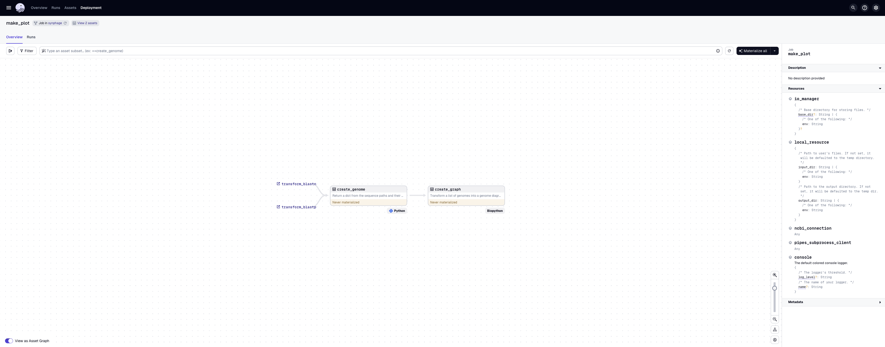
    <figcaption>Overview of the plot job.</figcaption>
</figure> 

???+ info
    If only the blastn or the blastp pipeline has been run, a warning message will pop-up.
    Select confirm to run the job. This will not impair the smooth run of step 4.  
    <figure markdown="span">
        
        <figcaption>Warning message - Plot Job.</figcaption>
    </figure> 

???+ tip
    - By default, the graph will be plotted based on the DataFrame generated through the `blastn pipeline`. To plot the data obtained for the blastp, the value for `graph-type` needs to be changed to `blastp`.  
    - To see the complete configuration for this step, go to the [Configuration](configurations.md#plot-config).  
    - To access the configuration window, open the dropdown menu (white arrow on the right of the black box located on the up right corner, labelled Materialize all) and select `Open launchpad`.  

<figure markdown="span">
    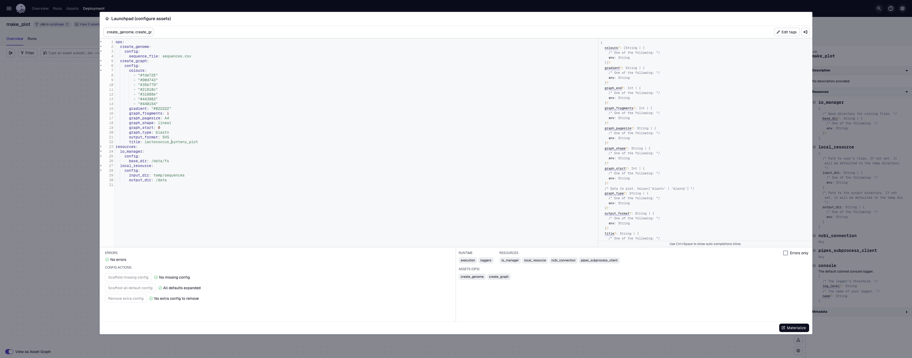
    <figcaption>Launchpad - Plot Job.</figcaption>
</figure> 

???+ success "create_graph"
    === "blastn"
        ``` yaml 
        ops:
            create_genome:
                config:
                sequence_file: sequences.csv
            create_graph:
                config:
                colours:
                    - "#fde725"
                    - "#90d743"
                    - "#35b779"
                    - "#21918c"
                    - "#31688e"
                    - "#443983"
                    - "#440154"
                gradient: "#B22222"
                graph_fragments: 1
                graph_pagesize: A4
                graph_shape: linear
                graph_start: 0
                graph_type: blastn
                output_format: SVG
                title: synteny_based_on_blastn
        ```
    === "blastp"
        ``` yaml
        ops:
            create_genome:
                config:
                sequence_file: sequences.csv
            create_graph:
                config:
                colours:
                    - "#fde725"
                    - "#90d743"
                    - "#35b779"
                    - "#21918c"
                    - "#31688e"
                    - "#443983"
                    - "#440154"
                gradient: "#B22222"
                graph_fragments: 1
                graph_pagesize: A4
                graph_shape: linear
                graph_start: 0
                graph_type: blastp
                output_format: SVG
                title: synteny_based_on_blastp
        ```

Select the `Materialize` botton to run the job. 

<figure markdown="span">
    
    <figcaption>Job after completion.</figcaption>
</figure> 

Metadata are also available for the plot, including a preview of the graph.

<figure markdown="span">
    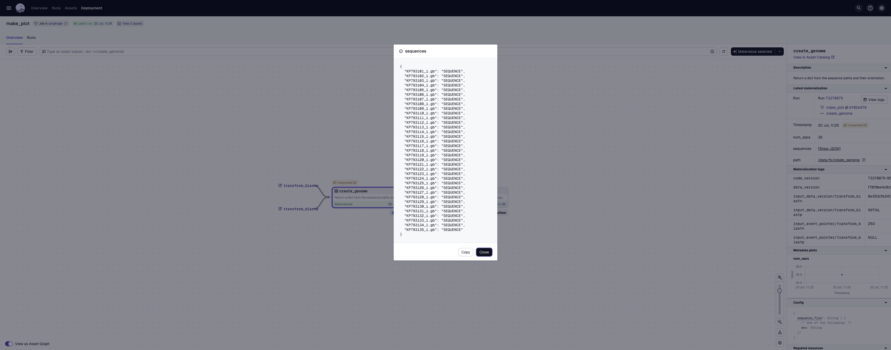
    <figcaption>Sequences to be plotted.</figcaption>
    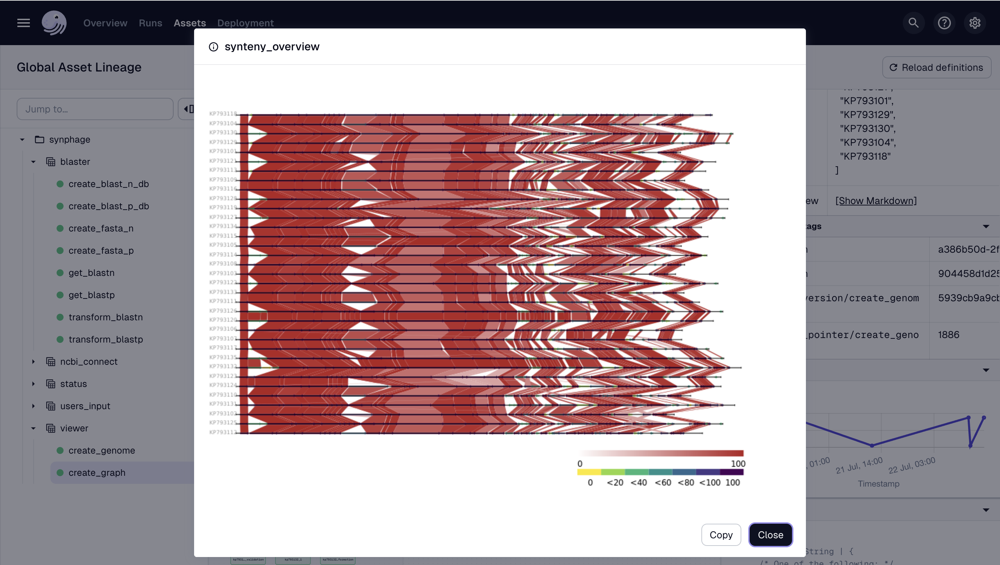
    <figcaption>Preview of the synteny diagram.</figcaption>
</figure> 


## Analysing the data

The output plot(s) allows to quickly visualise conserved and unique genes among our 35 *Lactococcus* 936-type phage sequences.

???+ example "Synteny diagram"
    === "blastn data"
        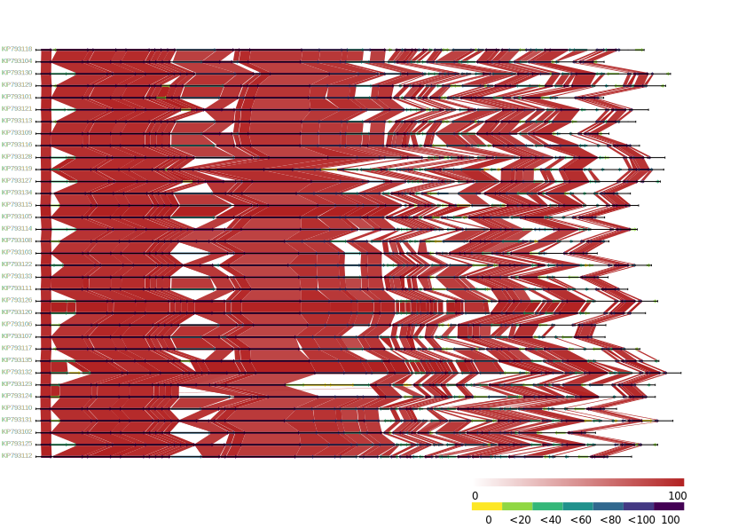
    === "blastp data"
        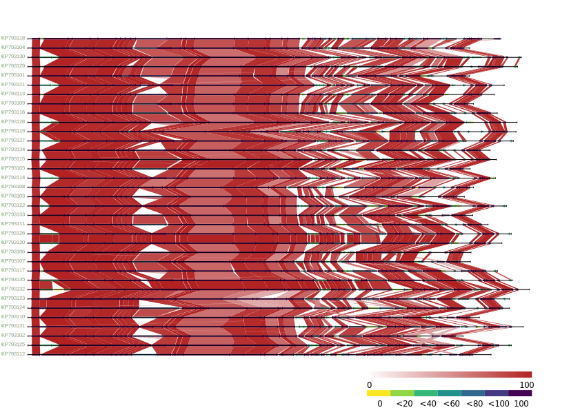

In addition, the generated parquet files `gene_uniqueness.parquet` and `protein_uniqueness.parquet`, respectively as output of the blastn and the blastp, allows to query for particular gene(s) or sequence(s) of interest.

???+ example "unique genes and proteins"
    === "unique genes"
        For example, we would like to query all the unique genes presents in KP793123 sequence (using polars):
        ```python title="Query:"
        pl.read_parquet('gene_uniqueness.parquet').select('query_name', 'query_locus_tag', 'query_gene', 'query_protein_id', 'percentage_of_identity', 'source_name', 'source_locus_tag', 'source_gene', 'source_protein_id').filter((pl.col('query_name')=='KP793123') & (pl.col('source_name').is_null())).sort('query_locus_tag')
        ```
        **```Result:```**  
          
        | query_name   | query_locus_tag   | query_gene   | query_protein_id   |   percentage_of_identity | source_name   | source_locus_tag   | source_gene   | source_protein_id   |
        |:-------------|:------------------|:-------------|:-------------------|-------------------------:|:--------------|:-------------------|:--------------|:--------------------|
        | KP793123     | Phi42_18          |              | ALM64133.1         |                      nan |               |                    |               |                     |
        | KP793123     | Phi42_19          |              | ALM64134.1         |                      nan |               |                    |               |                     |
        | KP793123     | Phi42_20          |              | ALM64135.1         |                      nan |               |                    |               |                     |
        | KP793123     | Phi42_25          |              | ALM64140.1         |                      nan |               |                    |               |                     |
        | KP793123     | Phi42_26          |              | ALM64141.1         |                      nan |               |                    |               |                     |

    === "unique proteins"
        According to the synteny diagram, only four genomes `KP793108`, `KP793119`, `KP793131` and `KP793132` have unique proteins. We can retrieve the protein ids from the Dataframe (using polars):
        ```python title="Query:"
        pl.read_parquet('protein_uniqueness.parquet').select('query_name', 'query_locus_tag', 'query_gene', 'query_protein_id', 'percentage_of_identity', 'source_name', 'source_locus_tag', 'source_gene', 'source_protein_id').filter(pl.col('source_name').is_null()).sort('query_name', 'query_locus_tag')
        ```
        **```Result:```**  
          
        | query_name   | query_locus_tag   | query_gene   | query_protein_id   |   percentage_of_identity | source_name   | source_locus_tag   | source_gene   | source_protein_id   |
        |:-------------|:------------------|:-------------|:-------------------|-------------------------:|:--------------|:-------------------|:--------------|:--------------------|
        | KP793108     | Phi512_34         |              | ALM63433.1         |                      nan |               |                    |               |                     |
        | KP793108     | Phi512_45         |              | ALM63444.1         |                      nan |               |                    |               |                     |
        | KP793119     | Phi105_42         |              | ALM64941.1         |                      nan |               |                    |               |                     |
        | KP793119     | Phi105_44         |              | ALM64943.1         |                      nan |               |                    |               |                     |
        | KP793131     | PhiE1127_54       |              | ALM64620.1         |                      nan |               |                    |               |                     |
        | KP793132     | PhiM1127_03       |              | ALM64629.1         |                      nan |               |                    |               |                     |

    === "gene of interest"
        Gene(s), locus_tag(s) and protein_id(s) of interest can also be directly queried (using polars): example of  locus_tag `Phi19_46`
        ``` python
        pl.read_parquet('gene_uniqueness.parquet').select('query_name', 'query_locus_tag', 'query_gene', 'query_protein_id', 'percentage_of_identity', 'source_name', 'source_locus_tag', 'source_gene', 'source_protein_id', 'source_function', 'source_product').filter(pl.col('query_name')=='KP793103').filter(pl.col('query_locus_tag')=='Phi19_46').sort('source_name')
        ```
        **```Result:```**  
          
        | query_name   | query_locus_tag   | query_gene   | query_protein_id   |   percentage_of_identity | source_name   | source_locus_tag   | source_gene   | source_protein_id   | source_function   | source_product       |
        |:-------------|:------------------|:-------------|:-------------------|-------------------------:|:--------------|:-------------------|:--------------|:--------------------|:------------------|:---------------------|
        | KP793103     | Phi19_46          |              | ALM63185.1         |                  100     | KP793101      | Phi4_47            |               | ALM63086.1          |                   | hypothetical protein |
        | KP793103     | Phi19_46          |              | ALM63185.1         |                   92.063 | KP793104      | PhiB1127_49        |               | ALM63238.1          |                   | hypothetical protein |
        | KP793103     | Phi19_46          |              | ALM63185.1         |                   94.18  | KP793105      | Phi193_48          |               | ALM63290.1          |                   | hypothetical protein |
        | KP793103     | Phi19_46          |              | ALM63185.1         |                   98.413 | KP793106      | PhiA1127_48        |               | ALM63342.1          |                   | hypothetical protein |
        | KP793103     | Phi19_46          |              | ALM63185.1         |                   91.053 | KP793108      | Phi512_49          |               | ALM63448.1          |                   | hypothetical protein |
        | KP793103     | Phi19_46          |              | ALM63185.1         |                   96.045 | KP793109      | PhiC0139_49        |               | ALM63501.1          |                   | hypothetical protein |
        | KP793103     | Phi19_46          |              | ALM63185.1         |                   94.18  | KP793111      | Phi192_51          |               | ALM64895.1          |                   | hypothetical protein |
        | KP793103     | Phi19_46          |              | ALM63185.1         |                   93.122 | KP793113      | PhiF17_52          |               | ALM63665.1          |                   | hypothetical protein |
        | KP793103     | Phi19_46          |              | ALM63185.1         |                   89.474 | KP793114      | Phi17_52           |               | ALM63721.1          |                   | hypothetical protein |
        | KP793103     | Phi19_46          |              | ALM63185.1         |                   94.18  | KP793115      | Phi114_49          |               | ALM63774.1          |                   | hypothetical protein |
        | KP793103     | Phi19_46          |              | ALM63185.1         |                   94.18  | KP793116      | Phi1316_50         |               | ALM63828.1          |                   | hypothetical protein |
        | KP793103     | Phi19_46          |              | ALM63185.1         |                   93.478 | KP793117      | PhiG_53            |               | ALM63885.1          |                   | hypothetical protein |
        | KP793103     | Phi19_46          |              | ALM63185.1         |                   92.593 | KP793118      | PhiF0139_52        |               | ALM63942.1          |                   | hypothetical protein |
        | KP793103     | Phi19_46          |              | ALM63185.1         |                   95.238 | KP793119      | Phi105_59          |               | ALM64958.1          |                   | hypothetical protein |
        | KP793103     | Phi19_46          |              | ALM63185.1         |                   90.526 | KP793120      | PhiL18_51          |               | ALM63998.1          |                   | hypothetical protein |
        | KP793103     | Phi19_46          |              | ALM63185.1         |                   92.593 | KP793121      | Phi109_50          |               | ALM64052.1          |                   | hypothetical protein |
        | KP793103     | Phi19_46          |              | ALM63185.1         |                   91.579 | KP793122      | PhiL6_54           |               | ALM64110.1          |                   | hypothetical protein |
        | KP793103     | Phi19_46          |              | ALM63185.1         |                   94.709 | KP793123      | Phi42_54           |               | ALM64169.1          |                   | hypothetical protein |
        | KP793103     | Phi19_46          |              | ALM63185.1         |                   94.18  | KP793124      | Phi44_48           |               | ALM64222.1          |                   | hypothetical protein |
        | KP793103     | Phi19_46          |              | ALM63185.1         |                   89.474 | KP793125      | Phi91127_52        |               | ALM64278.1          |                   | hypothetical protein |
        | KP793103     | Phi19_46          |              | ALM63185.1         |                   89.474 | KP793126      | PhiM5_53           |               | ALM64337.1          |                   | hypothetical protein |
        | KP793103     | Phi19_46          |              | ALM63185.1         |                   90     | KP793127      | Phi40_52           |               | ALM64394.1          |                   | hypothetical protein |
        | KP793103     | Phi19_46          |              | ALM63185.1         |                   90.526 | KP793128      | PhiM16_50          |               | ALM64449.1          |                   | hypothetical protein |
        | KP793103     | Phi19_46          |              | ALM63185.1         |                   93.478 | KP793129      | PhiJF1_53          |               | ALM64506.1          |                   | hypothetical protein |
        | KP793103     | Phi19_46          |              | ALM63185.1         |                   90     | KP793130      | Phi155_50          |               | ALM64561.1          |                   | hypothetical protein |
        | KP793103     | Phi19_46          |              | ALM63185.1         |                   89.474 | KP793131      | PhiE1127_55        |               | ALM64621.1          |                   | hypothetical protein |
        | KP793103     | Phi19_46          |              | ALM63185.1         |                   90.526 | KP793132      | PhiM1127_55        |               | ALM64681.1          |                   | hypothetical protein |
        | KP793103     | Phi19_46          |              | ALM63185.1         |                   89.474 | KP793135      | Phi16_52           |               | ALM64839.1          |                   | hypothetical protein |