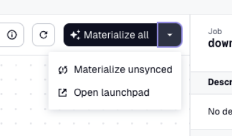

# Synteny diagram of bacteriophage genomes with 'synphage'

For this step-by-step example, a group of closely related Lactococcus phages has been selected based on name from [Bacterial and Viral Bioinformatics Resource Center (BV-BRC)](https://www.bv-brc.org/view/GenomeList/?eq(genome_name,phage)#view_tab=genomes&filter=keyword(Lactococcus)).  

<figure markdown="span">
    
    <figcaption>Selected *Lactococcus* phages for this example</figcaption>
</figure>  

*Lactococcus* phage genomes can be mosaic and are relevant for the [diary industry](https://doi.org/10.1038/srep21345).  

## Running 'synphage' pipeline  

To get familiar with `synphage` capabilities, you can reproduce the step-by-step example describe below. To get started, go to [step 1](#step1-phage-example).  

*Prerequisite:* you need to have `synphage` installed in a python environment or in a docker container (see [Installation](installation.md#pip-install)) and running. Open the Dagster UI in your browser to get started.
<figure markdown="span">
    
    <figcaption>Dagster UI - landing page</figcaption>
</figure>


### Step 1: Download the data of interest <a id="step1-phage-example"></a>

Go to Dagster_home -> Jobs -> download.  

<iframe width="560" height="315"
src="http://0.0.0.0:8000/synphage/images/phages/job_1.webm" 
frameborder="0" 
allow="accelerometer; autoplay; encrypted-media; gyroscope; picture-in-picture" 
allowfullscreen></iframe>

<figure markdown="span">
    
    <figcaption>Overview of the download job</figcaption>
</figure>

In order to query our genomes of interest, we need to pass query to the `search-key` in the configuration panel.  
To access the configuration window, open the dropdown menu (white arrow on the right of the black box located on the up right corner, labelled `Materialize all`) and select `Open launchpad`.  
<figure markdown="span">
    { width="200"}
    <figcaption>Warning message - Download job</figcaption>
    { width="200"}
    <figcaption>Access the lauchpad to the job configuration</figcaption>
</figure>

A warning will pop-up, press `Confirm` and configure the `search_key` parameter, changing the default value with the following keywords (Accession names for the genomes previously selected in this case) to query the NCBI database:  

=== "search_key"
    ``` bash
    KP793101[Accession] OR KP793102[Accession] OR KP793103[Accession] OR KP793105[Accession] OR KP793104[Accession] OR KP793107[Accession] OR KP793106[Accession] OR KP793108[Accession] OR KP793109[Accession] OR KP793112[Accession] OR KP793114[Accession] OR KP793113[Accession] OR KP793110[Accession] OR KP793115[Accession] OR KP793117[Accession] OR KP793118[Accession] OR KP793122[Accession] OR KP793116[Accession] OR KP793120[Accession] OR KP793121[Accession] OR KP793123[Accession] OR KP793126[Accession] OR KP793127[Accession] OR KP793125[Accession] OR KP793124[Accession] OR KP793128[Accession] OR KP793130[Accession] OR KP793129[Accession] OR KP793132[Accession] OR KP793131[Accession] OR KP793133[Accession] OR KP793135[Accession] OR KP793134[Accession] OR KP793111[Accession] OR KP793119[Accession]
    ```

<figure markdown="span">
    
    <figcaption>Configuration panel - Download job</figcaption>
</figure>

Select `Materialize`, in the right bottom corner.  

Most of the assets provides metadata after successful complition of the run. These metadata allow the user to easily follow the smooth execution of the job.
<figure markdown="span">
    
    <figcaption>Example of metadata provided for the `fetch_genome` asset. After complition the user can see the number and the name of GenBank files that have been downloaded.</figcaption>
</figure>

When the job finishes its executon, we can move to `step 2` to run the validation on the data.
<figure markdown="span">
    
    <figcaption>Job is terminated</figcaption>
</figure>


### Step 2: Run data quality checks on the dataset

(For more detailed information on this step, check the doc(link to doc))  

Go to Dagster_home -> Jobs -> make_validations.  
<figure markdown="span">
    
    <figcaption>Overview of the validation job</figcaption>
</figure>
<figure markdown="span">
    
    <figcaption>Zoom In </figcaption>
</figure>

Select `Materialize all` (black box located on the up right corner).

This job runs checks on each of the files that have been downloaded. The number of checks that pass or fail are directly visible on the assets and reflects how complete each dataset is.
The result table for the checks is available in the metadata panel and the detailed results for the checks can be accessed either from the right panel under `Checks -> View all check details` or by selecting the asset and then the `Checks` tab.  

<figure markdown="span">
    
    <figcaption>The assets display the number of failed and passed checks.</figcaption>
    
    <figcaption>Result table for the check, accessible from the metadata panel.</figcaption>
    
    <figcaption>Check results are accessible via the right panel.</figcaption>
    
    <figcaption>Full asset check results.</figcaption>
</figure>

The metadata attached to the second step of the validation, inform the user about the logic apply to the file, more precisely what feature type the software will be using for downstream processing and what attribute will be used as unique identifier for the coding genes.
<figure markdown="span">
    
    <figcaption>Step 2 of the validation with metadata.</figcaption>
</figure>

The metadata attached to the last step of the validation, render an overview of the transformed data.
<figure markdown="span">
    
    <figcaption>Step 3 of the validation with metadata.</figcaption>
</figure>  


### Step 3: Run the blast

For this example, blastn was run on the dataset.  

Go to Dagster_home -> Jobs -> make_blastn  
<figure markdown="span">
    
    <figcaption>Overview of the blastn job</figcaption>
</figure>  

Select `Materialize all` (black box located on the up right corner). 

<figure markdown="span">
    
    <figcaption>Completed job</figcaption>
</figure> 

Checks are run at the beginning of the job to verify that the key and identifier used for each of the coding element are unique over all the sequences.
<figure markdown="span">
    
    <figcaption>The checks confirm the uniqueness of the chosen identifier for each of the coding elements.</figcaption>
</figure> 

Several files are generated during this step.
=== "create_fasta_n"
    ``` title="KP793103_1.fna"
    --8<-- "KP793103_1.fna::7"
    ```

=== "create_blast_n_db"
    ``` title="KP793103_1"
    KP793103_1.ndb
    KP793103_1.nhr
    KP793103_1.nim
    KP793103_1.not
    KP793103_1.nsq
    KP793103_1.ntf
    KP793103_1.nto
    ```

=== "get_blastn"
    ``` title="KP793103_1_vs_KP793107_1"
    --8<-- "KP793103_1_vs_KP793107_1:19:51"
    ```

=== "transform_blastn"
    ``` title="KP793103_1_vs_KP793107_1.parquet"
    --8<-- "blastn_df.md:1:5"
    ```

=== "unified_dataframe"
    ``` title="gene_uniqueness.parquet"
    --8<-- "gene_uniqueness.md"
    ```

The generated `gene_uniqueness.parquet` file is used to generate the downstream graphic.  
This file can be read and manipulated with any DataFrame API the user choose, such as [Pandas](https://pandas.pydata.org/), [Apache Spark](https://spark.apache.org/docs/latest/api/python/index.html), [Polars](https://docs.pola.rs/api/python/stable/reference/index.html), [DuckDB](https://duckdb.org/) but also in a non-programmatic manner using softwares such as [Tad](https://www.tadviewer.com/).  


### Step 4: Generate the plot

Go to Dagster_home -> Jobs -> make_plot
<figure markdown="span">
    
    <figcaption>Overview of the plot job.</figcaption>
</figure> 

    ???+ info
        If only the blastn or the blastp pipeline has been run, a warning message will pop-up.
        Select confirm to run the job. This will not impair the smooth run of step 4.

<figure markdown="span">
    
    <figcaption>Warning message - Plot Job.</figcaption>
</figure> 

    ???+ tip
        - By default, the graph will be plotted based on the DataFrame generated through the `blastn pipeline`. To plot the data obtained for the blastp, the value for `graph-type` needs to be changed to `blastp`.  
        - To see the complete configuration for this step, go to the [Configuration](configurations.md#plot-config).  
        - To access the configuration window, open the dropdown menu (white arrow on the right of the black box located on the up right corner, labelled Materialize all) and select `Open launchpad`.  

<figure markdown="span">
    
    <figcaption>Launchpad - Plot Job.</figcaption>
</figure> 

    ???+ success "create_graph"
        === "blastn"
        ``` yaml 
        ops:
            create_genome:
                config:
                sequence_file: sequences.csv
            create_graph:
                config:
                colours:
                    - "#fde725"
                    - "#90d743"
                    - "#35b779"
                    - "#21918c"
                    - "#31688e"
                    - "#443983"
                    - "#440154"
                gradient: "#B22222"
                graph_fragments: 1
                graph_pagesize: A4
                graph_shape: linear
                graph_start: 0
                graph_type: blastn
                output_format: SVG
                title: synteny_based_on_blastn
        ```
        === "blastp"
        ``` yaml
        ops:
            create_genome:
                config:
                sequence_file: sequences.csv
            create_graph:
                config:
                colours:
                    - "#fde725"
                    - "#90d743"
                    - "#35b779"
                    - "#21918c"
                    - "#31688e"
                    - "#443983"
                    - "#440154"
                gradient: "#B22222"
                graph_fragments: 1
                graph_pagesize: A4
                graph_shape: linear
                graph_start: 0
                graph_type: blastp
                output_format: SVG
                title: synteny_based_on_blastp
        ```

Select the 'Materialize' botton.  

<figure markdown="span">
    
    <figcaption>Job after completion.</figcaption>
</figure> 

Metadata are also available for the plot, including a preview of the graph.

<figure markdown="span">
    
    <figcaption>Sequences to be plotted.</figcaption>
    
    <figcaption>Preview of the synteny diagram.</figcaption>
</figure> 


## Analyse the data

The output plot allows to quickly visualise conserved and unique genes among our 35 *Lactococcus* sequences.

In addition, the generated parquet files `gene_uniqueness.parquet` and `protein_uniqueness.parquet`, respectively as output of the blastn and the blastp, allows to query for particular gene of interest.

    ???+ example "gene_uniqueness.parquet"
    === "unique genes"
        Query for all the unique genes in sequence XXX
    === "gene of interest"
        Query for gene XXX 
        ``` python
        pl.read_parquet('temp/documentation_examples/bacteriophages/data/tables/gene_uniqueness.parquet').select('query_name', 'query_locus_tag', 'query_gene', 'query_protein_id', 'percentage_of_identity', 'source_name', 'source_locus_tag', 'source_gene', 'source_protein_id').filter(pl.col('query_name')=='KP793103').filter(pl.col('query_locus_tag')=='Phi19_07')
        ```
        ```
        pl.read_parquet('temp/documentation_examples/bacteriophages/data/tables/gene_uniqueness.parquet').select('query_name', 'query_locus_tag', 'query_gene', 'query_protein_id', 'percentage_of_identity', 'source_name', 'source_locus_tag', 'source_gene', 'source_protein_id').filter(pl.col('query_name')=='KP793123').filter(pl.col('source_name').is_null()).sort('query_locus_tag').to_pandas().to_markdown()
    ```
        ┌────────────┬─────────────────┬────────────┬──────────────────┬────────────────────────┬─────────────┬──────────────────┬─────────────┬───────────────────┐
        │ query_name ┆ query_locus_tag ┆ query_gene ┆ query_protein_id ┆ percentage_of_identity ┆ source_name ┆ source_locus_tag ┆ source_gene ┆ source_protein_id │
        │ ---        ┆ ---             ┆ ---        ┆ ---              ┆ ---                    ┆ ---         ┆ ---              ┆ ---         ┆ ---               │
        │ str        ┆ str             ┆ str        ┆ str              ┆ f32                    ┆ str         ┆ str              ┆ str         ┆ str               │
        ╞════════════╪═════════════════╪════════════╪══════════════════╪════════════════════════╪═════════════╪══════════════════╪═════════════╪═══════════════════╡
        │ KP793123   ┆ Phi42_18        ┆            ┆ ALM64133.1       ┆ null                   ┆ null        ┆ null             ┆ null        ┆ null              │
        │ KP793123   ┆ Phi42_19        ┆            ┆ ALM64134.1       ┆ null                   ┆ null        ┆ null             ┆ null        ┆ null              │
        │ KP793123   ┆ Phi42_20        ┆            ┆ ALM64135.1       ┆ null                   ┆ null        ┆ null             ┆ null        ┆ null              │
        │ KP793123   ┆ Phi42_25        ┆            ┆ ALM64140.1       ┆ null                   ┆ null        ┆ null             ┆ null        ┆ null              │
        │ KP793123   ┆ Phi42_26        ┆            ┆ ALM64141.1       ┆ null                   ┆ null        ┆ null             ┆ null        ┆ null              │
        └────────────┴─────────────────┴────────────┴──────────────────┴────────────────────────┴─────────────┴──────────────────┴─────────────┴───────────────────┘


        ┌────────────┬─────────────────┬────────────┬──────────────────┬────────────────────────┬─────────────┬──────────────────┬─────────────┬───────────────────┬─────────────────┬──────────────────────┐
        │ query_name ┆ query_locus_tag ┆ query_gene ┆ query_protein_id ┆ percentage_of_identity ┆ source_name ┆ source_locus_tag ┆ source_gene ┆ source_protein_id ┆ source_function ┆ source_product       │
        │ ---        ┆ ---             ┆ ---        ┆ ---              ┆ ---                    ┆ ---         ┆ ---              ┆ ---         ┆ ---               ┆ ---             ┆ ---                  │
        │ str        ┆ str             ┆ str        ┆ str              ┆ f32                    ┆ str         ┆ str              ┆ str         ┆ str               ┆ str             ┆ str                  │
        ╞════════════╪═════════════════╪════════════╪══════════════════╪════════════════════════╪═════════════╪══════════════════╪═════════════╪═══════════════════╪═════════════════╪══════════════════════╡
        │ KP793103   ┆ Phi19_46        ┆            ┆ ALM63185.1       ┆ 100.0                  ┆ KP793101    ┆ Phi4_47          ┆             ┆ ALM63086.1        ┆                 ┆ hypothetical protein │
        │ KP793103   ┆ Phi19_46        ┆            ┆ ALM63185.1       ┆ 92.063004              ┆ KP793104    ┆ PhiB1127_49      ┆             ┆ ALM63238.1        ┆                 ┆ hypothetical protein │
        │ KP793103   ┆ Phi19_46        ┆            ┆ ALM63185.1       ┆ 94.18                  ┆ KP793105    ┆ Phi193_48        ┆             ┆ ALM63290.1        ┆                 ┆ hypothetical protein │
        │ KP793103   ┆ Phi19_46        ┆            ┆ ALM63185.1       ┆ 98.413002              ┆ KP793106    ┆ PhiA1127_48      ┆             ┆ ALM63342.1        ┆                 ┆ hypothetical protein │
        │ KP793103   ┆ Phi19_46        ┆            ┆ ALM63185.1       ┆ 91.053001              ┆ KP793108    ┆ Phi512_49        ┆             ┆ ALM63448.1        ┆                 ┆ hypothetical protein │
        │ KP793103   ┆ Phi19_46        ┆            ┆ ALM63185.1       ┆ 96.044998              ┆ KP793109    ┆ PhiC0139_49      ┆             ┆ ALM63501.1        ┆                 ┆ hypothetical protein │
        │ KP793103   ┆ Phi19_46        ┆            ┆ ALM63185.1       ┆ 94.18                  ┆ KP793111    ┆ Phi192_51        ┆             ┆ ALM64895.1        ┆                 ┆ hypothetical protein │
        │ KP793103   ┆ Phi19_46        ┆            ┆ ALM63185.1       ┆ 93.122002              ┆ KP793113    ┆ PhiF17_52        ┆             ┆ ALM63665.1        ┆                 ┆ hypothetical protein │
        │ KP793103   ┆ Phi19_46        ┆            ┆ ALM63185.1       ┆ 89.473999              ┆ KP793114    ┆ Phi17_52         ┆             ┆ ALM63721.1        ┆                 ┆ hypothetical protein │
        │ KP793103   ┆ Phi19_46        ┆            ┆ ALM63185.1       ┆ 94.18                  ┆ KP793115    ┆ Phi114_49        ┆             ┆ ALM63774.1        ┆                 ┆ hypothetical protein │
        │ KP793103   ┆ Phi19_46        ┆            ┆ ALM63185.1       ┆ 94.18                  ┆ KP793116    ┆ Phi1316_50       ┆             ┆ ALM63828.1        ┆                 ┆ hypothetical protein │
        │ KP793103   ┆ Phi19_46        ┆            ┆ ALM63185.1       ┆ 93.477997              ┆ KP793117    ┆ PhiG_53          ┆             ┆ ALM63885.1        ┆                 ┆ hypothetical protein │
        │ KP793103   ┆ Phi19_46        ┆            ┆ ALM63185.1       ┆ 92.593002              ┆ KP793118    ┆ PhiF0139_52      ┆             ┆ ALM63942.1        ┆                 ┆ hypothetical protein │
        │ KP793103   ┆ Phi19_46        ┆            ┆ ALM63185.1       ┆ 95.237999              ┆ KP793119    ┆ Phi105_59        ┆             ┆ ALM64958.1        ┆                 ┆ hypothetical protein │
        │ KP793103   ┆ Phi19_46        ┆            ┆ ALM63185.1       ┆ 90.526001              ┆ KP793120    ┆ PhiL18_51        ┆             ┆ ALM63998.1        ┆                 ┆ hypothetical protein │
        │ KP793103   ┆ Phi19_46        ┆            ┆ ALM63185.1       ┆ 92.593002              ┆ KP793121    ┆ Phi109_50        ┆             ┆ ALM64052.1        ┆                 ┆ hypothetical protein │
        │ KP793103   ┆ Phi19_46        ┆            ┆ ALM63185.1       ┆ 91.579002              ┆ KP793122    ┆ PhiL6_54         ┆             ┆ ALM64110.1        ┆                 ┆ hypothetical protein │
        │ KP793103   ┆ Phi19_46        ┆            ┆ ALM63185.1       ┆ 94.709                 ┆ KP793123    ┆ Phi42_54         ┆             ┆ ALM64169.1        ┆                 ┆ hypothetical protein │
        │ KP793103   ┆ Phi19_46        ┆            ┆ ALM63185.1       ┆ 94.18                  ┆ KP793124    ┆ Phi44_48         ┆             ┆ ALM64222.1        ┆                 ┆ hypothetical protein │
        │ KP793103   ┆ Phi19_46        ┆            ┆ ALM63185.1       ┆ 89.473999              ┆ KP793125    ┆ Phi91127_52      ┆             ┆ ALM64278.1        ┆                 ┆ hypothetical protein │
        │ KP793103   ┆ Phi19_46        ┆            ┆ ALM63185.1       ┆ 89.473999              ┆ KP793126    ┆ PhiM5_53         ┆             ┆ ALM64337.1        ┆                 ┆ hypothetical protein │
        │ KP793103   ┆ Phi19_46        ┆            ┆ ALM63185.1       ┆ 90.0                   ┆ KP793127    ┆ Phi40_52         ┆             ┆ ALM64394.1        ┆                 ┆ hypothetical protein │
        │ KP793103   ┆ Phi19_46        ┆            ┆ ALM63185.1       ┆ 90.526001              ┆ KP793128    ┆ PhiM16_50        ┆             ┆ ALM64449.1        ┆                 ┆ hypothetical protein │
        │ KP793103   ┆ Phi19_46        ┆            ┆ ALM63185.1       ┆ 93.477997              ┆ KP793129    ┆ PhiJF1_53        ┆             ┆ ALM64506.1        ┆                 ┆ hypothetical protein │
        │ KP793103   ┆ Phi19_46        ┆            ┆ ALM63185.1       ┆ 90.0                   ┆ KP793130    ┆ Phi155_50        ┆             ┆ ALM64561.1        ┆                 ┆ hypothetical protein │
        │ KP793103   ┆ Phi19_46        ┆            ┆ ALM63185.1       ┆ 89.473999              ┆ KP793131    ┆ PhiE1127_55      ┆             ┆ ALM64621.1        ┆                 ┆ hypothetical protein │
        │ KP793103   ┆ Phi19_46        ┆            ┆ ALM63185.1       ┆ 90.526001              ┆ KP793132    ┆ PhiM1127_55      ┆             ┆ ALM64681.1        ┆                 ┆ hypothetical protein │
        │ KP793103   ┆ Phi19_46        ┆            ┆ ALM63185.1       ┆ 89.473999              ┆ KP793135    ┆ Phi16_52         ┆             ┆ ALM64839.1        ┆                 ┆ hypothetical protein │
        └────────────┴─────────────────┴────────────┴──────────────────┴────────────────────────┴─────────────┴──────────────────┴─────────────┴───────────────────┴─────────────────┴──────────────────────┘

with pl.Config(tbl_cols=-1, tbl_rows=-1):
pl.read_parquet('temp/documentation_examples/bacteriophages/data/tables/gene_uniqueness.parquet').select('query_name', 'query_locus_tag', 'query_gene', 'query_protein_id', 'percentage_of_identity', 'source_name', 'source_locus_tag', 'source_gene', 'source_protein_id', 'source_function', 'source_product').filter(pl.col('query_name')=='KP793103').filter(pl.col('query_locus_tag')=='Phi19_46').sort('source_name')