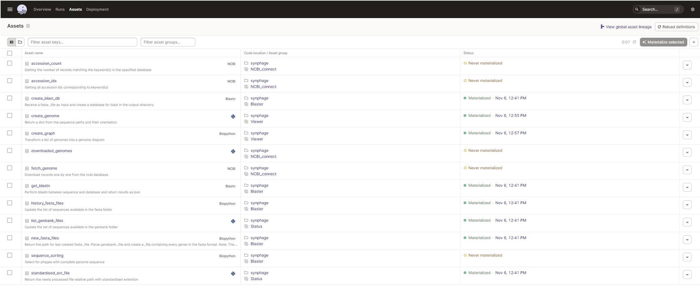

# Navigating `synphage` pipeline


## Requirements 

???+ success "*Prerequisite:*"
    You need to have `synphage` installed in a python environment or in a docker container or to have pulled synphage docker image. Start synphage and open the Dagster UI in your browser to get started.  
    === "venv"
        ``` bash
        pip install synphage
        dagster dev -h 0.0.0.0 -p 3000 -m synphage
        ```
        For more details, see [installation instruction](installation.md#pip-install) or [how to run the software](installation.md/#run-synphage-pip).
    === "docker"
        ``` bash
        docker pull vestalisvirginis/synphage:<tag>
        docker run --rm --name my-synphage-container -p 3000 vestalisvirginis/synphage:<tag>
        ```
        For more details, see [installation instruction](installation.md/#docker-install) or [how to run the software](installation.md/#run-synphage-container).
    === "Docker Desktop"
        <iframe width="560" height="315"
        src="../images/phages/docker_desktop_movie.mp4" 
        frameborder="0" 
        allow="accelerometer; autoplay; encrypted-media; gyroscope; picture-in-picture" 
        allowfullscreen></iframe>  
        For more details, see [installation instruction](installation.md/#docker-install) or [how to run the software](installation.md/#run-synphage-container).


<figure markdown="span">

<figcaption>Dagster UI - landing page</figcaption>
</figure>


## Navigating the UI

To navigate to the jobs, go to 
{ width="50"}
{ width="50"} 
Dagster_home -> Jobs

<figure markdown="span">
 
<figcaption>Dagster shutting down</figcaption>
</figure>

Whenever you are lost, go back to the 
{ width="50"}
{ width="50"} to get back on track.


For the steps that requires to open th `Launchpad`, after selecting `Materialize` you will automatically brought to the page where the job is running. To go back to the previous page you can either select `View jobs` on the top right of the page or select the job you are running on the left panel.

<figure markdown="span">
 
<figcaption>View after selecting `Materialize`. Select `View jobs`to go back.</figcaption>
 
<figcaption>The left panel displays the list of jobs. To go back select the job you are currently running.</figcaption>
</figure>


## Software structure

synphage pipeline is composed of `four steps` that need to be run `sequencially`:  
    - step 1: loading the data  
    - step 2: validating the data  
    - step 3: blasting the data  
    - step 4: ploting the data  


### Step 1: Loading the data into the pipeline

The step 1 is composed of two sub-steps :  
- `step_1a_get_user_data`, for loading user's data into the pipeline  
- `step_1b_download`, for downloading data from the NCBI  

GenBank files are loaded into the pipeline from the `input_folder` setup by the user `and/or` `downloaded` from the NCBI database. 

???+ tip
    Only one of the following jobs, `step_1a` or `step_1b` is required to successfully run step 1.


#### step_1a: `step_1a_get_user_data`

1. Description
    This job allows the users to upload their own data / data stored locally into the pipeline.  

    ???+ success
        This job requires the provision of a path to users' data folder or the data to be copied in the docker container.
        For more details on how to load your data, check the [documentation for `pip` users](installation.md#data_input_pip), [Docker Desktop users](installation.md#data_input_dockerdesktop) and [for docker CLI users](installation.md#data_input_docker).  

    During this step, the GenBank files are loaded into the pipeline and filenames are harmonised (remove spaces, dots) to avoid failure during the downstream processing. The information contained in each file is processed and the raw data is stored in a parquet file (*[./tables/genbank_db](output.md#data_architecture)*). This information will be further processed at step 2.

    <figure markdown="span">
      
    <figcaption>Step 1a schematic representation</figcaption>
    </figure>

2. In practice  
    *Requires:* GenBank files
    To run the job, no configuration is required at this stage. Select `Materialize all` on the top right corner of the main panel to run the job. Once the job is complete, all the assets will turn green. You can then select invidual assets to check the metadata generated by the asset. 
    Once the job is completed, you can:
    - add more files and re-run `step 1a`
    - download additional file, running `step 1b`
    - run `step 2`


#### step_1b: `step_1b_download`

1. Description  
    Run this job to download genomes to be analysed from the NCBI database (same combinaison of keywords can be used as in the ncbi website). The keyword(s) are passed to the `job configuration`.  

    ???+ success
        This job requires to have the `EMAIL` and `API_KEY` environnmental variables set in order to access the NCBI database.
        (For more information, check the documention [via pip](installation.md#env_pip), [with Docker Desktop](installation.md#env_dockerdesktop) and [via docker CLI](installation.md#docker)).

    During this step, the GenBank files are downloaded from the NCBI database into the pipeline and filenames are harmonised (remove spaces, dots) to avoid failure during the downstream processing. The information contained in each file is processed and the raw data is stored in a parquet file (*path: ./tables/genbank_db*). This information will be further processed at step 2.

    <figure markdown="span">
      
    <figcaption>Step 1b schematic representation</figcaption>
    </figure>

1. In practice  
    To run this job, you first need to set your keywords for the NCBI database query. Click the arrow on the right side of the `materialise all` botton to access the drop-down menu and select `Open launchpad`.  

    <figure markdown="span">
      
    <figcaption>How to open the launchpad</figcaption>
      
    <figcaption>Configuration panel for the download</figcaption>
    </figure>

    Select `Materialize` on the bottom left corner of the launchpad. Once the job is complete, all the assets will turn green. You can then select invidual assets to check the metadata generated by the asset.  (*Check our [step-by-step](phages.md#step1-phage-example) example.*)  
    Once the job is completed, you can:  
    - start another query, re-running `step 1b`  
    - add locally stored files and run `step 1a`  
    - run `step 2`  


???+ tip 
    If both step 1a and 1b are run, the data is combined in the parquet file.


### Step 2: Data validation

Completeness of the data is validated at this step.  
This step is composed of 1 job and the job visualisation (graph) will be updated after each step 1 run showing all the sequences present in the pipeline:
- `step_2_make_validation`, for performing checks and transformations on the dataset that are required for downstream processing 

???+ failure
    This step is required and cannot be skipped.

1. Description  
    Run a validation on the dataset. 

    <figure markdown="span">
      
    <figcaption>Step 2 schematic representation before loading any sequences in the pipeline</figcaption>
      
    <figcaption>Step 2 schematic representation after loading sequences in the pipeline and reloading the UI</figcaption>
    </figure>

    This step checks what features are present in the GenBank files (gene and CDS, only gene, only CDS) and select an attribute to be used as unique identifier for each coding region.  

    ???+ warning
        Dataset which does not complete this step are excluded from the downstream processing. This step aims to prevent failure at step 3 and 4 due to a low quality dataset.


2. In practice  
   *Requires:* step 1
   To run the job, no configuration is required at this stage. Select `Materialize all` on the top right corner of the main panel to run the job. Once the job is complete, all the assets will turn green. You can then select invidual assets to check the metadata generated by the asset. (*Check our [step-by-step](phages.md#step2-phage-example) example.*)  
    Once the job is completed, you can:
    - run `step 3`
  

### Step 3: Blasting the data

The step 3 is composed of two sub-steps and three different `options` are available:  
- `step_3a_make_blastn`, for running a Nucleotide BLAST on the dataset  
- `step_3b_make_blastp`, for running a Protein BLAST on the dataset  
- `step_3c_make_all_blast`, for running both, Nucleotide and Protein BLAST simultaneously  

A blast is performed at this step of the pipeline using the [blast+ tool](https://doi.org/10.1186/1471-2105-10-421) from the ncbi and the users can choose to perform either a blastn, or a blastp, or both simultaneously or sequentially (running for example, 3a and then 3b).

???+ tip
    - Only one of the above jobs is required to successfully run step 3.
    - Both `step_3a_make_blastn` and `step_3b_make_blastp` jobs can be run sequencially, mainly in the case where the user decide to run the second job based on the results obtained for the first one.


#### step_3a: `step_3a_make_blastn`  

1. Description  

    A blastn against each other sequences is performed at this step. The resulting fasta files, blast database and blastn output files are saved in *[./gene_identity/](output.md#data_architecture)*.

    <figure markdown="span">
      
    <figcaption>Step 3a schematic representation</figcaption>
    </figure>

    After performing the blast, the output json files are processed and the blast information is used to join information about queried sequences and hit sequences. The resulting parquet file is stored as *[./tables/gene_uniqueness.parquet](output.md#data_architecture)*. 
    This file is used to build the synteny diagram and can also be queried by the user to retrieve further information about unique and conserved genes (*For more details, read our [step-by-step](phages.md) example.*)

2. In practice  

    *Requires*: step 2
    To run the job, no configuration is required at this stage. Select `Materialize all` on the top right corner of the main panel to run the job. Once the job is complete, all the assets will turn green. You can then select invidual assets to check the metadata generated by the asset.  (*Check our [step-by-step](phages.md#step3-phage-example) example.*)  
    Once the job is completed, you can:  
    - run `step 3b`  
    - run `step 4`  


#### step_3b: `step_3b_make_blastp`  

1. Description  

    A blastp against each other sequences is performed at this step. The resulting fasta files, blast database and blastp output files are saved in *[./protein_identity/](output.md#data_architecture)*. 

    <figure markdown="span">
      
    <figcaption>Step 3b schematic representation</figcaption>
    </figure>

    After performing the blast, the output json files are processed and the blast information is used to join information about queried sequences and hit sequences. The resulting parquet file is stored as *[./tables/protein_uniqueness.parquet](output.md#data_architecture)*. 
    This file is used to build the synteny diagram and can also be queried by the user to retrieve further information about unique and conserved genes (*For more details, read our [step-by-step](phages.md) example.*)

2. In practice  
    *Requires*: step 2
    To run the job, no configuration is required at this stage. Select `Materialize all` on the top right corner of the main panel to run the job. Once the job is complete, all the assets will turn green. You can then select invidual assets to check the metadata generated by the asset.   
    Once the job is completed, you can:  
    - run `step 3a`  
    - run `step 4`  


#### step_3c: `step_3c_make_all_blast`  

1. Description  

    A blastn and a blastp against each other sequences is performed at this step. The resulting fasta files, blast database and, blastn nad blastp output files are saved in *[./gene_identity/ and ./protein_identity/](output.md#data_architecture)* respectively. 

    <figure markdown="span">
      
    <figcaption>Step 3c schematic representation</figcaption>
    </figure>

    After performing the blast, the output json files are processed and the blast information is used to join information about queried sequences and hit sequences. For this step, there are two resulting parquet files stored as *[./tables/gene_uniqueness.parquet and ./tables/protein_uniqueness.parquet](output.md#data_architecture)*, respectively for blastn and for blastp results. 
    This file is used to build the synteny diagram and can also be queried by the user to retrieve further information about unique and conserved genes (*For more details, read our [step-by-step](phages.md) example.*)

2. In practice  
    *Requires*: step 2
    To run the job, no configuration is required at this stage. Select `Materialize all` on the top right corner of the main panel to run the job. Once the job is complete, all the assets will turn green. You can then select invidual assets to check the metadata generated by the asset.  
    Once the job is completed, you can:  
    - run `step 4` 


### Step 4: Synteny plot

The synteny graph is created during this last step. The step 4 can be run multiple times with different configurations and different sets of data, as long as the data have been processed once through steps 1, 2 and 3.  
- `step_4_make_plot`, for plotting synteny diagram(s) from data generated at step 3 and the genbank files  


1. Description  

    At this step, a synteny plot is generated as `.svg` file and `.png` file.  
    The *[sequences.csv](output.md#/data_architecture)* file contains the sequences to be plotted, as well as their orientation and the order (from bottom to top). By default, all the sequences processed throughthe pipeline are plotted.  
    The genes are colour-coded according to their abundance (percentage) among the plotted sequences. The cross-links between each consecutive sequence indicates the percentage or similarities between those two sequences.  
    The `.svg` can simply be opened in your web-browser for visualisation or be opened with a software such as [Inkscape](https://inkscape.org) and be further annotated if needed.  

    <figure markdown="span">
      
    <figcaption>Step 4 schematic representation</figcaption>
    </figure>


2. In practice  
    *Requirement:* step3  
    To run this job, you first need to:
    - select the sequences to be plotted. You can use the default `sequences.csv` file, modify it or use your own `.csv` file. In the later case, the file name needs to be modified in the `Configuration`.  
    The structure of the file is the following:
    ``` txt 
    genome_1.gb,0
    genome_2.gb,1
    genome_3.gb,0
    ```
    - set the type of dataset you want to use for the plot. This is configure through the `graph_type` parameter that receives either `blastn` or `blastp` as value. Click the arrow on the right side of the `materialise all` botton to access the drop-down menu and select `Open launchpad`.  
    Other graphic parameters, such as the title or the colours, can be modified at this stage (optional), and the complete list is available in the [Configuration Documentation](configurations.md#/plot-config).  
    Select `Materialize` on the bottom left corner of the launchpad. Once the job is complete, all the assets will turn green. You can then select invidual assets to check the metadata generated by the asset.  (*Check our [step-by-step](phages.md/step4-phage-example) example.*)  
    Once the job is completed, you can:  
    - generate more diagrams by re-running `step 4` 


???+ tip 
    - Different synteny plots can be generated from the same set of genomes. In this case the three first steps only need to be run once and the fourth step, `step_4_make_plot`, can be triggered separately for each graphs.
    - For modifying the sequences to be plotted (selected sequences, order, orientation), the sequences.csv file generated at step3 can be modify and saved under a different name. This new `.csv` can be passed in the job configuration `sequence_file`.


???+ success "Successfully modifying or writing your `sequences.csv` file"
    - Use **only** `.gb` as file extension
    - The integer after the comma represents the orientation of the sequence in the synteny diagram.
        0 : sequence
        1 : reverse
    - No space is allowed between the comma and the integer (see above example)
    
    === ":octicons-terminal-16: Bash"
        ```bash
        # Create file
        touch new_sequences.csv
        # Edit file
        vim sequences.csv
        # Only when running in synphage Docker Container: Copy file to the /data directory
        docker cp path_to_file/new_sequences.csv /data/
        ```
    === ":simple-docker: Docker Desktop"
        Please use the file editor of the docker to modify or to check that the format of your file is according to the example above.

        <figure markdown="span">
        {align=right}
        <figcaption>Incorrectly formatted csv file (can happen when saved from excel)</figcaption>
        {align=right}
        <figcaption> Correctly formatted csv file</figcaption>
        </figure>


## To go further

Dagster keeps track of the job that have been run and of the metadata generated during the run.

The informations can be found in the `Assets` panel.

 

For each asset, you can review the metadata generated during the run as for the below example regarding the creation of the synteny plot.

  
